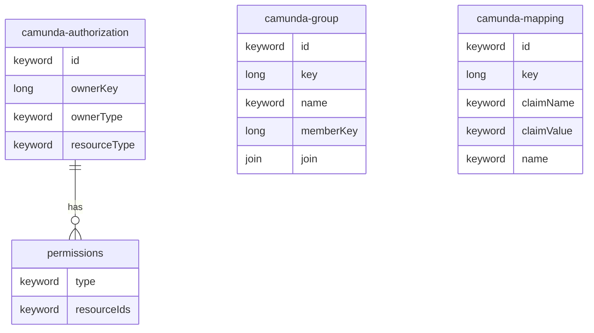
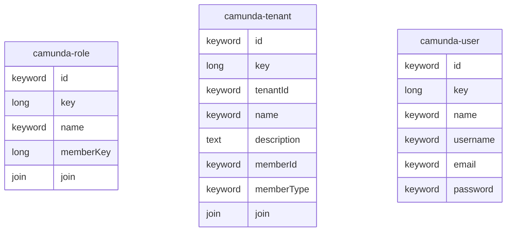
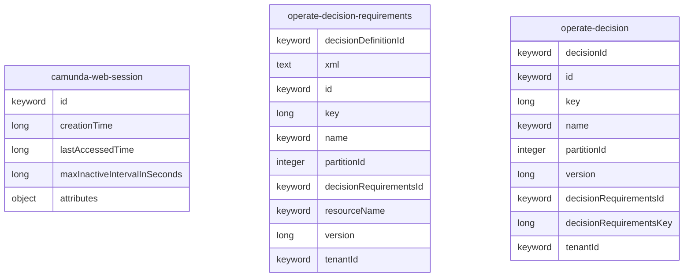
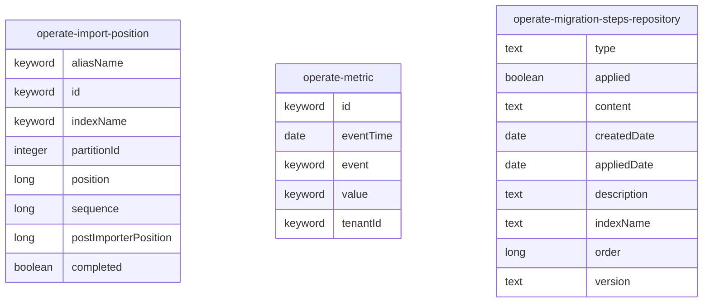
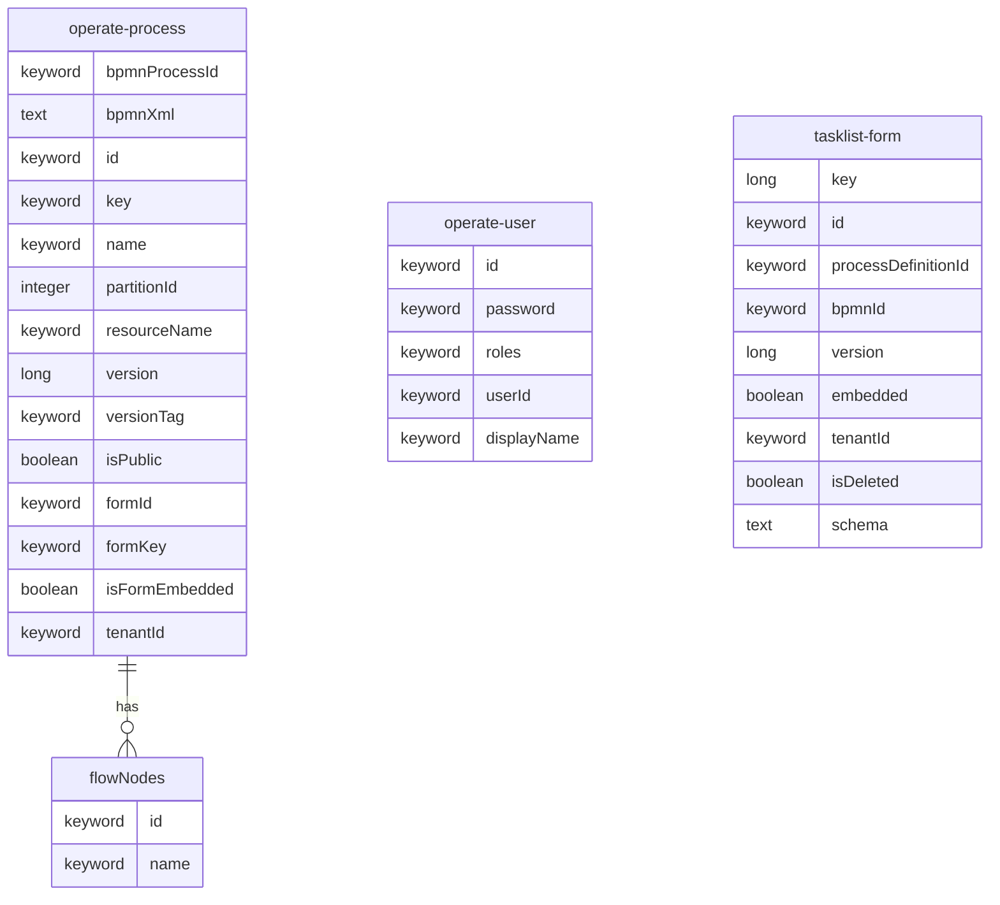
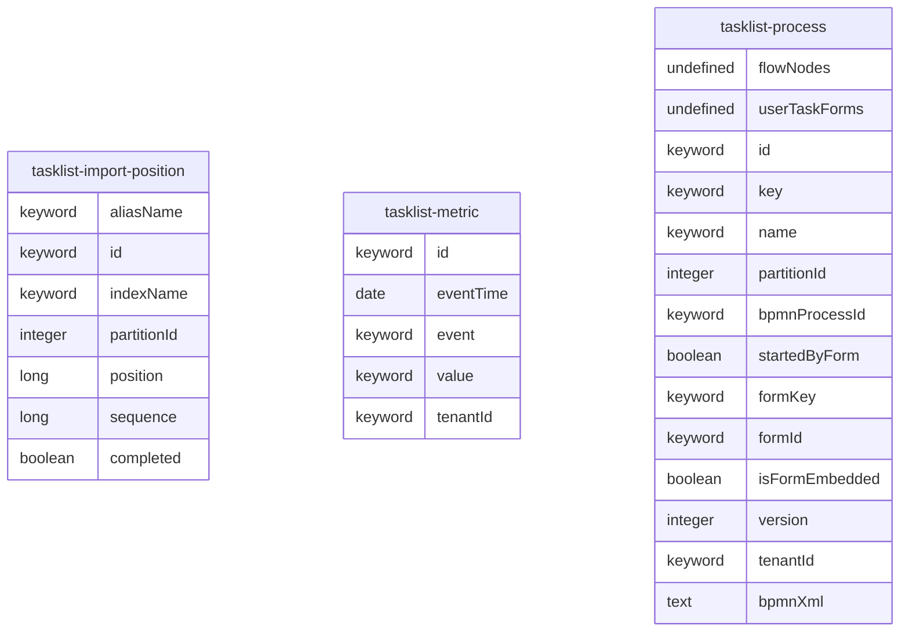
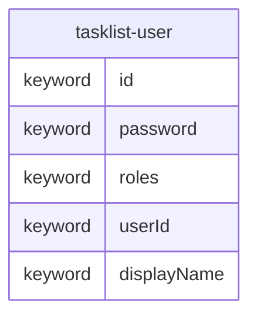

```mermaid
erDiagram

    camunda-authorization {
        keyword id
        long ownerKey
        keyword ownerType
        keyword resourceType
    }

    permissions {
        keyword type
        keyword resourceIds
    }
    camunda-authorization ||--o{ permissions : has

    camunda-group {
        keyword id
        long key
        keyword name
        long memberKey
        join join
    }

    camunda-mapping {
        keyword id
        long key
        keyword claimName
        keyword claimValue
        keyword name
    }
```

```mermaid
erDiagram

    camunda-role {
        keyword id
        long key
        keyword name
        long memberKey
        join join
    }

    camunda-tenant {
        keyword id
        long key
        keyword tenantId
        keyword name
        text description
        keyword memberId
        keyword memberType
        join join
    }

    camunda-user {
        keyword id
        long key
        keyword name
        keyword username
        keyword email
        keyword password
    }
```

```mermaid
erDiagram

    camunda-web-session {
        keyword id
        long creationTime
        long lastAccessedTime
        long maxInactiveIntervalInSeconds
        object attributes
    }

    operate-decision-requirements {
        keyword decisionDefinitionId
        text xml
        keyword id
        long key
        keyword name
        integer partitionId
        keyword decisionRequirementsId
        keyword resourceName
        long version
        keyword tenantId
    }

    operate-decision {
        keyword decisionId
        keyword id
        long key
        keyword name
        integer partitionId
        long version
        keyword decisionRequirementsId
        long decisionRequirementsKey
        keyword tenantId
    }
```

```mermaid
erDiagram

    operate-import-position {
        keyword aliasName
        keyword id
        keyword indexName
        integer partitionId
        long position
        long sequence
        long postImporterPosition
        boolean completed
    }

    operate-metric {
        keyword id
        date eventTime
        keyword event
        keyword value
        keyword tenantId
    }

    operate-migration-steps-repository {
        text type
        boolean applied
        text content
        date createdDate
        date appliedDate
        text description
        text indexName
        long order
        text version
    }
```

```mermaid
erDiagram

    operate-process {
        keyword bpmnProcessId
        text bpmnXml
        keyword id
        keyword key
        keyword name
        integer partitionId
        keyword resourceName
        long version
        keyword versionTag
        boolean isPublic
        keyword formId
        keyword formKey
        boolean isFormEmbedded
        keyword tenantId
    }

    flowNodes {
        keyword id
        keyword name
    }
    operate-process ||--o{ flowNodes : has

    operate-user {
        keyword id
        keyword password
        keyword roles
        keyword userId
        keyword displayName
    }

    tasklist-form {
        long key
        keyword id
        keyword processDefinitionId
        keyword bpmnId
        long version
        boolean embedded
        keyword tenantId
        boolean isDeleted
        text schema
    }
```

```mermaid
erDiagram

    tasklist-import-position {
        keyword aliasName
        keyword id
        keyword indexName
        integer partitionId
        long position
        long sequence
        boolean completed
    }

    tasklist-metric {
        keyword id
        date eventTime
        keyword event
        keyword value
        keyword tenantId
    }

    tasklist-process {
        undefined flowNodes
        undefined userTaskForms
        keyword id
        keyword key
        keyword name
        integer partitionId
        keyword bpmnProcessId
        boolean startedByForm
        keyword formKey
        keyword formId
        boolean isFormEmbedded
        integer version
        keyword tenantId
        text bpmnXml
    }
```

```mermaid
erDiagram

    tasklist-user {
        keyword id
        keyword password
        keyword roles
        keyword userId
        keyword displayName
    }
```
