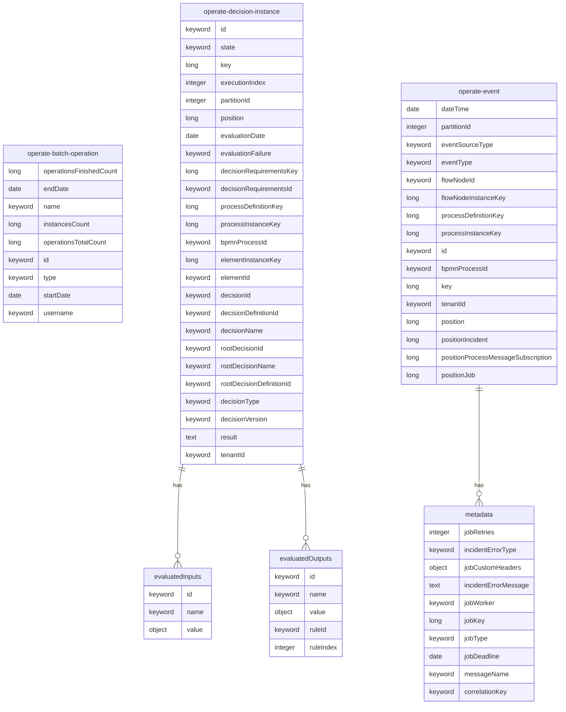
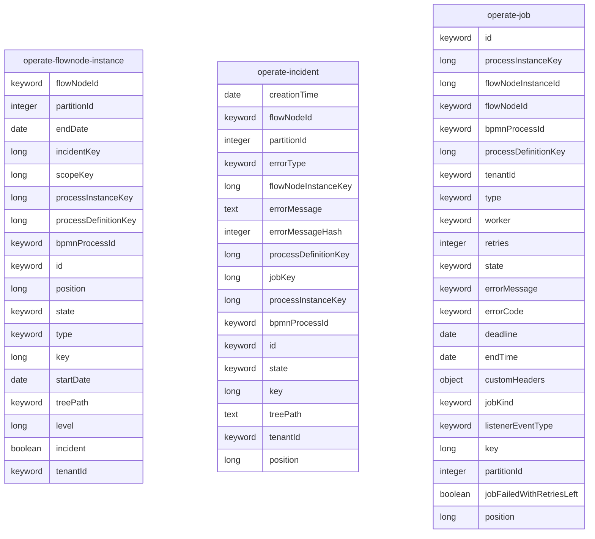
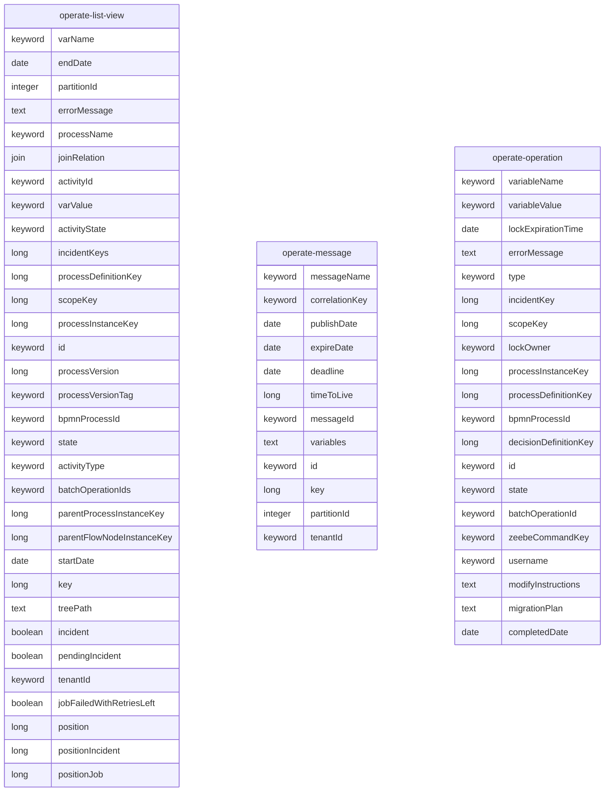
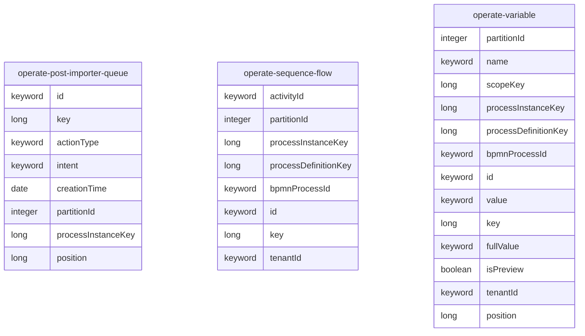
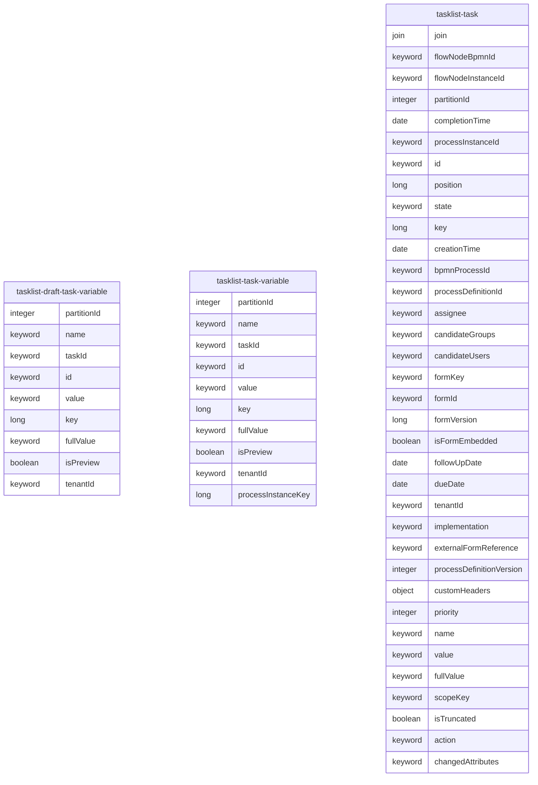

```mermaid
erDiagram

    operate-batch-operation {
        long operationsFinishedCount
        date endDate
        keyword name
        long instancesCount
        long operationsTotalCount
        keyword id
        keyword type
        date startDate
        keyword username
    }

    operate-decision-instance {
        keyword id
        keyword state
        long key
        integer executionIndex
        integer partitionId
        long position
        date evaluationDate
        keyword evaluationFailure
        long decisionRequirementsKey
        keyword decisionRequirementsId
        long processDefinitionKey
        long processInstanceKey
        keyword bpmnProcessId
        long elementInstanceKey
        keyword elementId
        keyword decisionId
        keyword decisionDefinitionId
        keyword decisionName
        keyword rootDecisionId
        keyword rootDecisionName
        keyword rootDecisionDefinitionId
        keyword decisionType
        keyword decisionVersion
        text result
        keyword tenantId
    }

    evaluatedInputs {
        keyword id
        keyword name
        object value
    }
    operate-decision-instance ||--o{ evaluatedInputs : has

    evaluatedOutputs {
        keyword id
        keyword name
        object value
        keyword ruleId
        integer ruleIndex
    }
    operate-decision-instance ||--o{ evaluatedOutputs : has

    operate-event {
        date dateTime
        integer partitionId
        keyword eventSourceType
        keyword eventType
        keyword flowNodeId
        long flowNodeInstanceKey
        long processDefinitionKey
        long processInstanceKey
        keyword id
        keyword bpmnProcessId
        long key
        keyword tenantId
        long position
        long positionIncident
        long positionProcessMessageSubscription
        long positionJob
    }

    metadata {
        integer jobRetries
        keyword incidentErrorType
        object jobCustomHeaders
        text incidentErrorMessage
        keyword jobWorker
        long jobKey
        keyword jobType
        date jobDeadline
        keyword messageName
        keyword correlationKey
    }
    operate-event ||--o{ metadata : has
```

```mermaid
erDiagram

    operate-flownode-instance {
        keyword flowNodeId
        integer partitionId
        date endDate
        long incidentKey
        long scopeKey
        long processInstanceKey
        long processDefinitionKey
        keyword bpmnProcessId
        keyword id
        long position
        keyword state
        keyword type
        long key
        date startDate
        keyword treePath
        long level
        boolean incident
        keyword tenantId
    }

    operate-incident {
        date creationTime
        keyword flowNodeId
        integer partitionId
        keyword errorType
        long flowNodeInstanceKey
        text errorMessage
        integer errorMessageHash
        long processDefinitionKey
        long jobKey
        long processInstanceKey
        keyword bpmnProcessId
        keyword id
        keyword state
        long key
        text treePath
        keyword tenantId
        long position
    }

    operate-job {
        keyword id
        long processInstanceKey
        long flowNodeInstanceId
        keyword flowNodeId
        keyword bpmnProcessId
        long processDefinitionKey
        keyword tenantId
        keyword type
        keyword worker
        integer retries
        keyword state
        keyword errorMessage
        keyword errorCode
        date deadline
        date endTime
        object customHeaders
        keyword jobKind
        keyword listenerEventType
        long key
        integer partitionId
        boolean jobFailedWithRetriesLeft
        long position
    }
```

```mermaid
erDiagram

    operate-list-view {
        keyword varName
        date endDate
        integer partitionId
        text errorMessage
        keyword processName
        join joinRelation
        keyword activityId
        keyword varValue
        keyword activityState
        long incidentKeys
        long processDefinitionKey
        long scopeKey
        long processInstanceKey
        keyword id
        long processVersion
        keyword processVersionTag
        keyword bpmnProcessId
        keyword state
        keyword activityType
        keyword batchOperationIds
        long parentProcessInstanceKey
        long parentFlowNodeInstanceKey
        date startDate
        long key
        text treePath
        boolean incident
        boolean pendingIncident
        keyword tenantId
        boolean jobFailedWithRetriesLeft
        long position
        long positionIncident
        long positionJob
    }

    operate-message {
        keyword messageName
        keyword correlationKey
        date publishDate
        date expireDate
        date deadline
        long timeToLive
        keyword messageId
        text variables
        keyword id
        long key
        integer partitionId
        keyword tenantId
    }

    operate-operation {
        keyword variableName
        keyword variableValue
        date lockExpirationTime
        text errorMessage
        keyword type
        long incidentKey
        long scopeKey
        keyword lockOwner
        long processInstanceKey
        long processDefinitionKey
        keyword bpmnProcessId
        long decisionDefinitionKey
        keyword id
        keyword state
        keyword batchOperationId
        keyword zeebeCommandKey
        keyword username
        text modifyInstructions
        text migrationPlan
        date completedDate
    }
```

```mermaid
erDiagram

    operate-post-importer-queue {
        keyword id
        long key
        keyword actionType
        keyword intent
        date creationTime
        integer partitionId
        long processInstanceKey
        long position
    }

    operate-sequence-flow {
        keyword activityId
        integer partitionId
        long processInstanceKey
        long processDefinitionKey
        keyword bpmnProcessId
        keyword id
        long key
        keyword tenantId
    }

    operate-variable {
        integer partitionId
        keyword name
        long scopeKey
        long processInstanceKey
        long processDefinitionKey
        keyword bpmnProcessId
        keyword id
        keyword value
        long key
        keyword fullValue
        boolean isPreview
        keyword tenantId
        long position
    }
```

```mermaid
erDiagram

    tasklist-draft-task-variable {
        integer partitionId
        keyword name
        keyword taskId
        keyword id
        keyword value
        long key
        keyword fullValue
        boolean isPreview
        keyword tenantId
    }

    tasklist-task-variable {
        integer partitionId
        keyword name
        keyword taskId
        keyword id
        keyword value
        long key
        keyword fullValue
        boolean isPreview
        keyword tenantId
        long processInstanceKey
    }

    tasklist-task {
        join join
        keyword flowNodeBpmnId
        keyword flowNodeInstanceId
        integer partitionId
        date completionTime
        keyword processInstanceId
        keyword id
        long position
        keyword state
        long key
        date creationTime
        keyword bpmnProcessId
        keyword processDefinitionId
        keyword assignee
        keyword candidateGroups
        keyword candidateUsers
        keyword formKey
        keyword formId
        long formVersion
        boolean isFormEmbedded
        date followUpDate
        date dueDate
        keyword tenantId
        keyword implementation
        keyword externalFormReference
        integer processDefinitionVersion
        object customHeaders
        integer priority
        keyword name
        keyword value
        keyword fullValue
        keyword scopeKey
        boolean isTruncated
        keyword action
        keyword changedAttributes
    }
```
