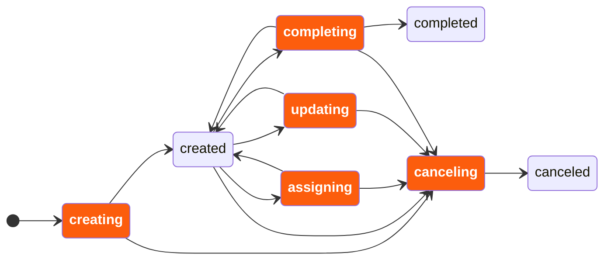
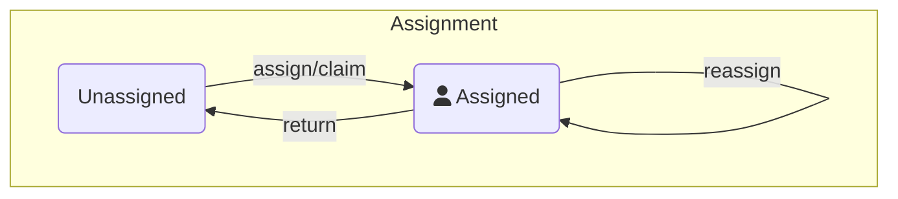

The user task lifecycle in Camunda defines how users interact with tasks and perform work. Define it before implementing your application logic and user interface.

## Define your task lifecycle

Define your task lifecycle based on your use case, the users interacting with the task, and the data you want to track.

Use the following task lifecycle as a starting point.

## Task lifecycle example

[Tasklist](/components/tasklist/introduction-to-tasklist.md) implements a lifecycle optimized for tracking work on individual tasks using [forms](../03-forms/01-introduction-to-forms.md). It separates assignment from task state to support collaborative processes.

In a typical flow, users can:

- Get assigned to a task, or assign the task to themselves.
- Start working on the task.
- Complete the task when the work is done.
- Pause, resume, or return the task if they can't continue work, depending on how your task application handles interrupted work.

If your application supports interrupted work, make sure it explicitly persists any draft or intermediate data before users leave the form.



The engine derives the task state using a CQRS pattern. [Zeebe](/components/zeebe/zeebe-overview.md), Camunda's process execution engine, manages a stream of events. There is no single status attribute on tasks. Instead, the task status is derived from these events.

User task listeners run in a blocking manner. The lifecycle transition pauses until all listeners complete.

Listeners can also deny certain transitions. During `completing`, a listener can reject the transition and return the task to its previous state.

:::tip
Optimize currently tracks assigned and unassigned time for user tasks. If you need more detailed reporting, such as work started, paused, resumed, or returned, model these as custom `action` values and process them in your own reporting or audit logic.
:::

### Task assignment

Assignment runs independently of the work state, so tasks can be reassigned while work is in progress. A task may be assigned but remain open for some time, indicating that the assigned user is not available to work on it immediately. The assignee can also change while work is in progress.

In the Tasklist user interface, a task can be claimed by the logged-in user, which assigns the task to that user. Managers can assign unassigned tasks to team members and reassign them as needed.



The execution engine does not validate user authorization. Your application must enforce access control.

Tasklist allows only the assigned user or another authorized user to update and complete a task. You can implement different rules in your application, such as allowing a user to complete a task on behalf of another user.

In Camunda 8.9 and later, you can use [user task authorizations](../../../components/tasklist/user-task-authorization.md) to control who can read, update, assign, or complete user tasks.

The following best practices are implemented in Tasklist:

- `update` and `complete` operations can only be performed by the assigned user or an admin or manager.
- Users can only see tasks assigned to them and tasks assigned to their candidate groups.
- When a task is returned to the queue, the assignee is cleared so another user can pick it up.
- Only authorized users can reassign tasks.
- Users can return tasks, but they must provide a comment explaining why.
- Users can mark tasks with a follow-up date. Depending on the assignment, the task remains assigned to the user or becomes unassigned.

Define validation logic that matches your use case.

## Lifecycle events

Camunda emits lifecycle events that can be triggered by REST API operations. User task listeners react to them to execute custom logic. For details, see [user task listeners](/components/concepts/user-task-listeners.md).

Supported events:

- `creating`
- `assigning`
- `updating`
- `completing`
- `canceling`

Lifecycle events represent engine-level transitions. Supported API calls can include an `action` value to add application-specific meaning to the resulting user task listener event. For example, your application can use actions such as `start`, `pause`, or `resume` to represent application-level work progress.

### `creating`

The `creating` event is emitted when a task instance is created. If the `creating` event already contains an assignee, no additional `assigning` event is fired.

### `assigning`

The engine emits the `assigning` event when a task assignment changes. The resulting event can include an `action` value, such as `claim`, `assign`, `return`, or `unassign`.

### `updating`

The engine emits the `updating` event when task data changes, except assignment changes. This can include changes to variables, candidate users, candidate groups, or other supported task fields.

The update API can also include an `action` value. Use this value to add application-specific meaning to the resulting event, such as `start`, `pause`, or `resume`.

### `completing`

The engine emits the `completing` event when a task is being completed. It can contain a custom action to indicate the outcome, such as `approved` or `rejected`.

### `canceling`

The engine emits the `canceling` event when a user task is terminated by the process. This happens when the process instance is canceled or an interrupting catch event ends the user task.

## Implement the lifecycle

Use the Orchestration Cluster REST API to implement task lifecycle operations in your application.  
See the [full API reference](/apis-tools/orchestration-cluster-api-rest/orchestration-cluster-api-rest-overview.md).

### Perform lifecycle operations

You interact with user tasks through the following endpoints:

- Assign or unassign a task:
  - [`POST /user-tasks/:userTaskKey/assignment`](/apis-tools/orchestration-cluster-api-rest/specifications/assign-user-task.api.mdx)
  - [`DELETE /user-tasks/:userTaskKey/assignee`](/apis-tools/orchestration-cluster-api-rest/specifications/unassign-user-task.api.mdx)

- Update a task:
  - [`PATCH /user-tasks/:userTaskKey`](/apis-tools/orchestration-cluster-api-rest/specifications/update-user-task.api.mdx)

- Complete a task:
  - [`POST /user-tasks/:userTaskKey/completion`](/apis-tools/orchestration-cluster-api-rest/specifications/complete-user-task.api.mdx)

These operations trigger lifecycle events such as `assigning`, `updating`, and `completing`.

### Assign a task

Use the assignment endpoint to assign, reassign, or unassign a task.

- `POST /user-tasks/:userTaskKey/assignment` assigns or reassigns a task.
- `DELETE /user-tasks/:userTaskKey/assignee` removes the current assignee.

Use the `action` attribute to describe the reason for the change, such as `claim`, `assign`, or `reassign`.

### Update a task

Use the update endpoint to modify task data or provide an application-specific `action` value.

You can:

- Update fields such as candidate users, candidate groups, due date, or follow-up date using a `changeset`.
- Add application-specific meaning to the resulting event by providing an `action` value, such as `start`, `pause`, or `resume`.

You can also send custom actions for audit or business logic purposes, such as `escalate`, `requestFurtherInformation`, `uploadDocument`, or `openExternalApp`.

Example request:

```json
{
  "changeset": {
    "dueDate": "2024-03-18T20:47:20.340Z"
  },
  "action": "escalate"
}
```

### Complete a task

Use `POST /user-tasks/:userTaskKey/completion` to complete a task. You can include an `action` to indicate the outcome, such as `approve` or `reject`.

## Reporting

Use lifecycle events to build audit logs or productivity reports.

### Task lifecycle reporting in Optimize

Optimize supports task productivity reports but currently measures only assigned vs. unassigned time.

It does not calculate:

- **Idle time:** Time a task was open (time to `start`).
- **Net working time:** Time during which a task was processed from a custom `start` action to completion, excluding time between custom `pause` and `resume` actions.

### Export task lifecycle information

Use user task listeners and job workers to send lifecycle event data to external systems such as analytics or monitoring tools.
