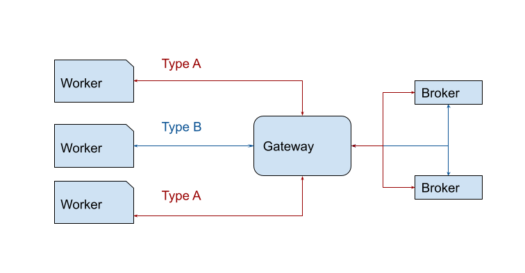

## Related resources

- [Job worker basics](/components/concepts/job-workers.md)

## The Java client's job worker

The Java client provides a job worker that handles polling for available jobs. This allows you to focus on writing code to handle the activated jobs.

On `open`, the job worker waits `pollInterval` milliseconds and then polls for `maxJobsActive` jobs. It then continues with the following schedule:

1. If a poll did not activate any jobs, it waits for `pollInterval` milliseconds and then polls for more jobs.
2. If a poll activated jobs, the worker submits each job to the job handler.
3. Every time a job is handled, the worker checks whether the number of unhandled jobs have dropped below 30% of `maxJobsActive`. The first time that happens, it will poll for more jobs.
4. If a poll fails with an error response, a backoff strategy is applied. This strategy waits for the delay provided by the `backoffSupplier` and polls for more jobs.

## Example usage

- [Open a job worker](../java-client-examples/job-worker-open.md)

## Backoff configuration

When a poll fails with an error response, the job worker applies a backoff strategy. It waits for some time, after which it polls again for more jobs. This gives a Zeebe cluster some time to recover from a failure. In some cases, you may want to configure this backoff strategy to better fit your situation.

The retry delay (i.e. the time the job worker waits after an error before the next poll for new jobs) is provided by the [`BackoffSupplier`](https://github.com/camunda-cloud/zeebe/blob/develop/clients/java/src/main/java/io/camunda/zeebe/client/api/worker/BackoffSupplier.java). You can replace it using the `.backoffSupplier()` method on the [`JobWorkerBuilder`](https://github.com/camunda-cloud/zeebe/blob/develop/clients/java/src/main/java/io/camunda/zeebe/client/api/worker/JobWorkerBuilderStep1.java).

By default, the job worker uses an exponential backoff implementation, which you can configure using `BackoffSupplier.newBackoffBuilder()`.

The backoff strategy is especially useful for dealing with the `GRPC_STATUS_RESOURCE_EXHAUSTED` error response (refer to [gRPC Technical Error Handling](/apis-tools/grpc.md#technical-error-handling)).

This error code indicates the Zeebe cluster is currently under too large of a load and has decided to reject this request.

By backing off, the job worker helps Zeebe by reducing the load.

:::note
Zeebe's [backpressure mechanism](../../../self-managed/zeebe-deployment/operations/backpressure) can also be configured.
:::

## Metrics

The job worker exposes metrics through a custom interface: [JobWorkerMetrics](https://github.com/camunda/zeebe/blob/main/clients/java/src/main/java/io/camunda/zeebe/client/api/worker/JobWorkerMetrics.java). These represent specific callbacks used by the job worker to keep track of various internals, e.g. count of jobs activated, count of jobs handled, etc.

:::note
By default, job workers will not track any metrics, and it's up to the caller to specify an implementation if they wish to make use of this feature.
:::

### Available metrics

The API currently supports two metrics: the count of jobs activated, and the count of jobs handled.

- **The count of jobs activated** is incremented every time a worker activates new jobs. This is done by calling `JobWorkerMetrics#jobActivated(int)`, with the first argument being the count of jobs newly activated. The method is called before the job is passed to the job handler.
- **The count of jobs handled** is incremented every time a worker's `JobHandler` (passed to the builder via `JobWorkerBuilderStep2#handler(JobHandler)`) returns (regardless of whether it was successful). This is done by calling `JobWorkerMetrics#jobHandled(int)`, with the first argument being the count of jobs newly handled.

For both counters, the expectation is that implementations will simply increment an underlying counter, and track the rate or increase of this counter to derive the speed at which jobs are activated/handled by a given worker.

Additionally, by subtracting both counters, you can derive the count of queued or buffered jobs - jobs which have yet to be handled by the worker. This can help you tune your workers, e.g. scaling in or out, tuning the amount of jobs activated, etc.

### Usage

To use job worker metrics, create a new instance of a `JobWorkerMetrics` implementation, and pass it along to the builder:

```java
public final JobWorker openWorker(final ZeebeClient client, final JobHandler handler) {
  final JobWorkerMetrics metrics = new MyCustomJobWorkerMetrics();
  return client.newJobWorker()
    .jobType("foo")
    .handler(handler)
    .metrics(metrics)
    .open();
}
```

#### Micrometer implementation

The Java client comes with an optional, built-in [Micrometer](https://micrometer.io/) implementation of `JobWorkerMetrics`.

:::note
[Micrometer](https://micrometer.io/) is a popular metrics facade in the Java ecosystem - what SLF4J is to logging. It can be configured to export metrics to many other systems, such as OpenTelemetry, Prometheus, StatsD, Datadog, etc.
:::

If your project does not yet use Micrometer, you need to add it to your dependencies, and wire it up to your metrics backend, [as described in the Micrometer docs](https://micrometer.io/docs).

Once Micrometer is set up in your project, you can start using the implementation. For example:

```java
public final JobWorker openWorker(final ZeebeClient client, final JobHandler handler) {
  final MeterRegistry meterRegistry = new PrometheusMeterRegistry(PrometheusConfig.DEFAULT);
  final JobWorkerMetrics metrics = JobWorkerMetrics
    .micrometer()
    .withMeterRegistry(meterRegistry)
    .withTags(Tags.of("zeebe.client.worker.jobType", "foo", "zeebe.client.worker.name", "bee"))
    .build();
  return client.newJobWorker()
    .jobType("foo")
    .handler(handler)
    .metrics(metrics)
    .name("bee")
    .open();
}
```

:::note
There are currently no built-in tags, primarily because these are likely to be high cardinality, which can become an issue with some metric registries. If you want per-worker tags, create a different `JobWorkerMetrics` instance per worker.
:::

This implementation creates two metrics:

- `zeebe.client.worker.job.activated`: A counter tracking the count of jobs activated.
- `zeebe.client.worker.job.handled`: A counter tracking the count of jobs handled.

### Workarounds for additional metrics

The decision to track a small set of metrics directly in the client is a conscious one. The idea is we should only be tracking what is not possible for users to track themselves. If you believe a specific metric should be tracked by us, do open a feature request for it. In the meantime, here is a list of workarounds to help you track additional job worker-related metrics that you can already use:

#### Job polling count

You can use a gRPC [ClientInterceptor](https://grpc.github.io/grpc-java/javadoc/io/grpc/ClientInterceptor.html) to track any client calls, including the `ActivateJobsCommand` call that is sent every time a worker polls for more jobs.

Here's an example using [Micrometer](https://javadoc.io/doc/io.micrometer/micrometer-core/1.7.2/io/micrometer/core/instrument/binder/grpc/MetricCollectingServerInterceptor.html):

```java
public ZeebeClientBuilder configureClientMetrics(final ZeebeClientBuilder builder, final MeterRegistry meterRegistry) {
  final ClientInterceptor monitoringInterceptor = new MetricCollectingClientInterceptor(meterRegistry);
  return builder.withInterceptors(monitoringInterceptor);
}
```

#### Executor metrics

If you wish to tune your job worker executor, you can pass a custom, instrumented executor to the client builder. For example, if we use Micrometer:

```java
public ZeebeClientBuilder configureClientMetrics(
    final ZeebeClientBuilder builder,
    final ScheduledExecutorService executor,
    final MeterRegistry meterRegistry) {
  final ScheduledExecutorService instrumentedExecutor = ExecutorServiceMetrics.monitor(meterRegistry, executor, "job-worker-executor");
  return builder.jobWorkerExecutor(instrumentedExecutor);
}
```

## Job streaming

:::warning
Job streaming is an experimental feature which is still under development. It is an opt-in feature which is disabled by default.
:::

Job workers are designed to regularly poll and activate jobs. It's also possible to use them in a streaming fashion, such that jobs are automatically activated and pushed downstream to workers without requiring an extra round of polling. This greatly cuts down on overall activation latency by completely obviating the poll request.

### Usage

Enabling job streaming consists of toggling a single flag in the job worker builder:

```java
public JobWorkerBuilderStep3 enableStreaming(final JobWorkerBuilderStep3 builder) {
  return builder.streamEnabled(true);
}
```

This will configure the job worker to open a long living stream between itself and a gateway, through which activated jobs will be pushed. **If the stream is closed for any reason - e.g. the gateway crashed, there is a temporary network issue, etc. - it is automatically recreated.**

:::note
It's also possible to set an overall timeout - so called `streamTimeout` - which will ensure the underlying long-living stream is refreshed once the timeout is reached. This is useful to trigger load balancing of your workers over time, instead of having workers pinned to the same gateway.
:::

### How it works

Job streaming works by having the worker open a long living gRPC unidirectional stream from the client to the gateway. The gateway will then aggregate logically equivalent streams and register each of these aggregated streams to every broker.



:::note
Two streams are considered logically equivalent if they would both activate the same job in the exact same way. More concretely, this means if:

- They target the same job type
- They have the same worker name
- They have the same job activation timeout
- They have the same fetch variables
  :::

On the broker side, whenever a job is made activate-able (e.g. a service task is activated, a job times out, a job failed and is retried, etc.), if there is one or more streams for this job type, a random one is picked, the job is activated and then pushed to it. As the job makes it way back to the gateway which owns this stream, a random client associated with it is picked, and the job is forwarded to it.

:::note
The RNG used to random pick streams and clients provides a good uniform distribution for the same underlying set, which is a cheap way of evenly distributing the load _as long as the stream set remains stable_.
:::

To help visualize the process in general, here is a sequence diagram which shows a single worker opening a job stream for jobs of type "foo", against a cluster consisting of a single gateway and a single broker (to keep things simple). It receives some jobs, and when it closes, one job that had been pushed asynchronously is returned to the broker.


#### Backfilling

Even with streaming enabled, job workers will still occasionally poll the cluster for jobs. Due to implementation constraints, when a job is made activate-able, it will be pushed out only if there exists a stream for it - if not, then it remains untouched. Even if a stream is created afterwards, it will remain untouched. However, if a stream exists, then streaming is always prioritized over polling.

This ensures that, over time, polling should not activate any new jobs, and the worker will back off and poll less often as long as it receives empty responses.

### Caveats

While job streaming is already usable, it is still a feature under development, and there are some major known caveats should you decide to use it:

#### Lack of flow control

There is currently no flow control mechanism between the workers and a Zeebe cluster. As Zeebe has no knowledge of the load on your workers, it's possible for a cluster to push too many jobs to your workers such that they will become overloaded, and in the worst case, crash. That said, Zeebe will try to distribute the load across your workers evenly, but this is not guaranteed, and even if it were so, there is no guarantee each worker will perform in exactly the same way.

To avoid this, make sure to enable the job worker metrics for all your workers and monitor them closely. This would allow you to scale your worker deployment in or out, depending on the current load per worker.

Additionally, try to ensure that workers perform tasks in a roughly similar time frame to avoid one or more workers becoming overwhelmed.

**We're aware that this is a big feature gap, and hope to address it soon.**

#### Job loss

Since an activated job must now cross two network boundaries - from broker to gateway, then gateway to client - it is possible for the connection to be disrupted (e.g. the gateway crashes while the job is being sent, the client crashes before the job is received, etc.), and thus the activated job will not make it to its intended worker.

We implemented a best effort mechanism to detect such issues and make the job available again, but this is never guaranteed, as it's not always possible to accurately detect in time that a job did not make it (e.g. network time out, where the job may or may not have made it to the recipient). When this happens, the job will remain in limbo until it times out, at which point it can be pushed out again.

To help ensure accurate detection of client shutdown, make sure to close your job workers gracefully when you're finished with them. This will in turn tell the gateway that the worker is gone, and will help prevent job loss.

### Troubleshooting

Since this feature requires a good amount of coordination between various components over the network, we've built in some tools to help monitor the health of the job streams.

#### Metrics

We expose several metrics which help check whether the feature is working.

- `zeebe_broker_jobs_pushed_count_total`: allows you to derive the rate at which a broker is pushing jobs out to all streams. This can help you figure out if the broker is the bottleneck when it comes to throughput.
- `zeebe_gateway_job_stream_push_total`: allows you to derive the rate at which a gateway is pushing jobs out to clients. If this is much less than the broker's pushed count, then this could indicate an issue between the broker and the gateway: jobs are getting lost, the gateway is overloaded, etc.
- `zeebe_gateway_job_stream_clients`: the number of open job stream client calls on the gateway. This can help you figure out if your workers are well load balanced across your gateways.
- `zeebe_gateway_job_stream_streams`: the number of aggregated streams per gateway.
- `zeebe_broker_open_job_stream_count`: the count of job streams registered on the broker. This should be the sum of all gateway aggregated streams.
- `zeebe_gateway_job_stream_servers`: the amount of known brokers (or stream servers) per gateway. This should always be the number of brokers in your cluster. If this is less, this could indicate a clustering issue between your gateways and brokers (e.g. temporary network partition).

#### Actuator endpoint

Each broker and gateway exposes a new actuator endpoint - `/actuator/jobstreams` - accessible via the monitoring port. For example, if you run Zeebe locally with the default monitoring port, it would be accessible under `http://localhost:9600/actuator/jobstreams`.

This returns the current view of the registered job streams, where `client` refers to client streams opened on the gateway, and `remote` refers to the aggregated gateway streams as opened on each broker.

For example, if jobs of a given type are not activated, but a worker is opened for this type, you can verify first if it exists in one of the gateways as a client stream. Once you've found it, grab its ID, and verify that you can find it as a consumer of a remote stream on each broker.

If it's not present in the gateway as a client stream, and the simplest solution is to restart your worker. If it's not present as a consumer in one of the broker, this indicates a bug. As a workaround, you could restart your gateway, which will cause some interruption in your service, but will force all streams for this gateway to be recreated properly.
