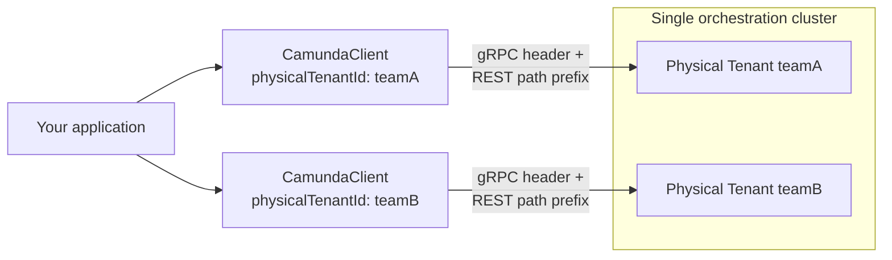

import Tabs from "@theme/Tabs";
import TabItem from "@theme/TabItem";

**Physical Tenants are strongly isolated execution units within a single Orchestration Cluster**, distinct from the [logical tenant](./job-worker.md#multi-tenancy) mechanism. This page covers how the Java client targets a Physical Tenant, and how to work with multiple Physical Tenants from a single application.

For the server-side isolation model, see [Physical Tenant isolation model](/self-managed/concepts/physical-tenants/index.md). For API routing details, see [API routing for Physical Tenants](/self-managed/concepts/physical-tenants/api-routing.md).

## Physical Tenants vs. logical tenants

These two mechanisms are independent and can be combined:

|                         | Logical tenant                                  | Physical Tenant                                                      |
| ----------------------- | ----------------------------------------------- | -------------------------------------------------------------------- |
| **Configured on**       | Job worker or API call (`tenantId`/`tenantIds`) | The client itself (`physicalTenantId`)                               |
| **Scope**               | A subdivision within one Physical Tenant        | A separate, isolated execution unit within the Orchestration Cluster |
| **Isolation**           | Logical only — shared engine, shared storage    | Strong — separate primary/secondary storage, separate authorization  |
| **Targeting mechanism** | API parameter, per call or per worker           | gRPC header and REST path prefix, per client instance                |

A Physical Tenant can have its own set of logical tenants. For example, Physical Tenant `teamA` and Physical Tenant `teamB` can each have a logical tenant called `foo` — `teamA`'s `foo` and `teamB`'s `foo` are completely isolated from each other.

## Target a Physical Tenant

Set the Physical Tenant on the client builder:

```java
CamundaClient client = CamundaClient.newClientBuilder()
    .physicalTenantId("teamA")
    .build();
```

This does two things:

- Adds the `Camunda-Physical-Tenant` gRPC metadata header to every gRPC call.
- Prefixes the REST base path with `/physical-tenants/teamA` (for example, `https://your-cluster/physical-tenants/teamA/v2/...`).

If `physicalTenantId` is not set, the client targets the **default** Physical Tenant on both protocols.

### Using a pre-prefixed REST address

If your REST address already points at a tenant-specific path — for example, behind a reverse proxy that performs the routing — disable the automatic path prefix so the configured address is used as-is:

```java
CamundaClient client = CamundaClient.newClientBuilder()
    .physicalTenantId("teamA")
    .restAddress(URI.create("https://your-proxy/teamA/v2"))
    .prefixPhysicalTenantPath(false)
    .build();
```

`prefixPhysicalTenantPath(false)` only affects the REST base path. The gRPC header is always sent when `physicalTenantId` is set, regardless of this setting.

## Targeting multiple Physical Tenants

A single `CamundaClient` instance targets exactly one Physical Tenant. Multiplicity lives at the application layer, not inside the client — to interact with multiple Physical Tenants, create one client instance per tenant:



```java
CamundaClient teamAClient = CamundaClient.newClientBuilder()
    .physicalTenantId("teamA")
    .build();

CamundaClient teamBClient = CamundaClient.newClientBuilder()
    .physicalTenantId("teamB")
    .build();
```

If you're using the [Camunda Spring Boot Starter](/apis-tools/camunda-spring-boot-starter/getting-started.md), it manages multiple named client instances for you — see [multi-client configuration](/apis-tools/camunda-spring-boot-starter/configuration.md#multi-client-configuration-physical-tenants) — rather than constructing and managing `CamundaClient` instances directly.

## Code examples

### Create a process instance scoped to a Physical Tenant

```java
teamAClient.newCreateInstanceCommand()
    .bpmnProcessId("order-process")
    .latestVersion()
    .send()
    .join();
```

The process instance is created within Physical Tenant `teamA`. No additional API parameter is needed — the client's `physicalTenantId` determines the target.

### Register a job worker

<Tabs groupId="tenant-scope" queryString>
<TabItem value="single" label="One Physical Tenant">

```java
teamAClient.newWorker()
    .jobType("shipOrder")
    .handler(new ShipOrderHandler())
    .open();
```

This worker only polls Physical Tenant `teamA` — it uses the gRPC channel configured with the `teamA` header.

</TabItem>
<TabItem value="multi" label="Multiple Physical Tenants">

There's no single worker registration that spans Physical Tenants. Open the same job type on each client instance:

```java
Stream.of(teamAClient, teamBClient)
    .forEach(client -> client.newWorker()
        .jobType("shipOrder")
        .handler(new ShipOrderHandler())
        .open());
```

Each registration opens an independent polling loop against its own client's Physical Tenant. Inside the handler, call `activatedJob.getPhysicalTenantId()` to find out which Physical Tenant the job belongs to — this is populated on every `ActivatedJob`, whether the job arrived over gRPC or REST, and returns the default Physical Tenant's ID when none was set at job creation:

```java
public class ShipOrderHandler implements JobHandler {
  @Override
  public void handle(JobClient client, ActivatedJob job) {
    String physicalTenantId = job.getPhysicalTenantId();
    // route or log based on physicalTenantId as needed
  }
}
```

</TabItem>
</Tabs>

### Update a variable scoped to a Physical Tenant

```java
teamAClient.newSetVariablesCommand(processInstanceKey)
    .variables(Map.of("status", "shipped"))
    .send()
    .join();
```

`processInstanceKey` values are only valid within the Physical Tenant that created them — using a key from `teamB` against `teamAClient` fails, since the instance doesn't exist from `teamA`'s perspective.

## Best practices

### One client vs. multiple clients

Use a single client (default Physical Tenant, no `physicalTenantId` set) unless your application genuinely needs to operate across more than one Physical Tenant. If it does, prefer the [Spring Boot Starter's multi-client support](/apis-tools/camunda-spring-boot-starter/configuration.md#multi-client-configuration-physical-tenants) over manually constructing and tracking `CamundaClient` instances — it centralizes lookup (`CamundaClientRegistry`) and lifecycle management for you.

### Connection pooling

Each `CamundaClient` instance maintains its own gRPC channel and REST connection pool. Running multiple clients (one per Physical Tenant) means multiple independent connection pools — there's no pooling shared across clients. Size your application's resource expectations accordingly when targeting many Physical Tenants from one process.

### Error handling for unauthorized tenant access

At the API level, an unrecognized Physical Tenant ID returns `404 Not Found`, and a request the caller isn't authorized for returns `401 Unauthorized` (missing or invalid credentials for the tenant) or `403 Forbidden` (valid credentials, insufficient permission) — see [How to determine who can access a tenant](/self-managed/concepts/physical-tenants/authorization-model.md#how-to-determine-who-can-access-a-tenant) for the full breakdown of these status codes at the API level.

:::note
Whether the Java client surfaces these as distinct, easily-distinguishable exception types (as opposed to a generic client exception carrying the HTTP/gRPC status) is not yet confirmed. Check the status code or gRPC error details on the thrown exception until this is documented more specifically.
:::

<!-- TODO: Confirm whether the Java client exposes unauthorized-Physical-Tenant errors as a distinct exception type, or only as a generic exception carrying the HTTP/gRPC status? -->

### Monitoring and logging across tenants

Built-in metrics are currently client-instance-scoped, not tenant-aware: job worker metrics are tagged by job type and action, not by client name or Physical Tenant. If you run multiple client instances and need to distinguish their metrics, tag your own application-level metrics using `ActivatedJob.getPhysicalTenantId()` inside job handlers, or the client/tenant identifier you already have at hand when issuing other commands. There is no built-in tracing for multi-tenant operations today — this is left entirely to the application layer.
