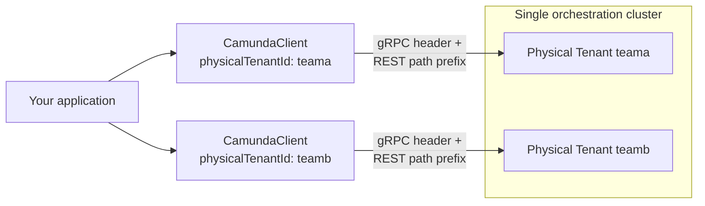

import Tabs from "@theme/Tabs";
import TabItem from "@theme/TabItem";

**Physical Tenants are strongly isolated execution units within a single Orchestration Cluster**, distinct from the [logical tenant](./job-worker.md#multi-tenancy) mechanism. This page covers how the Java client targets a Physical Tenant, and how to work with multiple Physical Tenants from a single application.

For the server-side isolation model, see [Physical Tenant isolation model](/self-managed/concepts/physical-tenants/index.md). For API routing details, see [API routing for Physical Tenants](/self-managed/concepts/physical-tenants/api-routing.md).

## Physical Tenants vs. logical tenants

These two mechanisms are independent and can be combined:

|                         | Logical tenant                                  | Physical Tenant                                                      |
| ----------------------- | ----------------------------------------------- | -------------------------------------------------------------------- |
| **Configured on**       | Job worker or API call (`tenantId`/`tenantIds`) | The client itself (`physicalTenantId`)                               |
| **Scope**               | A subdivision within one Physical Tenant        | A separate, isolated execution unit within the Orchestration Cluster |
| **Isolation**           | Logical only — shared engine, shared storage    | Strong — separate primary/secondary storage, separate authorization  |
| **Targeting mechanism** | API parameter, per call or per worker           | gRPC header and REST path prefix, per client instance                |

A Physical Tenant can have its own set of logical tenants. For example, Physical Tenant `teama` and Physical Tenant `teamb` can each have a logical tenant called `foo` — `teama`'s `foo` and `teamb`'s `foo` are completely isolated from each other.

## Target a Physical Tenant

Set the Physical Tenant on the client builder:

```java
CamundaClient client = CamundaClient.newClientBuilder()
    .physicalTenantId("teama")
    .build();
```

A Physical Tenant ID must be lowercase alphanumeric and at most 64 characters — an invalid value fails application startup rather than failing at request time.

The same setting is also reachable via plain client properties and environment variables, without going through the builder. The environment variable names differ depending on how you configure the client, which is an easy trap if you mix the two:

- Bare Java client: `CAMUNDA_PHYSICAL_TENANT_ID` and `CAMUNDA_PREFIX_PHYSICAL_TENANT_PATH`.
- [Camunda Spring Boot Starter](/apis-tools/camunda-spring-boot-starter/getting-started.md): `CAMUNDA_CLIENT_PHYSICALTENANTID` (see the [properties reference](/apis-tools/camunda-spring-boot-starter/properties-reference.md)).

Setting `physicalTenantId` does three things:

- Adds the `Camunda-Physical-Tenant` gRPC metadata header to every gRPC call.
- Prefixes the REST base path with `/physical-tenants/teama` (for example, `https://your-cluster/physical-tenants/teama/v2/...`) for the per-tenant API.
- Leaves the cluster-scoped REST API (`/cluster/v2/...`, for example `newStatusRequest()`) unprefixed — it's never physical-tenant-scoped, since it reports on the cluster as a whole. If your configured REST address already carries a `/physical-tenants/<id>` segment, the client strips it again when building the cluster-scoped base.

If `physicalTenantId` is not set, the client targets the **default** Physical Tenant on both protocols.

### Using a pre-prefixed REST address

If your REST address already points at a tenant-specific path — for example, behind a reverse proxy that performs the routing — disable the automatic path prefix so the client does not insert the tenant segment a second time:

```java
CamundaClient client = CamundaClient.newClientBuilder()
    .physicalTenantId("teama")
    .restAddress(URI.create("https://your-proxy/teama"))
    .prefixPhysicalTenantPath(false)
    .build();
```

The client still appends the `/v2` API path to whatever address you configure, so leave it off your configured `restAddress`.

`prefixPhysicalTenantPath(false)` only affects the REST base path. The gRPC header is always sent when `physicalTenantId` is set, regardless of this setting.

With a blank (whitespace-only) `physicalTenantId`, the two protocols diverge in the bare client: the REST prefix is skipped, but the gRPC interceptor is still installed and sends an empty header value, since it's added whenever the configured value is non-null. The Spring Boot Starter normalizes blank to `null` before it reaches the client, so this only affects applications wiring the builder directly from their own configuration. Set the value to `null`, not an empty string, to target the default tenant.

## Targeting multiple Physical Tenants

A single `CamundaClient` instance targets exactly one Physical Tenant. Multiplicity lives at the application layer, not inside the client — to interact with multiple Physical Tenants, create one client instance per tenant:



```java
CamundaClient teamaClient = CamundaClient.newClientBuilder()
    .physicalTenantId("teama")
    .build();

CamundaClient teambClient = CamundaClient.newClientBuilder()
    .physicalTenantId("teamb")
    .build();
```

If you're using the [Camunda Spring Boot Starter](/apis-tools/camunda-spring-boot-starter/getting-started.md), it manages multiple named client instances for you — see [multi-client configuration](/apis-tools/camunda-spring-boot-starter/configuration.md#multi-client-configuration-physical-tenants) — rather than constructing and managing `CamundaClient` instances directly.

## Code examples

### Create a process instance scoped to a Physical Tenant

```java
teamaClient.newCreateInstanceCommand()
    .bpmnProcessId("order-process")
    .latestVersion()
    .send()
    .join();
```

The process instance is created within Physical Tenant `teama`. No additional API parameter is needed — the client's `physicalTenantId` determines the target.

### Register a job worker

<Tabs groupId="tenant-scope" queryString>
<TabItem value="single" label="One Physical Tenant">

```java
teamaClient.newWorker()
    .jobType("shipOrder")
    .handler(new ShipOrderHandler())
    .open();
```

This worker only polls Physical Tenant `teama` — the targeting comes from the client, on whichever protocol it uses.

</TabItem>
<TabItem value="multi" label="Multiple Physical Tenants">

There's no single worker registration that spans Physical Tenants. Open the same job type on each client instance:

```java
Stream.of(teamaClient, teambClient)
    .forEach(client -> client.newWorker()
        .jobType("shipOrder")
        .handler(new ShipOrderHandler())
        .open());
```

Each registration opens an independent polling loop against its own client's Physical Tenant. Inside the handler, call `activatedJob.getPhysicalTenantId()` to find out which Physical Tenant the job belongs to — this is populated on every `ActivatedJob`, whether the job arrived over gRPC or REST, and returns the ID of the Physical Tenant the activation request was routed to, which is the default Physical Tenant when the request did not target one:

```java
public class ShipOrderHandler implements JobHandler {
  @Override
  public void handle(JobClient client, ActivatedJob job) {
    String physicalTenantId = job.getPhysicalTenantId();
    // route or log based on physicalTenantId as needed
  }
}
```

</TabItem>
</Tabs>

### Update a variable scoped to a Physical Tenant

```java
teamaClient.newSetVariablesCommand(processInstanceKey)
    .variables(Map.of("status", "shipped"))
    .send()
    .join();
```

`processInstanceKey` values are only valid within the Physical Tenant that created them — using a key from `teamb` against `teamaClient` fails, since the instance doesn't exist from `teama`'s perspective.

## Best practices

### One client vs. multiple clients

Use a single client (default Physical Tenant, no `physicalTenantId` set) unless your application genuinely needs to operate across more than one Physical Tenant. If it does, prefer the [Spring Boot Starter's multi-client support](/apis-tools/camunda-spring-boot-starter/configuration.md#multi-client-configuration-physical-tenants) over manually constructing and tracking `CamundaClient` instances — it centralizes lookup (`CamundaClientRegistry`) and lifecycle management for you.

### Connection pooling

Each `CamundaClient` instance maintains its own gRPC channel and REST connection pool. Running multiple clients (one per Physical Tenant) means multiple independent connection pools — there's no pooling shared across clients. Size your application's resource expectations accordingly when targeting many Physical Tenants from one process.

### Error handling for unauthorized tenant access

There is no dedicated exception type for Physical Tenant errors — the Java client surfaces them as its regular per-protocol exception, carrying the underlying status:

- **REST:** `ProblemException` (extends `ClientHttpException`) — call `code()` for the HTTP status and `details()` for the `ProblemDetail` body.
- **gRPC:** `ClientStatusException` — call `getStatus()` / `getStatusCode()`.

The status code for an unrecognized Physical Tenant ID differs by protocol, which matters more than the exception type:

- **REST** always returns `404 Not Found` for an unknown tenant. This comes from a pre-security filter that leaves unknown tenants to the catch-all routing chain, so it's returned regardless of whether the caller is authenticated.
- **gRPC** returns `404 Not Found` only when the API is unprotected (no authentication configured). With authentication enabled, an unknown tenant instead returns `UNAUTHENTICATED`, deliberately without echoing the tenant ID — so tenant existence isn't revealed to an unauthenticated caller.

If you're debugging a gRPC call that fails with `UNAUTHENTICATED`, don't assume it's a credentials problem — a typo'd or nonexistent Physical Tenant ID produces the same status on an authenticated cluster.

For the full breakdown of authorization outcomes at the API level (missing/invalid credentials vs. insufficient permission), see [How to determine who can access a tenant](/self-managed/concepts/physical-tenants/authorization-model.md#how-to-determine-who-can-access-a-tenant).

### Monitoring and logging across tenants

Built-in job worker metrics are tagged only by job type and action — not by client name or Physical Tenant. Running the same job type across several clients doesn't just lack a tenant dimension in these metrics: the series for each client collapse into one, since there's nothing to tell them apart by. The job worker actuator endpoint has the same gap — its response carries no client name, so a multi-client application sees indistinguishable duplicate entries for the same job type. This is usually the first place people look when a multi-tenant application's metrics don't add up.

If you run multiple client instances and need to distinguish their metrics, tag your own application-level metrics using `ActivatedJob.getPhysicalTenantId()` inside job handlers, or the client/tenant identifier you already have at hand when issuing other commands. There is no built-in tracing for multi-tenant operations today — this is left entirely to the application layer.
