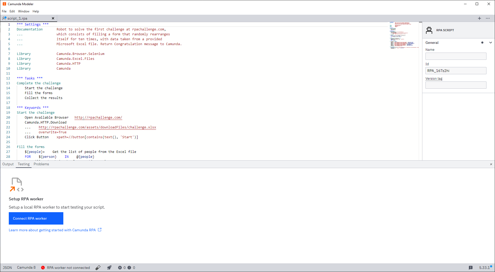
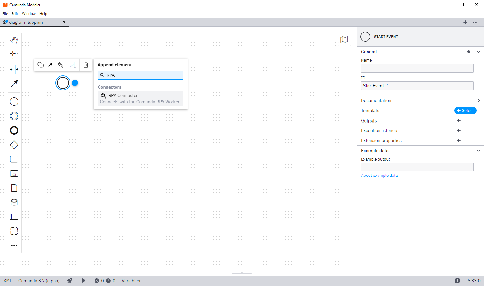
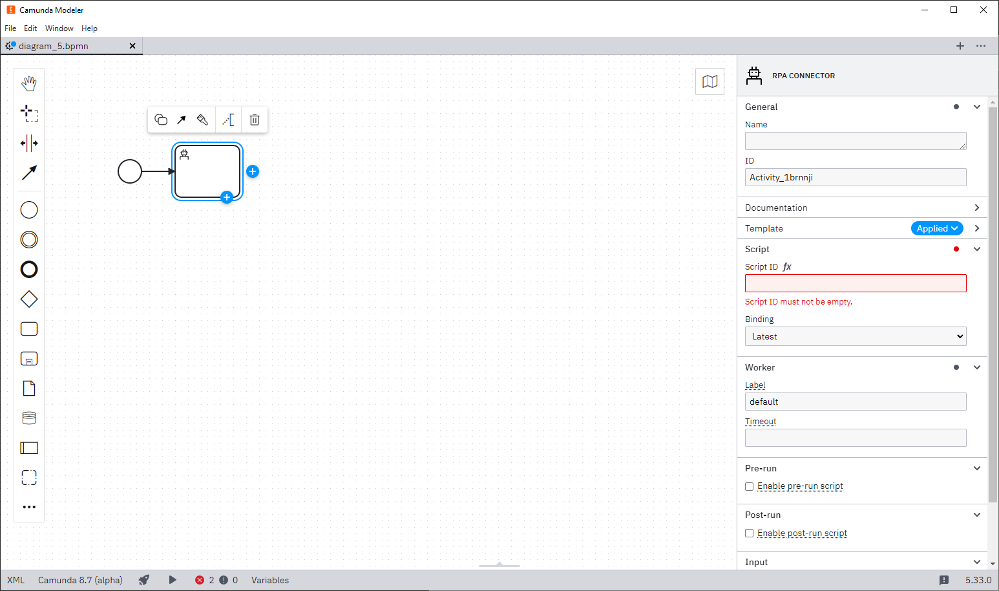

:::note
New to RPA? Visit the [overview page](/components/RPA/overview.md) to get familiar with Robotic Process Automation (RPA) capabilities.
:::

### Create your first script

<!-- TODO(marstamm): The modeler flag is only required in the alpha releases. Remove this caution for 8.7 minor relase -->

:::caution
In Camunda Modeler 5.33.1, the RPA editor is enabled only if the `--no-disable-rpa` flag is set. Check out the [Modeler Documentation](/components/modeler/desktop-modeler/flags/flags.md) to learn about setting flags.
:::
To get started with RPA, you first need to write an RPA script. [Camunda Modeler](/components/modeler/about-modeler.md) offers an interface for editing and testing your scripts:

1. **Download Camunda Modeler**: Download the latest version of Camunda Modeler from the [Camunda website](https://camunda.com/download/modeler/). As RPA scripts are run locally on your machine, the RPA editor is only available in [Desktop Modeler](/components/modeler/desktop-modeler/index.md).
2. **Open the RPA script editor**: Open Camunda Modeler and navigate to the RPA script editor under **Testing**.
   
3. **Start writing your RPA script using Robot Framework**: Use the interface provided to write your first RPA script. Scripts use the [Robot Framework](https://robotframework.org/) syntax.

### Test your script

Once you have written your script, you can test it on a local RPA worker.

1. **Start the RPA worker**:

   1. Download the latest version of the [RPA worker](https://github.com/camunda/rpa-worker/releases).
   2. Create a new file named `rpa-worker.properties` in the same directory as the RPA worker. This is the configuration file for this worker.
   3. Add `camunda.client.zeebe.enabled=false` to `rpa-worker.properties`. This disables connection to Zeebe and allows you to test scripts locally.
   4. Start the worker by running the executable.

2. **Check Desktop Modeler**: Ensure the RPA worker is now connected to Desktop Modeler. The worker should automatically connect. If not, ensure the connection URL is correct.

3. **Test the script**:
   1. Click the test tube (🧪) icon in the footer of Desktop Modeler to open the run dialog. You can add any variables you expect from the process in JSON format. Once you start the execution, the execution tab will open.
   2. Review the execution log and the variables created during the script execution within Modeler.
      

### Automate execution

Once you are happy with your script and have tested it locally, you can start automating it with Camunda.

#### Link RPA task to BPMN

1. **Deploy the RPA file**:

   1. If you haven't already, [set up client connection credentials](/guides/setup-client-connection-credentials.md) for your Modeler.
   2. Deploy your RPA script file by clicking on the rocket (🚀) icon in Modeler.
   3. Note the ID of your RPA script. You will need this in the next step.

2. **Add RPA to your process**:

   1. In Camunda Modeler, create a new BPMN file or open an existing one.
   2. Add a new task and change it to an "RPA Connector".
      
   3. Configure the task with the script ID from the previous step. Add any input mappings required for your script to work.
      

3. **Deploy and run the process**:

   1. Deploy the BPMN model with the configured RPA task.
   2. Start an instance of your process.

#### Connect worker to Zeebe

The last step is to configure the RPA worker to pick up the jobs from Camunda.

1. **Create credentials for the worker**:

   1. Create the necessary worker credentials in Console. You can follow the same steps as for the Modeler credentials. Give your new client the scopes `Zeebe` and `Secrets`.
   2. Save the generated credentials in a file named `rpa-worker.properties` in the same directory as your RPA worker executable.
   3. Add `camunda.client.zeebe.enabled=true` to `rpa-worker.properties` to start fetching jobs from Zeebe.

2. **Restart the worker**: If your worker is still running, restart it to apply the new credentials. The RPA worker should now be connected and ready to execute scripts from Zeebe.
