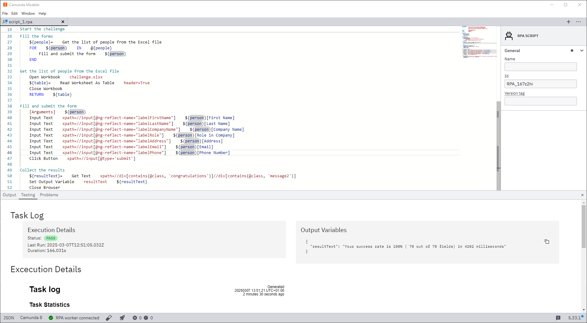

### Create your first script

To get started with RPA, you first need to write an RPA script. The Camunda Modeler offers an interface for easy editing and testing of your scripts.

1. **Download the Camunda Modeler**:

   - Download the latest version of the Camunda Modeler from the [Camunda website](https://camunda.com/download/modeler/). As RPA scripts are run locally on your machine, the RPA editor is only available in the Desktop Modeler.

2. **Open the RPA script editor**:

   - Open the Camunda Modeler and navigate to the RPA script editor.
     

3. **Start writing your RPA script using RobotFramework**:
   - Use the interface provided to write your first RPA script. Scripts use the [RobotFramework](https://robotframework.org/) syntax.

### Test your script

Once you have written your script, you can test it on a local RPA worker.

1. **Start the RPA worker**:

   - Download the latest version of the [RPA worker](https://github.com/camunda/rpa-worker/releases).
   - Create a new file `rpa-worker.properties` in the same directory as the RPA worker. This is the configuration file for this worker.
   - Add `camunda.client.zeebe.enabled=true` to `rpa-worker.properties`. This disables connection to Zeebe and allows you to test scripts locally.
   - Start the worker by running the executable.

2. **Check the Desktop Modeler**:

   - Ensure that the RPA worker is now connected to the Desktop Modeler. The worker should automatically connect. If not, ensure the connection URL is correct.

3. **Test the script**:
   - Click the 🧪 icon in the footer of the Modeler to open the run dialog. You can add any variables you expect from the process in JSON format. Once you start the execution, the execution tab will open.
   - Review the execution log and the variables created during the script execution within the Modeler.
     

### Automate Execution

Once you are happy with your script and have tested it locally, you can start automating it with Camunda.

#### Link RPA Task to BPMN

1. **Deploy the RPA file**:

   - If you don't have it already, set up client connection credentials for your Modeler by [following our guide](/guides/setup-client-connection-credentials.md).
   - Deploy your RPA script file by clicking on the 🚀 icon in the Modeler.
   - Note the ID of your RPA script. You will need this in the next step.

2. **Add RPA to your process**:

   - In the Camunda Modeler, create a new BPMN file or open an existing one.
   - Add a new Task and change it to an "RPA Connector".
     

   - Configure the Task with the Script ID from the previous step. Add any input mappings required for your script to work.
     

3. **Deploy and run the process**:
   - Deploy the BPMN model with the configured RPA task.
   - Start an instance of your process.

#### Connect Worker to Zeebe

The last step is to configure the RPA worker to pick up the jobs from Camunda.

1. **Create credentials for the worker**:

   - Create the necessary worker credentials in Console. You can follow the same steps as for the Modeler credentials. Give your new client the scopes `Zeebe` and `Secrets`.
   - Save the generated credentials in a file named `rpa-worker.properties` in the same directory as your RPA worker executable.
   - Add `camunda.client.zeebe.enabled=true` to `rpa-worker.properties` to start fetching jobs from Zeebe.

2. **Restart the worker**:
   - If your worker is still running, restart it to apply the new credentials.
   - The RPA worker should now be connected and ready to execute scripts from Zeebe.
