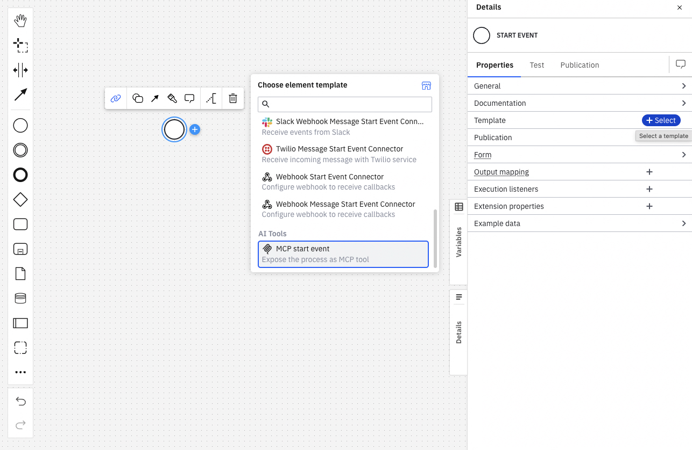

Expose a BPMN process as a callable [Model Context Protocol (MCP)](https://modelcontextprotocol.io/) tool so that AI agents and LLM-powered applications can discover and invoke it.

## About

You can configure a BPMN process as a callable MCP tool through the [Processes MCP Server](/apis-tools/processes-mcp/processes-mcp-overview.md).

It is built into the Orchestration Cluster and automatically registers processes as MCP tools when they are deployed with the [MCP start event element template](/components/connectors/out-of-the-box-connectors/agentic-ai-mcp-start-event.md).

:::tip
If your AI agent and the target process run on the **same** Orchestration Cluster, consider using a [call activity](/components/modeler/bpmn/call-activities/call-activities.md) inside the ad-hoc sub-process instead. Call activities are synchronous and maintain a connected instance hierarchy with a consistent audit trail. See [call processes as agent tools](/components/agentic-orchestration/design-architecture.md#call-processes-as-agent-tools) for a full comparison.
:::

## Prerequisites

- Access to [Web Modeler](/components/hub/workspace/modeler/launch-modeler.md) or [Desktop Modeler](/components/modeler/desktop-modeler/install-the-modeler.md).
- An [Orchestration Cluster](/components/orchestration-cluster.md) running Camunda 8.10 or later.

## Step 1: Add an MCP start event to your process

The [MCP start event element template](/components/connectors/out-of-the-box-connectors/agentic-ai-mcp-start-event.md) is an element template that you apply to a BPMN message start event. When deployed, it registers the process as an MCP tool.

1. Open your BPMN process in Modeler.
2. Select the start event (or add a new one).
3. In the properties panel, click the element template picker and select **MCP start event** from the **AI Tools** category.

## Step 2: Configure the MCP tool metadata

The properties you fill in become the MCP tool's metadata, which AI agents and LLMs use to decide when and how to call your process.

Define them in clear and concise language. Vague or incomplete metadata leads to incorrect tool selection or missing arguments.

| Property                  | Required | Description                                                                                                                                                               |
| :------------------------ | :------- | :------------------------------------------------------------------------------------------------------------------------------------------------------------------------ |
| **Name**                  | Yes      | The MCP tool identifier used by clients to call this process. Alphanumeric characters, hyphens (`-`), underscores (`_`), and dots (`.`) **only**. Maximum 100 characters. |
| **What it does**          | Yes      | A plain-language description of the process function, shown to LLMs as tool metadata.                                                                                     |
| **Which inputs it needs** | Yes      | A plain-language description of required and optional input parameters, their types, and any constraints.                                                                 |
| **When to use**           | No       | Specific situations or user intents that should trigger this tool.                                                                                                        |
| **When not to use**       | No       | Conditions or situations where this tool should not be invoked.                                                                                                           |
| **What the tool returns** | No       | The outcomes, results, and variable names the process produces on completion.                                                                                             |

## Step 3: Design the process execution

When an MCP client calls the tool:

1. The Processes MCP Server starts a new process instance with the tool call arguments mapped as process variables.
2. The server immediately returns the started process instance key to the MCP client.

You can map the incoming tool call arguments from the LLM to the process variables your process expects using the **Output mapping** property. If you don't define any explicit output mapping, all incoming tool call arguments become process variables with the same names.

## Step 4: Deploy the process

Deploy the process to your Orchestration Cluster. After deployment, the Processes MCP Server automatically registers the process as an MCP tool using the metadata you configured.

:::important Version binding
Only the latest deployed version of a process is exposed as an MCP tool. If you redeploy the process with a changed interface, existing MCP clients holding a cached reference to the old tool will receive a stale-tool error and must re-fetch the tool list. See [version binding](/apis-tools/processes-mcp/processes-mcp-version-binding.md) for more details.
:::

## Step 5: Connect an MCP client

Connect any MCP-compliant client to the Processes MCP Server.

See [Enable and connect](/apis-tools/processes-mcp/processes-mcp-setup.md) for endpoint URLs, authentication options, and other configuration details.

## Step 6: Verify

After deployment, you can verify that your process is registered as an MCP tool in the Orchestration Cluster admin UI. See [MCP processes](/self-managed/components/orchestration-cluster/admin/mcp-processes.md) to learn how.
