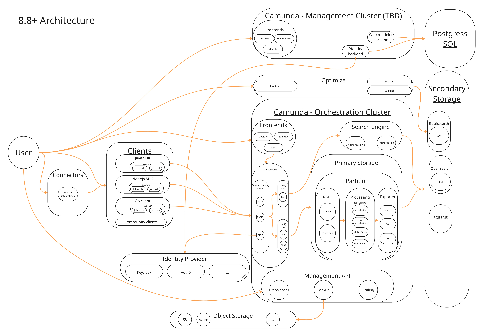

Camunda 8.8 introduced a consolidated [Orchestration Cluster](/components/orchestration-cluster.md). For a component-topology overview, see the [reference architecture](/self-managed/reference-architecture/). This page goes one level deeper: it traces how data moves through those components — and why that flow drives the sizing recommendations in the pages that follow.

<!-- Source: Miro board, exported from PR camunda/camunda-docs#8590 -->

## A tale of two storages

Every record in Camunda passes through two distinct storage layers, and understanding the difference between them is the key to understanding sizing.

**[Primary storage](/reference/glossary/#primary-storage)** is the multi Raft cluster in Camunda, with partitions as the scaling unit. Each Partition has a Raft append-only log, RocksDB to store internal state, and snapshots for compaction. All writes land here first. It is durable and strongly consistent, but it is not directly queryable from outside the cluster. Each partition has exactly one leader that is responsible for both processing commands and exporting records.

**[Secondary storage](/reference/glossary/#secondary-storage)** is an external data storage where events are written to,like: Elasticsearch, OpenSearch, or an RDBMS (available from 8.9). It is eventually consistent — populated asynchronously by the export pipeline. Everything that Operate, Tasklist, and the REST Query API reads comes exclusively from secondary storage.

## The three paths

| Path | Direction | Latency characteristic |
|---|---|---|
| Command path | Inbound (client → engine) | Synchronous, bounded by Raft |
| Export pipeline | Internal (engine → secondary storage) | Async, partition-bounded |
| Query path | Outbound (secondary storage → caller) | Depends on export pipeline lag |

### Command processing path

A command travels from the client to the primary storage to the engine and only after processing a response comes back.

The command processing path (Command lifecycle) looks like this:

**Client (REST or gRPC) → Camunda API (Gateway) → Broker (Command API) → Raft partition (log) → Raft replication → Processing Engine → event on log → RocksDB state update → Client response**

Client responses are not sent until the command is fully processed  by the engine, the engine is only able to process the command when it is commited on the log (as part of the Raft consensus protocol). The engine reads commands sequentially per partition — only one command per partition is processed at a time, and only the Raft partition leader runs the engine.

This means command response latency is bounded below by Raft commit time, engine processing time and processing queue length. In a healthy and stable cluster, this typically means sub-second response latency for simple commands.

If the engine cannot process commands fast enough; for example, because disk I/O is saturated, network latency is high or the backlog is large, the Command API applies backpressure to the client.

You can read more about this internal processing [here](https://docs.camunda.io/docs/components/zeebe/technical-concepts/internal-processing/).

### Export pipeline

After the engine processes a command, the exporter asynchronously reads records from the log and writes them to secondary storage in batches.

**The exporter runs on the same leader as the engine.** It is partition-bounded and cannot scale independently of partition count.

There are two exporters in play:

- **Camunda Exporter**: aggregates and writes enriched data to secondary storage for Operate, Tasklist, and the REST Query API.
- **Elasticsearch exporter**: writes raw engine events into specific Elasticsearch/OpenSearch indices, consumed by Optimize.

The exporter tracks its position (a checkpoint) in RocksDB. If the exporter falls behind, Zeebe reduces the record write rate via [flow control](/self-managed/operational-guides/configure-flow-control/configure-flow-control.md) to keep the backlog manageable. In extreme cases, client commands are rejected via the standard backpressure mechanism. A slow secondary storage therefore directly reduces process execution throughput.

### Query path

Operate, Tasklist, and the REST Query API (`GET /v2/...`) read exclusively from secondary storage. They never read directly from the engine.

This means query results are **eventually consistent**: there is always some lag between a command completing in the engine and the result being visible in search results or the UI. Query latency is bounded below by export pipeline lag — if the exporter is behind, queries are behind.

## Optimize data flow

Optimize sits on top of the export pipeline as a second-tier consumer:

1. The Elasticsearch exporter writes raw engine events into per-partition Elasticsearch/OpenSearch indices.
2. Optimize's **importer** reads from those indices and transforms the data into its own analytics indices.
3. Optimize writes the analytics indices **back into the same Elasticsearch cluster**.

This creates a second write pass on Elasticsearch — on top of the Camunda Exporter writes. The combined write load has significant sizing implications:

- Benchmarks show a **25–50% throughput reduction** when Optimize is enabled versus disabled, depending on workload and payload size.
- Optimize import time increases approximately linearly with payload size. A realistic payload (~11 KB) takes proportionally longer to import than a typical payload (~0.5 KB).
- With a realistic payload and 30-day retention, Optimize can consume 128 Gi of Elasticsearch disk in under 12 hours at 1 process instance per second.

**Mitigation options:** Run Optimize on a separate Elasticsearch instance to isolate its load from the core export pipeline; use variable filtering to reduce export volume; tune retention periods; disable variable import if variables are not needed in Optimize reports.

:::note
Optimize is not supported with RDBMS backends. If Optimize is required, a separate Elasticsearch instance must be present even if the core platform uses OpenSearch or RDBMS.
:::

For concrete sizing recommendations with Optimize enabled, see [Impact of Optimize](sizing-your-environment.md#impact-of-optimize).

## Data availability latency

Data availability latency is the time between an event occurring in the engine and it being queryable in Operate, Tasklist, or the REST Query API. Under a healthy setup with a well-provisioned Elasticsearch cluster, this is typically under 5 seconds.

Data availability latency degrades when:

- **Elasticsearch disk utilization exceeds ~70%**: indexing slows, the exporter queue grows, and engine backpressure kicks in.
- **Optimize is enabled**: the second write pass competes for Elasticsearch I/O, increasing overall indexing latency.

For the specific factors and recommended thresholds, see [Data availability latency](sizing-your-environment.md#data-availability-latency).

## Four scenarios

### Deploy a process definition

1. Client sends `POST /v2/deployments` → command path → engine parses the BPMN/DMN and stores the definition in RocksDB.
2. The engine emits a `PROCESS` record on the log.
3. The Camunda Exporter writes the process definition record to secondary storage.
4. The definition is now queryable via `GET /v2/process-definitions`.

:::note
A deployment is distributed across all partitions — each partition must acknowledge it. If a `CreateProcessInstance` command reaches a partition before the deployment record has propagated to that partition, the command will fail. This is expected behavior, not a bug.
:::

### Complete a service task via job worker

1. Client creates a process instance → engine executes BPMN until it reaches the service task → engine activates the job → Camunda Exporter writes a `JOB_CREATED` event to secondary storage.
2. A job worker polls and activates the job.
3. Worker completes the job → completion command goes through the command path → engine advances the token.
4. Camunda Exporter writes completion events → instance is visible as completed in Operate.

### Complete a user task

1. Engine reaches the user task → emits a `USER_TASK` record → Camunda Exporter indexes the task in secondary storage.
2. Tasklist reads from secondary storage and displays the task to the assigned user.
3. User assigns and completes the task in the Tasklist UI → completion command goes through the command path → engine resumes the token.
4. Camunda Exporter writes the updated task record (status: completed) to secondary storage.

### Exporter backpressure

1. Elasticsearch experiences slowness (disk above ~70%, resource contention, or Optimize write competition).
2. Indexing latency increases → Camunda Exporter write batches queue up.
3. Exporter position falls behind engine position → gap reaches the configurable threshold.
4. Engine applies backpressure → process execution throughput drops.
5. Recovery: free Elasticsearch disk or add resources → indexing recovers → backpressure releases → exporter catches up.

## Sizing bridge

The three paths above map directly to the factors documented in [Size your environment](sizing-your-environment.md):

- **Partition count** bounds both command path throughput and export pipeline parallelism. More partitions means more parallel processing and more parallel export, up to the available hardware.
- **Elasticsearch disk utilization** is the most common cause of operational delay degradation. Monitor and scale storage before hitting ~70%.
- **Optimize** significantly increases secondary storage write load. Size Elasticsearch separately — or use a dedicated Elasticsearch instance — if Optimize is enabled.

For hardware recommendations based on these factors, see [Size your environment](sizing-your-environment.md).
