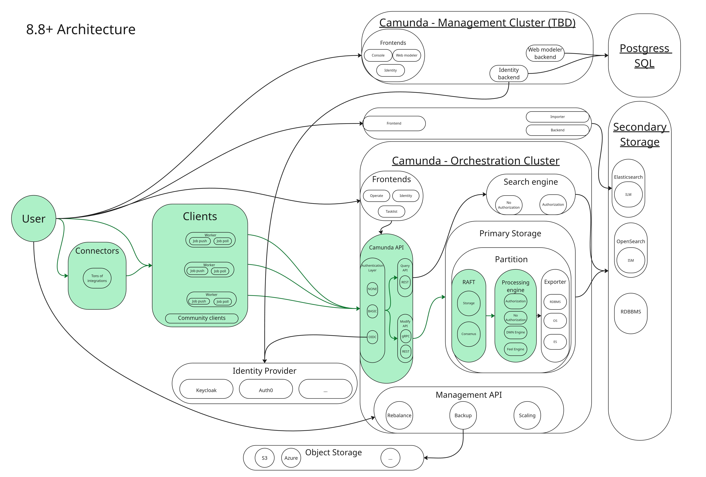
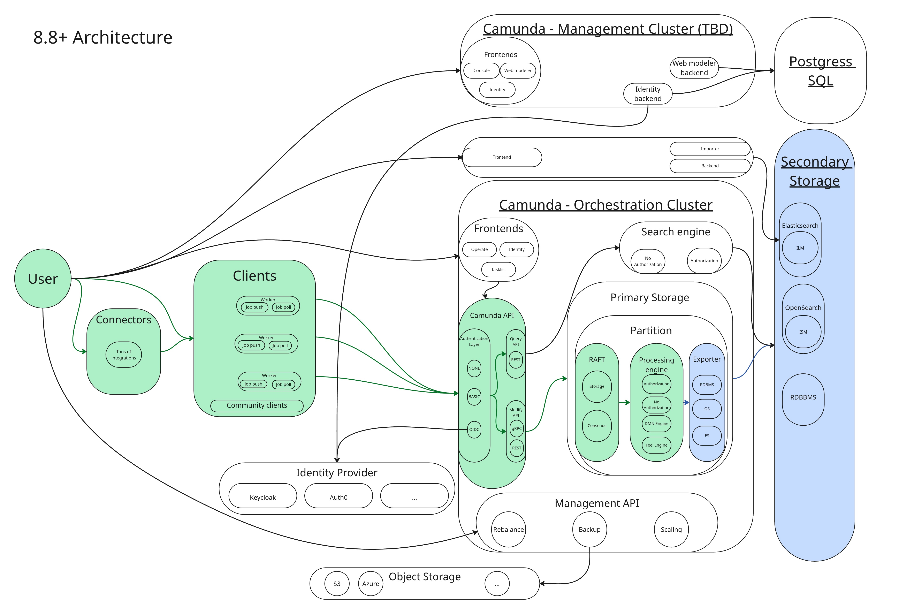
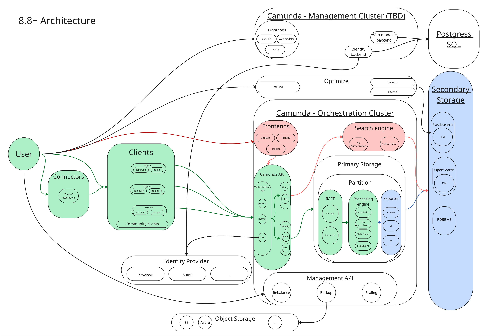

Understand how data moves through Camunda 8.8+ and why it matters when sizing your environment.

## About

Camunda 8.8 introduced a consolidated [Orchestration Cluster](/components/orchestration-cluster.md).
This is an overview of Camunda 8.8+ architecture:

<!-- Source: Miro board https://miro.com/app/board/uXjVGiNnJBc=/ -->

See the [reference architecture](/self-managed/reference-architecture/reference-architecture.md) for a component-topology overview.

### How Camunda stores data

Every record in Camunda passes through two distinct storage layers. Understanding the difference between them is the key to understanding sizing.

- **[Primary storage](/reference/glossary.md#primary-storage)** is the multi-Raft cluster in Camunda, with partitions as the scaling unit. Each partition has a Raft append-only log, RocksDB to store internal state, and snapshots for compaction. All writes land here first. It is durable and strongly consistent, but it is not directly queryable from outside the cluster. Each partition has exactly one leader responsible for both processing commands and exporting records.
- **[Secondary storage](/reference/glossary.md#secondary-storage)** is an external data storage where events are written, such as Elasticsearch, OpenSearch, or an RDBMS (available from 8.9). It is eventually consistent and populated asynchronously by the export pipeline. Everything Operate, Tasklist, Identity, and the REST Query API reads comes exclusively from secondary storage.

## Command processing path

A command travels from the client to primary storage and then to the engine. A response only comes back after processing.
Its processing path (command lifecycle) follows this pattern:

**Client (REST or gRPC) → Camunda API (Gateway) → Broker (Command API) → Raft partition (log) → Raft replication → Processing Engine → event on log → RocksDB state update → Client response**

See it in green in the diagram below:

Client responses are not sent until the command is fully processed by the engine. The engine can only process a command once it has been committed to the log (as part of the Raft consensus protocol). Commands are read sequentially per partition, only one command per partition is processed at a time, and only the Raft partition leader runs the engine.

This means command response latency is bounded below by Raft commit time, engine processing time, and processing queue length. In a healthy and stable cluster, this typically results in sub-second response latency for simple commands.

If the engine cannot process commands fast enough, for example, because disk I/O is saturated, network latency is high, or the backlog is large, the Command API applies backpressure to the client.

See [internal processing](../../zeebe/technical-concepts/internal-processing.md) for more details.

## Export pipeline

After the engine processes a command, it confirms its state change with an event on the log. Exporters asynchronously read such events from the log (only committed events) and write them to secondary storage in _batches_. See it in blue in the diagram below:

**The exporters run on the same leader as the engine.** They are partition-bounded and cannot scale independently of partition count. There are three built-in exporters in play:

- **[Camunda Exporter](../../../self-managed/components/orchestration-cluster/zeebe/exporters/camunda-exporter.md)**: aggregates and writes enriched data to secondary storage (ES/OS) for Operate, Tasklist, and the REST Query API
- **[RDBMS Exporter](../../../self-managed/components/orchestration-cluster/zeebe/exporters/rdbms-exporter.md)**: aggregates and writes enriched data to secondary storage (RDBMS) for Operate, Tasklist, and the REST Query API.
- **[Elasticsearch Exporter](../../../self-managed/components/orchestration-cluster/zeebe/exporters/elasticsearch-exporter.md) / [OpenSearch Exporter](../../../self-managed/components/orchestration-cluster/zeebe/exporters/opensearch-exporter.md)**: writes raw engine events into specific Elasticsearch/OpenSearch indices, consumed by Optimize.

The Camunda Exporter and RDBMS Exporter are mutually exclusive, only one can be enabled at a time. The Elasticsearch/OpenSearch exporter is independent and can be enabled alongside either of the other two.

:::note
Read events are applied to the registered exporters one by one, in the same order as they appear on the log. Each event is applied to ALL exporters before the next event is processed.
:::

The exporters track their position in the Exporter state (backed by RocksDB). If the exporting backlog grows over a certain threshold, Camunda reduces the record write rate via a corresponding [flow control](/self-managed/operational-guides/configure-flow-control/configure-flow-control.md) mechanics to keep the exporting backlog manageable. In extreme cases, client commands are rejected via the standard backpressure mechanism.

Exporter behavior and performance is important for the system, because:

- If an exporter falls behind, it holds up all exporters for that partition.
- Slow secondary storage directly reduces process execution throughput.
- Custom exporters can have a high impact on overall throughput if they are not performant enough.

## Query path

Operate, Tasklist, and the REST Query API (`GET /v2/...`) read exclusively from the configured secondary storage. They never read directly from the engine.
See it in red in the diagram below:

Query results depend on the performance of both the primary (processing path) and secondary storage (exporting pipeline). They are **eventually consistent**: there is always some lag between a command completing in the engine and the result being visible in search results or the UI. This is measured as the **data availability latency**.

Data availability latency is bounded below by export pipeline lag; if the exporter is behind, data availability is behind. This can be caused by a slow or overloaded secondary storage.

## Optimize data flow

Optimize sits on top of the export pipeline as a second-tier consumer. See it in violet in the diagram below:

1. The Elasticsearch/OpenSearch exporter writes raw engine events into per-partition Elasticsearch/OpenSearch indices.
2. Optimize's **importer** reads from those indices and transforms the data into its own analytics indices.
3. Optimize writes the analytics indices **back into the same or another Elasticsearch/OpenSearch cluster**.

This means Optimize has an additional hop in the data flow compared to Operate and Tasklist, and it writes to secondary storage twice: once for the raw events and once for the analytics indices. As a result, data availability latency for Optimize is higher than for Operate and Tasklist, and the overall write load on Elasticsearch/OpenSearch is significantly higher when Optimize is enabled.

:::note
This is exactly why the architecture was changed in 8.8: the Camunda Exporter now aggregates the data for Operate and Tasklist, which previously both used an Exporter-Importer architecture similar to Optimize. See this [blog post](https://camunda.com/blog/2025/02/one-exporter-to-rule-them-all-exploring-camunda-exporter/) for more details.
:::

See the [sizing guide](./sizing-your-environment.md#impact-of-optimize) for the full impact of running Optimize and how to reduce it.

:::note
Optimize is not supported with RDBMS backends. If Optimize is required, a separate Elasticsearch/OpenSearch instance must be present even if the core platform uses RDBMS.
:::

## Performance and sizing factors

The paths above map directly to the factors to consider when [sizing your environment](sizing-your-environment.md):

- **Partition count** bounds both command path throughput and export pipeline parallelism. More partitions means more parallel processing and exporting, up to the available hardware.
- **Elasticsearch/OpenSearch resources** is the most common cause of operational delay and degradation. Monitor and scale storage before hitting performance bottlenecks.
- **Optimize** significantly increases secondary storage write load. Size Elasticsearch/OpenSearch accordingly, or use a dedicated Elasticsearch/OpenSearch instance, if Optimize is enabled.

For hardware recommendations based on these factors, see how to [size your environment](sizing-your-environment.md).
