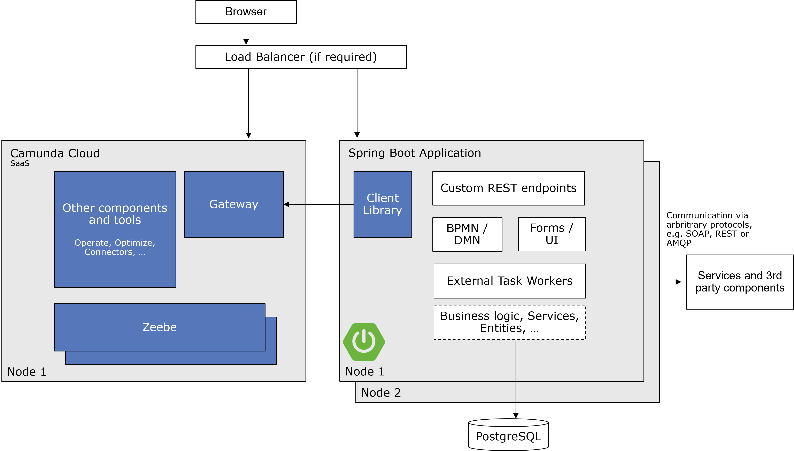

This document provides guidance on selecting the appropriate technology stack for your Camunda 8 project, especially if you don't have special architecture requirements. We recommend using SaaS for a streamlined experience.

:::caution Camunda 8
This best practice specifically targets Camunda 8. For Camunda 7, please refer to [Deciding about your Camunda 7 stack](../deciding-about-your-stack-c7/).
:::

## The Greenfield Stack

Our greenfield stack recommendation is a result of extensive discussions and evaluations. While not the only option, it is a solid choice if there are no specific reasons to choose an alternative. Your choice of programming language should align with your team's expertise; we suggest Java or JavaScript for their broad applicability and support.

### The Java Greenfield Stack

For a Java-based setup using Camunda 8 SaaS and Spring Boot, use the following stack:

1. **Camunda 8 SaaS:**

   1. **Sign Up:** Users need to sign up for Camunda 8 SaaS. This can be done through the [Camunda SaaS registration page.](https://signup.camunda.com/accounts?utm_source=docs.camunda.io&utm_medium=referral)
   2. **Create a Cluster:** After signing up, users should create a cluster. They can follow the guide on [Creating a Cluster in Camunda 8](https://docs.camunda.io/docs/guides/create-cluster/) which provides step-by-step instructions on setting up a new cluster in the Camunda 8 environment.

2. **Spring Boot:**

   1. **Develop a Spring Boot Application:** Users should develop their process solutions as [Spring Boot](https://spring.io/projects/spring-boot) applications. This involves setting up a new Spring Boot project, either manually or using tools like [Spring Initializr](https://start.spring.io/).
   2. **Integrate Spring Zeebe:** Integrate [Spring Zeebe](https://github.com/camunda-community-hub/spring-zeebe) into the Spring Boot project by adding necessary dependencies to the project’s pom.xml file and configuring the application to use Camunda services.

3. **Maven:**

   1. **Use Maven for Build Management:** [Maven](https://maven.apache.org/) should be used to manage the build lifecycle of the application.

4. **IDE Selection:**

   1. **Choose an IDE:** Select an Integrated Development Environment (IDE) that supports Java development, Maven, and Spring Boot. Frequently used options include Visual Studio Code, IntelliJ IDEA, or Eclipse.

5. **Java Runtime:**

   1. **Install OpenJDK 17:** Install and use OpenJDK 17 as your Java runtime environment. Download it from the [official JDK 17 download page](https://jdk.java.net/17/).

6. **Modeling:**

   1. **Use Camunda Desktop Modeler:** Download and use the Camunda Modeler for designing and modeling business processes. The Modeler is available here.

7. **Code Integration:**
   1. **Integrate Code and Models:** Incorporate all Java code and BPMN process models into the Spring Boot project, ensuring that they are structured correctly and referenced properly within the application.

## Running the Process Application:

To run the process application, transfer the `jar` to the desired server.

Start the application using the command `java -jar YourProcessApplication.jar`. Frequently, this deployment process is managed through Docker for ease of use.

For a practical implementation, refer to our [example application on GitHub](https://github.com/camunda-community-hub/camunda-cloud-examples/tree/main/twitter-review-java-springboot), which demonstrates a typical setup for a Spring Boot-based process application with Camunda.

## Why This Stack?

- SaaS simplifies workflow engine integration.
- Spring Boot is widely adopted for Java application development.
- Flexible for both on-premise and cloud environments.

Discover more in our [getting started guide for microservices orchestration](https://docs.camunda.io/docs/guides/orchestrate-microservices/) or the [Spring Zeebe instructions](https://github.com/camunda-community-hub/spring-zeebe).

## Customize Your Stack

### Polyglot Stacks

You can develop process solutions as described with Java above also in any other programming language. Simply use the [existing language clients / SDKs](../../../apis-tools/working-with-apis-tools.md) for doing this.

### Running Camunda 8 Self-Managed

Run Camunda 8 on your Kubernetes cluster. For local development, a [Docker Compose configuration is available](https://docs.camunda.io/docs/self-managed/platform-deployment/docker/), though not for production use. Learn more in the [deployment docs](https://docs.camunda.io/docs/self-managed/platform-deployment/overview/).

## Further References

Find more information in the [Camunda Platform 8 Documentation](https://docs.camunda.io/), or join the [Camunda Platform 8 Forum](https://forum.camunda.io/) and [Camunda Platform 8 Slack](https://camunda-cloud.slack.com/) community.
