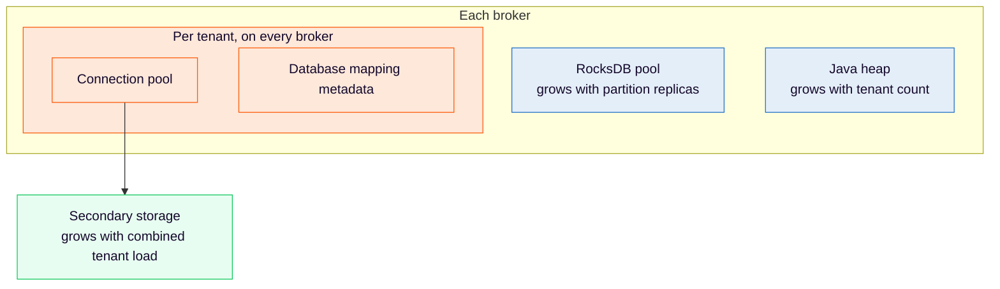

<span class="badge badge--platform">Self-Managed only</span>

Learn how to size broker memory, secondary storage, and noisy neighbor limits when you run multiple [Physical Tenants](/self-managed/concepts/physical-tenants/index.md) on one Orchestration Cluster.

:::note
This guide covers only what changes when you add tenants. Start from [Self-Managed resource planning](sizing-self-managed.md) for the baseline configuration, partitions, disk, RocksDB, and Elasticsearch/OpenSearch. Figures here are directional observations from internal Camunda 8.10 tests, not capacity guarantees. Your limit is whichever resource runs out first in your environment.
:::

## Understand the sizing model

Tenants share brokers, gateways, and actor threads, but each tenant brings its own partitions, exporters, and secondary storage connections. The default tenant counts as a tenant in every formula on this page.



| Resource                                    | Scales with                                                      |
| :------------------------------------------ | :--------------------------------------------------------------- |
| Engine CPU, replication, and broker disk    | Total partitions and throughput across all tenants               |
| RocksDB memory (native)                     | Partition replicas per broker, across all tenants                |
| Java heap (RDBMS)                           | Tenant count, on every broker, regardless of partition placement |
| RDBMS connections                           | Brokers × tenants × pool size                                    |
| Secondary storage capacity                  | Combined load of all tenants that share an instance or cluster   |
| Elasticsearch/OpenSearch indices and shards | Tenants that share a cluster, each with its own index prefix     |
| CPU throttling and thread count             | Tenant count, because each adds stream processors and exporters  |

To see which infrastructure tenants share, read [what is not isolated](/self-managed/concepts/physical-tenants/index.md#what-is-not-isolated).

## Size broker memory

Size native RocksDB memory and Java heap separately. RocksDB memory grows with partition replicas per broker, and Java heap grows with the tenant count.

### Size RocksDB memory

Each partition replica on a broker, leader or follower, needs at least 32 MiB of RocksDB memory, and by default all tenants' replicas share one pool. The broker checks this at startup for every allocation strategy. With the default `FRACTION` strategy:

```text
broker memory × memory-fraction  ≥  partition replicas on the broker × 32 MiB

partition replicas on the broker  =  Σ over tenants (partitions × replication factor) / brokers
```

:::warning
If the check fails, the broker doesn't start and logs `Expected the allocated memory for RocksDB per partition to be at least 33554432 bytes, but was <bytes> bytes.`
:::

For example, [baseline](sizing-self-managed.md#baseline-resource-configuration) brokers with 2 GiB and the default fraction of `0.1` have about 205 MiB, enough for six replicas. With three brokers and three partitions at replication factor three per tenant, each tenant adds three replicas per broker, so a third tenant stops the brokers from starting.

To meet the minimum, raise broker memory, raise `camunda.data.primary-storage.rocksdb.memory-fraction`, change the RocksDB allocation strategy, or add brokers. A higher fraction leaves less memory for the heap and page cache, so raising broker memory is usually safer.

See [memory](sizing-self-managed.md#memory) for how these budgets fit together. Disk is a separate budget, covered in [RocksDB](sizing-self-managed.md#rocksdb).

### Size Java heap

With RDBMS secondary storage, every broker creates a connection pool and database mapping metadata for every tenant at startup. Heap usage grows with the tenant count, independent of load and broker count. If the heap is too small, brokers run out of memory during startup, so validate heap at your target tenant count.

In an internal test, each tenant held about 4.4 MB of heap, about 700 MB across 160 tenants. The figure covers only the retained database mapping metadata, so treat it as a lower bound. The heap cost per tenant for Elasticsearch or OpenSearch hasn't been measured.

<details>
  <summary>Heap test configuration</summary>

Camunda 8.10 with 160 tenants plus the default tenant, one partition each, replication factor three. 20 brokers with 6 vCPU, 8 GiB memory, and a 2 GiB heap. PostgreSQL behind PgBouncer. Brokers ran out of memory at startup, before any load.

</details>

## Size secondary storage

Secondary storage is usually the first bottleneck as you add tenants. Size a shared database instance or cluster for the combined load of all its tenants. Size a dedicated instance for its own tenant, using the general [secondary storage](sizing-your-environment.md#secondary-storage) guidance.

### Size RDBMS connections

Each broker opens one HikariCP connection pool per tenant at startup, so connections scale with brokers and tenants, not partitions:

```text
idle connections     =  brokers × tenants × minimum-idle
maximum connections  =  brokers × tenants × maximum-pool-size
```

With the defaults (`maximum-pool-size` `10`, `minimum-idle` `2`), three brokers and four tenants can open 120 connections, above the PostgreSQL default `max_connections` of 100. Calculate this for each database instance, counting only its tenants, and either raise the database limit or add a connection pooler. You can override [pool properties](/self-managed/concepts/databases/relational-db/configuration.md#connection-pool-configuration) for each tenant.

HikariCP metrics carry the `physicalTenant` tag. If data availability latency rises as you add tenants, check pool saturation before adding database capacity.

#### Use a connection pooler

Camunda doesn't ship or require a connection pooler. If you use one, such as PgBouncer, validate it with your own load and size its limits separately:

| Limit                         | What it caps                                    | Compare it against                       |
| :---------------------------- | :---------------------------------------------- | :--------------------------------------- |
| PgBouncer `max_client_conn`   | Client connections from all brokers and tenants | Brokers × tenants × `maximum-pool-size`  |
| PgBouncer `default_pool_size` | Server connections per database and user pair   | Concurrent queries the tenants need      |
| PostgreSQL `max_connections`  | Backend connections on the database server      | Sum of server connections from all pools |

Camunda's tests used PgBouncer in transaction pooling mode with `prepareThreshold=0` on the JDBC URL. The PgBouncer defaults were too low: a `default_pool_size` of 20 limited throughput with 24 partitions, and a `max_client_conn` of 100 was exhausted at 120 tenants.

#### Reduce table row count metric queries

The RDBMS table row count metric queries the database for each tenant on every broker, every `camunda.data.secondary-storage.rdbms.metrics.table-row-count-cache-duration` (default `5m`). Camunda 8.10.0 batches these into one query per tenant per broker, which fixed periodic database CPU spikes at high tenant counts ([camunda/camunda#62967](https://github.com/camunda/camunda/issues/62967)). On earlier versions, or if CPU spikes still match this interval, increase the duration.

#### Spread tenants across database instances

Tenants that share one database compete for its capacity. If tenants run at high load together, give them separate [database instances](/self-managed/concepts/physical-tenants/storage-isolation.md#rdbms-storage).

In an internal test with 10 tenants at maximum load, one shared instance reached 69% of the throughput of 10 single-tenant clusters, unevenly spread across tenants. Two instances with five tenants each reached 88%, evenly spread.

<details>
  <summary>Database split test configuration</summary>

10 tenants, three partitions each, replication factor three, 30 brokers. PostgreSQL behind PgBouncer. Optimize disabled.

</details>

### Size Elasticsearch and OpenSearch

Each tenant that shares an Elasticsearch or OpenSearch cluster has its own index prefix and indices. Size the cluster for:

- Aggregate write load: The combined export load of all tenants, at their combined peak.
- Shard budget: Every tenant adds indices. Count all tenants in the [shard budget](sizing-your-environment.md#elasticsearchopensearch-shard-budget).
- Disk: The sum of each tenant's data volume under its own retention settings.

For scale, an internal test split the [realistic baseline workload](sizing-self-managed.md#baseline-performance) across five tenants. The workload met the baseline targets, but broker CPU rose 24%, CPU throttling rose about eight times, and Elasticsearch held about 290 indices.

<details>
  <summary>Elasticsearch test configuration</summary>

Five tenants, three partitions each, replication factor three. Three brokers with 3 vCPU and 2 GiB, `memory-fraction` `0.3`. Three Elasticsearch nodes with 7 vCPU and 8 GiB. 40-minute window.

</details>

## Plan for noisy neighbors

A busy tenant mainly costs tenants that share its brokers and secondary storage latency, not throughput.

### Understand the observed effects

In an internal test on a prerelease 8.10 build, eight tenants shared three brokers (6 vCPU, 8 GiB) and PostgreSQL behind PgBouncer. Quiet tenants ran a typical workload at 6 process instances per second (PI/s) and kept that throughput while one tenant's load increased:

| Noisy tenant offered load | Quiet tenants' request-response p99 |
| :------------------------ | :---------------------------------- |
| 6 PI/s (baseline)         | 0.05–0.06 s                         |
| 24 PI/s                   | 0.15–0.20 s                         |
| 48 PI/s                   | 1.13–1.72 s                         |
| 96 PI/s                   | 2.48–3.20 s                         |

The noisy tenant's throughput leveled off at about 33–35 PI/s. At the highest load, quiet tenants' data availability p99 rose from about 1 s to 3.4–3.9 s. Latency returned to the baseline when the load dropped.

Raising the noisy tenant from three to 12 partitions at 6 PI/s barely changed quiet tenants' p99 (about 50 ms to 54–66 ms). It used about 0.73 more broker CPU cores across the cluster and 2.2–2.5 GiB more disk per broker.

### Limit tenant load with flow control

Use [flow control](/self-managed/operational-guides/configure-flow-control/configure-flow-control.md) to limit what a tenant can write:

- Static configuration: Override `camunda.processing.flow-control.write.*` under `camunda.physical-tenants.<tenant-id>`.
- Runtime change: Call `POST actuator/flowControl?physicalTenant=<tenant-id>`. Without the parameter, the change applies to every tenant. Runtime changes revert when the broker restarts.

Flow control isn't a direct cap for each tenant:

- The write limit applies to each partition, so a tenant's ceiling is roughly the limit times its partition count.
- Throttling reacts to each partition's export backlog. In the 10-tenant PostgreSQL test described earlier, one slow shared database throttled tenants unevenly.
- Limits count records, not bytes or CPU time. Large payloads or expensive processing can use more shared resources at the same record rate.

Runaway loops and large multi-instance elements are bounded by write limits. Expressions are canceled after [`camunda.expression.timeout`](/self-managed/components/orchestration-cluster/core-settings/configuration/properties.md#expression) (default `5s`) and raise an incident.

## Know the current limitations

These limitations apply to Camunda 8.10.0:

- Per-tenant RDBMS infrastructure on every broker: The Physical Tenant count is bounded by single-broker heap and database connections. Adding brokers doesn't add tenant capacity and increases total connections. See [camunda/camunda#61935](https://github.com/camunda/camunda/issues/61935).
- Tested range: Sizing tests cover tens of Physical Tenants per cluster. Load test your own target if you plan for more.
- No performance guarantee for each tenant: If one Physical Tenant needs high throughput or strict latency on its own, validate it with dedicated load tests or use a separate cluster.
- Single secondary storage type: All tenants must use the same type. See [storage isolation](/self-managed/concepts/physical-tenants/storage-isolation.md#known-limitations).

## Validate your configuration

Before production, check:

- Representative load: Each tenant's real process models, payload sizes, and job workers.
- Concurrent load: All tenants at peak together, and one tenant above its peak.
- Database connections: HikariCP pending connections and timeouts by `physicalTenant`, pooler waiting clients, and database connections against `max_connections`.
- Heap: Heap usage and GC time after startup with all tenants, before load.
- CPU throttling: Container throttling, not only average CPU.
- Latency: Request p99 and data availability p99 for each tenant.
- Startup: A rolling restart and adding a tenant. The RocksDB check and heap exhaustion fail at startup, not under load.
