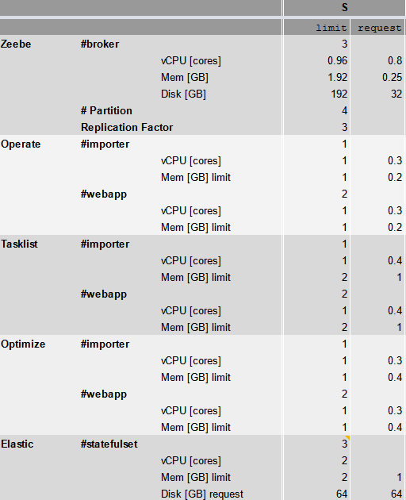

In order to define and size your environment for Camunda Cloud appropriately, you need to understand the factors that influence hardware requirements. Then you can apply this knowledge to select the appropriate Camunda Cloud SaaS hardware package or size your self-managed Kubernetes cluster.

:::caution Camunda Cloud only
This best practice targets Camunda Cloud only! If you are looking at Camunda Plaform, please visit [Sizing your Camunda 7 environment](../sizing-your-environment-c7/).
:::

## Understanding influencing factors

Let's understand the important numbers.

### Throughput 

Throughput defines, how many process instances can be executed in a certain timeframe. 

It is typically easy to estimate the number of **process instances per day** you need to execute. If you only know the number of process instances per year, we recommend to divide this number by the 250 (average number of working days in a year). 

Unfortunately, the hardware sizing depends very much on the **number of BPMN service tasks** in a process model. In a nutshell, you will have a much higher throughput for processes with one service task than for processes with 30 service tasks. If you don't yet know the number of service tasks, we recommend to use 10 service tasks as a rule of thumb.

If you already know your future process model, you can use this to count the number of tasks for your process. For example, the following onboarding process contains five service tasks in a typical execution.

This allows you to calculate the required number of **tasks per day (tasks/day)** which can also be converted into **tasks per second (tasks/s)** (devide by 24 hours \* 60 minutes \* 60 seconds). 

| Indicator | Calculation method | Number |
| :- | :-: | -: |
| Onboarding Instances per year |  | 5,000,000 |
| Process instances per business day | /250 | 20,000 |
| Tasks per day | /5 | 4,000 |
| Tasks per second | /(24*60*60) | 0.05 |

### Peak loads

In most scenarios, your load will be volatile and not constant. For example, your company might start 90% of their monthly process instances in the same day of the month. The ability to handle those peaks is the more crucial requirement and should drive your decision instead of looking at the average load.

So in the above example, the one day with the peak load defines your throughput requirements.

In most cases, we define throughput per day, as this time frame is easier to understand. But in high-performance use cases you might need to define the throughput per second. This is especially important, if you need to gurantee certain cycle times even within peak loads. The cycle time is the time a process (or sometimes only single tasks) takes to complete. For example, the number of milliseconds a fully automated process with 10 tasks takes.

Your calculation might look different if you have peak loads:

| Indicator | Calculation method | Number |
| :- | :-: | -: |
| Onboarding Instances per year |  | 5,000,000 |
| Expected process instances on peak day |  | 150,000 |
| Tasks per second within 8 business hours on peak day | /(8*60*60) | 5.20 |
| Tasks per second with buffer | *10 | 52.08 |

If cycle time matters, you might even plan for more buffer, as the tasks will not be evenly distributed within the 8 business hours. The exact buffer depends on the severity of delays, a good rule of thumb is to plan for 10 times the tasks per second.

### Disk space

The workflow engine itself will store data along every process instance, especially to keep the current state persistent. This is unavoidable. In case there are human tasks, data is also sent to Tasklist and kept there, until tasks are completed. 

Furthermore, data is also sent Operate and Optimize. These tools keep data in Elasticsearch and also store historical audit data. The total amount of disk space can be reduced by using **data retention settings**. As a rule of thumb, we typically delete data in Operate after 30 days, but keep it in Optimize for a longer period of time to allow more analysis.

The data you attach to a process instance as process variables will influence disk space requirements. For example, it makes a big difference if you only add one or two strings (requiring ~ 1kb of space) to your process instances, or a full JSON document containing 1MB.

Assuming a [typical payload of 15 process variables (simple strings, numbers or booleans)](https://github.com/camunda-cloud/zeebe/blob/develop/benchmarks/project/src/main/resources/bpmn/typical_payload.json) we measured the following approximations for disk space requirements using Camunda Cloud SaaS 1.2.4. Please note, that these are not exact numbers!

* Zeebe: 0.0000145 GB/PI (TODO: ADJUST)
* Operate: 
* Optimize: 

## Understanding sizing and scalability behavior

Spinning up a Zeebe Cluster means you run multiple components that all need resources in the background, like the Zeebe broker, Elasticsearch (as the database for Operate, Tasklist, and Optimize), Operate, Tasklist, and Optimize. All those components need to be equiped with resources.

All components are clustered to provide high-availability, fault-tolerance and resiliency. 

This work is delegated to Kubernetes. Every components runs as a so-called pod, that gets resources assigned. These resources can be vertically scaled (=get more or less hardware resources assigned) within certain limits. Note that vertically scaling not always results in more throughput, as the various components need to be adjusted on each other. This is a complex topic and requires running experiments with benchmarks. In general, we recommend to stick to defined default hardware packages as defined below unless you have requirements that justify own tuning.

Zeebe scales horizontally by adding more cluster nodes (pods). This is limited by the so-called partition size of a Zeebe cluster, as the work within one partition cannot be parallelized by design. Hence, you need to define enough partitions to utilize your cluster or to have some buffer if your load increases later on. The number of partitions cannot be changed after the cluster was initially provisioned (at least not yet), so elastic scalability of cluster nodes is (not yet) possible.

Camunda licensing does not depend on the provisioned hardware resources, making it easy to size according to your needs.

## Sizing your runtime environment 

With the above numbers, you can select a hardware package that will fulfill your requirements.

### Camunda Cloud SaaS

Camunda Cloud defines three fixed hardware packages you can select from. The table below gives you an indication what requirements you can fullfill with these. If your requirements are above the mentioned numbers, please contact us to discuss a customized sizing.

|                                              | S                               | M                               | L                                |
| :------------------------------------------- | ------------------------------: | ------------------------------: | -------------------------------: |
| Max Throughput **Tasks/day**                 | 1.7 M                           | 19 M                            | 28 M                             |
| Max Throughput **Tasks/second**              | 20                              | 220                             | 320                              |
| Max Throughput **Process Instances/day**     | 0.2 M                           | 1.9 M                           | 3 M                              |
| Data Retention in Operate                    | 30 days                         | 30 days                         | 30 days                          |
| Data Retention in Optimize                   | 6 months                        | 6 months                        | 6 months                         |
| Max Total Number of Process Instances        | 5.4 M                           | 17 M                            |                                  |
| Typically used for licensing tier **\***     | XS, S, M, L, XL                 | XXL                             |                                  |
| Approx resources provisioned **\*\***        | 15 vCPU, 20 GB mem, 640 GB disk | 28 vCPU, 50 GB mem, 640 GB disk | 56 vCPU, 85 GB mem, 1320 GB disk |

**\*** This information tells you, which cluster size you would need to fully utilize your volume tier from your Camunda license. Please note, that this is looking at a load that is distributed evenly over time, your peak loads might still justify a bigger cluster.

**\*\*** The numbers in the table where measured using Camunda Cloud 1.2.4 and [the official benchmark project](https://github.com/camunda-cloud/zeebe/tree/develop/benchmarks) (load generation was running on an own Kubernetes Cluster). The mentioned resources are the resource limits configured in the Kubernetes cluster and are subject to change.

### Camunda Cloud Self-Managed

When provisioning Camunda Cloud yourself onto your self-managed Kubernetes cluster, we recommend to follow the sizing we do for Camunda Cloud SaaS. The below table gives you the current resources configuration for the three hardware packages.

## Running experiments and benchmarks

If you are in doubt about which package to choose, you can do a load test with a representative workload with the target hardware package. This will help you decide if the specific package can serve your needs. 

This is definitely recommend, if you want to setup a cluster that can handle more load than the standard packages.

Use the [Zeebe benchmark project](https://github.com/camunda-cloud/zeebe/tree/develop/benchmarks/setup) to setup a benchmark. 

You need access 

 * Kubectl https://kubernetes.io/de/docs/tasks/tools/install-kubectl/