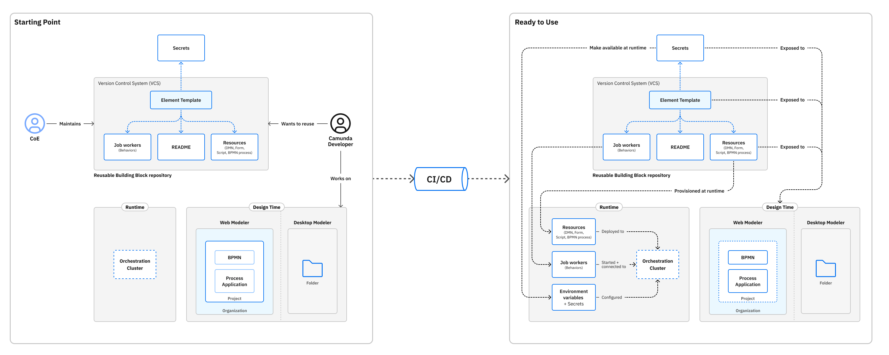

To effectively manage large libraries of reusable building blocks ([element templates](/components/concepts/element-templates.md)), you can create a pipeline that:

- Provisions the [dependencies of element templates](/components/modeler/element-templates/element-template-with-dependencies.md) to required clusters.
- Makes templates available at design time to multiple Web Modeler [shared projects](/components/modeler/web-modeler/use-shared-project-for-organization-wide-collaboration.md) within an organization.



This guide covers conceptually what your pipeline needs to do, from obtaining credentials to runtime provisioning and template syncing.

## Prerequisites

Before building your pipeline, ensure you have the following:

| Prerequisite                                                                                                                    | Purpose                                                                         |
| ------------------------------------------------------------------------------------------------------------------------------- | ------------------------------------------------------------------------------- |
| [VCS repository](https://en.wikipedia.org/wiki/Version_control)                                                                 | Store all element templates                                                     |
| System of record                                                                                                                | Track which templates are required in each cluster and which projects need them |
| [Web Modeler API token](/apis-tools/web-modeler-api/authentication.md)                                                          | Access Web Modeler programmatically                                             |
| [Orchestration Cluster API client](/apis-tools/orchestration-cluster-api-rest/orchestration-cluster-api-rest-authentication.md) | Provision dependencies to clusters                                              |

For simplicity, this guide assumes:

- One organization
- One cluster
- One Web Modeler project
- A pipeline handling runtime provisioning and template syncing

## Runtime provisioning

### Secrets

Secrets are required to authenticate the pipeline with your cluster and Web Modeler:

- **SaaS**: Use the [Administration API](/apis-tools/administration-api/administration-api-reference.md) or [Console UI](/components/console/manage-clusters/manage-secrets.md) to configure secrets.
- **Self-Managed/local development**: Configure secrets outside the pipeline. See [connector secrets](/self-managed/components/connectors/connectors-configuration.md#secrets).

### Job Workers

As part of the pipeline, you may spin up a service to connect to the cluster, or handle it in a separate pipeline.

Recommended resources:

- [Outbound connectors vs. job workers](/components/concepts/outbound-connectors-job-workers.md)
- [Host custom connectors](/components/connectors/custom-built-connectors/host-custom-connector.md)

### Other dependencies

The following dependency types are provisioned at runtime using the [Orchestration Cluster API](/apis-tools/orchestration-cluster-api-rest/orchestration-cluster-api-rest-overview.md):

| Dependency                                                            | Purpose                     |
| --------------------------------------------------------------------- | --------------------------- |
| [Camunda forms](/components/modeler/forms/camunda-forms-reference.md) | Used in user tasks          |
| [RPA scripts](/components/rpa/overview.md)                            | Used in service tasks       |
| [BPMN processes](/components/modeler/bpmn/bpmn.md)                    | Used in call activities     |
| [DMN decisions](/components/modeler/dmn/dmn.md)                       | Used in business rule tasks |

To deploy dependencies, send a [POST request](/apis-tools/orchestration-cluster-api-rest/specifications/create-deployment.api.mdx) with the files. This works for SaaS, self-managed, and local development.

When referencing a dependency such as a form, Camunda recommends using a `versionTag` as your [binding type](/components/best-practices/modeling/choosing-the-resource-binding-type.md#supported-binding-types). This option ensures the right version of the target resource is always used.

## Making templates available in Web Modeler

The pipeline can make templates available in Web Modeler using the [Web Modeler API](/apis-tools/web-modeler-api/index.md):

1. **Get project metadata**: Retrieve the project ID to know which content is available. This allows the pipeline to translate repository changes into CRUD operations.

```json title="POST /api/v1/projects/search"
{
  "filter": {
    "name": "(PROJECT NAME)"
  },
  "page": 0,
  "size": 50
}
```

Pagination is enforced for all `search` endpoints. Ensure you retrieve all relevant pages. Alternatively, a separate system of record can maintain project IDs.

2. **Get file metadata**: With the project ID, retrieve a list of files and metadata to check which repository files need to be created or updated.

```json
{
  "filter": {
    "projectId": "(PROJECT ID)"
  },
  "page": 0,
  "size": 50
}
```

3. **Create or update files**: For each repository file, execute the appropriate request based on whether it needs to be [created](https://modeler.camunda.io/swagger-ui/index.html#/Files/createFile) or [updated](https://modeler.camunda.io/swagger-ui/index.html#/Files/patchFile).
4. **Publish versions**: For each file, determine if a new version is needed and publish it to the project using the [Versions](https://modeler.camunda.io/swagger-ui/index.html#/Versions) resource. This makes the templates available to BPMN diagrams inside the project.

## Making templates available in Desktop Modeler

To set up your local environment:

- Access the VCS repository containing the templates.
- Choose how to [configure them](/components/modeler/desktop-modeler/element-templates/configuring-templates.md) depending on your needs. If your templates are reused across multiple projects, configuring them globally will make it easier to maintain. For project-specific templates, consider making them available only for that project to avoid exposing templates to projects that should not be using them.

:::note
If you are the template creator/maintainer, include a `README` file in your repository that lists the requirements for using your templates -- for example, which dependencies need to be provisioned in advance.
:::

## Next steps

Refer to [Integrate Web Modeler in CI/CD](/components/modeler/web-modeler/integrate-web-modeler-in-ci-cd.md) for additional CI/CD-related guidance.
