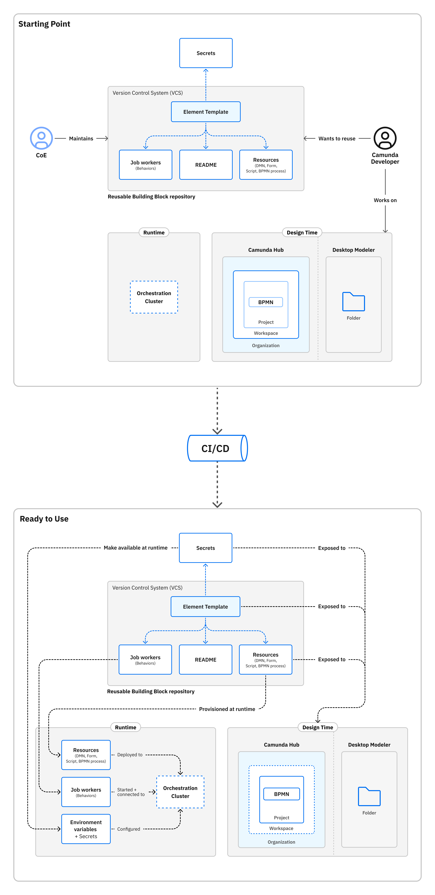

To effectively manage large libraries of reusable building blocks ([element templates](/components/concepts/element-templates.md)), you can create a pipeline that:

- Provisions the [dependencies of element templates](/components/modeler/element-templates/element-template-with-dependencies.md) to required clusters.
- Makes templates available at design time to multiple [workspaces](/components/hub/workspace/modeler/collaboration/use-shared-project-for-organization-wide-collaboration.md) within an organization.

<!--- source: https://www.figma.com/design/VyyoV0hNbazXV8DKcMMEU9/Camunda-Documentation-Assets?node-id=2078-301&t=YNT70ktAMXBBupbJ-1 --->



This guide covers conceptually what your pipeline needs to do, from obtaining credentials to runtime provisioning and template syncing.

## Prerequisites

Before building your pipeline, ensure you have the following:

| Prerequisite                                                                                                                           | Purpose                                                                                                                                                                                                                                                         |
| -------------------------------------------------------------------------------------------------------------------------------------- | --------------------------------------------------------------------------------------------------------------------------------------------------------------------------------------------------------------------------------------------------------------- |
| [Git Repository](https://en.wikipedia.org/wiki/Git)                                                                                    | Store all element templates                                                                                                                                                                                                                                     |
| Template state management                                                                                                              | Maintain an authoritative inventory (for example, via Git or an IaC tool like Terraform) that defines which templates are applied to each cluster and which workspaces depend on them. This source acts as the single source of truth for template deployments. |
| Camunda Hub API token ([SaaS](/apis-tools/hub-api-saas/authentication.md) or [Self-Managed](/apis-tools/hub-api-sm/authentication.md)) | Access Camunda Hub programmatically                                                                                                                                                                                                                             |
| [Orchestration Cluster API client](/apis-tools/orchestration-cluster-api-rest/orchestration-cluster-api-rest-authentication.md)        | Provision dependencies to clusters                                                                                                                                                                                                                              |

For simplicity, this guide assumes:

- One organization
- One cluster
- One [workspace](/components/hub/workspace/modeler/collaboration/use-shared-project-for-organization-wide-collaboration.md)
- A pipeline handling runtime provisioning and template syncing

## Runtime provisioning

### Secrets

You can use sensitive information in your element templates without exposing it in your BPMN processes by referencing secrets.

These guides show you how to configure them depending on the environment you are using:

- **SaaS**: Use the [Administration API](/apis-tools/administration-api/administration-api-reference.md) or [Camunda Hub UI](/components/hub/organization/manage-clusters/manage-secrets.md) to configure secrets.
- **Self-Managed/local development**: Configure secrets outside the pipeline. See [connector secrets](/self-managed/components/connectors/connectors-configuration.md#secrets).

### Job Workers

As part of the pipeline, you may spin up a service that will connect to a Camunda cluster to perform specific tasks. For example, you can use the [Spring Boot Camunda Starter](/apis-tools/camunda-spring-boot-starter/getting-started.md) to start a job worker.

Recommended resources:

- [Outbound connectors vs. job workers](/components/concepts/outbound-connectors-job-workers.md)
- [Host custom connectors](/components/connectors/custom-built-connectors/host-custom-connector.md)

### Other dependencies

The following dependency types are provisioned at runtime using the [Orchestration Cluster API](/apis-tools/orchestration-cluster-api-rest/orchestration-cluster-api-rest-overview.md):

| Dependency                                                            | Purpose                     |
| --------------------------------------------------------------------- | --------------------------- |
| [Camunda forms](/components/modeler/forms/camunda-forms-reference.md) | Used in user tasks          |
| [RPA scripts](/components/rpa/overview.md)                            | Used in service tasks       |
| [BPMN processes](/components/modeler/bpmn/bpmn.md)                    | Used in call activities     |
| [DMN decisions](/components/modeler/dmn/dmn.md)                       | Used in business rule tasks |

To deploy dependencies, send a [POST request](/apis-tools/orchestration-cluster-api-rest/specifications/create-deployment.api.mdx) with the files. This works for SaaS, Self-Managed, and local development.

For example:

```bash
curl -L 'http://localhost:8080/v2/deployments' \
-H 'Accept: application/json' \
-F resources=@/path/to/your/form/user-signup.form
```

You will get a response containing the details of the deployed elements:

```json
{
  "deployments": [
    {
      "form": {
        "formKey": "KEY_OF_THE_FORM",
        "formId": "user-signup",
        "version": 1,
        "resourceName": "user-signup.form",
        "tenantId": "<default>"
      }
    }
  ],
  "deploymentKey": "KEY_OF_THE_DEPLOYMENT",
  "tenantId": "<default>"
}
```

When referencing a dependency such as a form, Camunda recommends using a `versionTag` as your [binding type](/components/best-practices/modeling/choosing-the-resource-binding-type.md#supported-binding-types). This option ensures the right version of the target resource is always used.

## Make templates available in Camunda Hub

Make templates available in Camunda Hub with the Camunda Hub API ([SaaS](/apis-tools/hub-api-saas/overview.md) or [Self-Managed](/apis-tools/hub-api-sm/overview.md)).

### Get the workspace key

Search for your workspace to get the `workspaceKey`:

```bash
POST /api/v2/workspaces/search
{
    "filter": {
        "name": "(WORKSPACE NAME)"
    }
}
```

You'll use the `workspaceKey` to filter projects to the target workspace.

### Get projects

With the `workspaceKey`, retrieve the projects that belong to the workspace:

```bash
GET /api/v2/workspaces/(WORKSPACE KEY)
```

Under `content`, get the `projectKey` for the project you want to update.

### Get file metadata

With the `projectKey`, retrieve a list of files and metadata:

```bash
GET /api/v2/projects/(PROJECT KEY)
```

Using `content`, compare the files in Camunda Hub to the files in your repository.

### Create or update files

For each file in your repository that doesn't match the content in Camunda Hub, [create](/apis-tools/hub-api-saas/specifications/create-file.api.mdx) or [update](/apis-tools/hub-api-saas/specifications/update-file.api.mdx) the appropriate file resource.

### Create new file versions

If desired, [create a new file version](https://modeler.camunda.io/swagger-ui/index.html#/Versions) for each of the affected files:

```bash
POST /api/v2/versions
{
  "fileKey": "(FILE KEY)",
  "name": "(VERSION NAME)"
}
```

## Making templates available in Desktop Modeler

To set up your local environment:

- Access the VCS repository containing the templates.
- Choose how to [configure them](/components/modeler/desktop-modeler/element-templates/configuring-templates.md) depending on your needs. If your templates are reused across multiple projects, configuring them globally will make it easier to maintain. For project-specific templates, consider making them available only for that project to avoid exposing templates to projects that should not be using them.

:::note
If you are the template creator/maintainer, include a `README` file in your repository that lists the requirements for using your templates -- for example, which dependencies need to be provisioned in advance.
:::

## Next steps

Refer to [integrate Camunda Hub in CI/CD](/components/hub/workspace/modeler/integrate-modeler-in-ci-cd.md) for additional CI/CD-related guidance.
