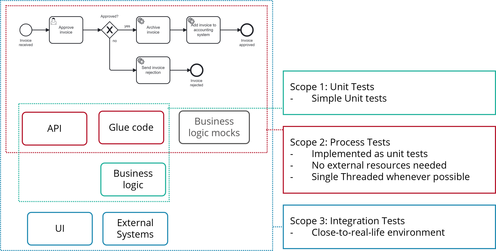
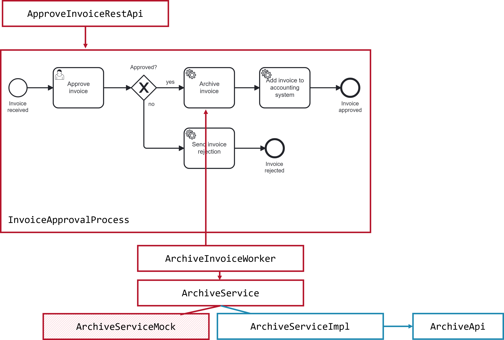

Test your executable BPMN processes as they are software. If possible, do automated unit tests with a fast in-memory workflow engine. Before releasing, verify with integration tests close to your real-life environment, which might include human-driven, exploratory integration tests.

This best practice uses the following process example:

<div bpmn="best-practices/testing-process-definitions-assets/TwitterDemoProcess.bpmn" callouts="user_task_review_tweet,service_task_send_rejection_notification,service_task_publish_on_twitter,user_task_handle_duplicate" />

<span className="callout">1</span>

New tweets need to be reviewed before publication.

<span className="callout">2</span>

The tweeting employee is notified about rejected tweets.

<span className="callout">3</span>

Approved tweets get published.

<span className="callout">4</span>

Duplicate tweets are rejected by Twitter and dealt with by the original author (e.g. rephrased) just to be reviewed again.

## Testing scopes

There are basically three typical test scopes used when building process solutions:

1. **Unit tests**: Testing glue code or programming code you developed for your process solution. How to unit test your software itself is not discussed here, as this is a common practice for software development.

2. **Process tests**: Testing the expected behavior of the process model, including glue code and specifically the data flowing through the process model. Those tests should run frequently, so they should behave like unit tests (quick turnaround, no need for external resources, etc.)

3. **Integration tests**: Testing the system in a close-to-real-life-environment to make sure it is really working. This is typically done before releasing a new version of your system. Those tests include _human-driven_, _exploratory_ tests.



## Writing process tests in Java

:::caution Camunda 8 only
This section targets Camunda 8. Refer to the specific Camunda 7 section below if you are looking for Camunda 7.x.
:::

This section describes how to write process tests as unit tests in Java. We are working on more information on how to write tests in other languages, like Node.Js or C#.

When using Java, most customers use Spring Boot. While this is a common setup for customers, it is not the only one. Find some more examples of Java process tests in the README.md of the [zeebe-process-test](https://github.com/camunda-cloud/zeebe-process-test) project.

### Technical setup using Spring

:::caution JUnit 5
You need to use JUnit 5. Ensure you use JUnit 5 in every test class: the `@Test` annotation you import needs to be `org.junit.jupiter.api.Test`.
:::

1. Use [_JUnit 5_](http://junit.org) as unit test framework.
2. Use [spring-zeebe](https://github.com/camunda-community-hub/spring-zeebe).
3. Use `@ZeebeSpringTest` to ramp up an in-memory process engine.
4. Use annotations from [zeebe-process-test](https://github.com/camunda-cloud/zeebe-process-test/) to check whether your expectations about the state of the process are met.
5. Use mocking of your choice, e.g. [Mockito](http://mockito.org) to mock service methods and verify that services are called as expected.

A test can now look like the following example. The complete source code is available on [GitHub](https://github.com/camunda-community-hub/camunda-cloud-examples/blob/main/twitter-review-java-springboot/src/test/java/org/camunda/community/examples/twitter/TestTwitterProcess.java):

```java
@SpringBootTest
@ZeebeSpringTest
class TestTwitterProcess {

    @Autowired
    private ZeebeClient zeebe;

    @MockBean
    private TweetPublicationService tweetPublicationService;


    @Test
    void testTweetApproved() throws Exception {
        // Prepare data input
        TwitterProcessVariables variables = new TwitterProcessVariables()
            .setTweet("Hello world")
            .setBoss("Zeebot");

        // start a process instance
        ProcessInstanceEvent processInstance = zeebe.newCreateInstanceCommand() //
            .bpmnProcessId("TwitterDemoProcess").latestVersion() //
            .variables(variables) //
            .send().join();

        // And then retrieve the UserTask and complete it with 'approved = true'
        waitForUserTaskAndComplete("user_task_review_tweet", Collections.singletonMap("approved", true));

        // Now the process should run to the end
        waitForProcessInstanceCompleted(processInstance);

        // Let's assert that it passed certain BPMN elements (more to show off features here)
        assertThat(processInstance)
                .hasPassedElement("end_event_tweet_published")
                .hasNotPassedElement("end_event_tweet_rejected")
                .isCompleted();

        // And verify it caused the right side effects b calling the business methods
        Mockito.verify(twitterService).tweet("Hello world");
        Mockito.verifyNoMoreInteractions(twitterService);
    }
}
```

### Test scope and mocking

In such a test case, you want to test the executable BPMN process definition, plus all the glue code which logically belongs to the process definition in a wider sense. Typical examples of glue code you want to include in a process test are:

- Worker code, typically connected to a service task
- Expressions (FEEL) used in your process model for gateway decisions or input/output mappings
- Other glue code, for example, a REST API that does data mapping and delegates to the workflow engine

In the example above, this is the worker code and the REST API:



Workflow engine-independent business code should _not_ be included in the tests. In the Twitter example, the `TwitterService` will be mocked, and the `TwitterWorker` will still read process variables and call this mock. This way, you can make test the process model, the glue code, and the data flow in your process test.

The following code examples highlight the important aspects around mocking.

The `PublishTweetWorker` is executed as part of the test. It does input data mapping **(1)** and also translates a specific business exception into a BPMN error **(2)**:

```java
@Autowired
private TwitterService twitterService;

@ZeebeWorker( type = "publish-tweet", autoComplete = true)
public void handleTweet(@ZeebeVariablesAsType TwitterProcessVariables variables) throws Exception {
    try {
        twitterService.tweet(
          variables.getTweet() // 1
        );
    } catch (DuplicateTweetException ex) { // 2
        throw new ZeebeBpmnError("duplicateMessage", "Could not post tweet, it is a duplicate.");
    }
}
```

The `TwitterService` is considered a business service (it could, for example, wrap the twitter4j API) and shall _not_ be executed during the test. This is why this interface is mocked:

```java
@MockBean
private TwitterService tweetPublicationService;

@Test
void testTweetApproved() throws Exception {
    // ...
    // Using Mockito you can make sure a business method was called with the expected parameter
    Mockito.verify(tweetPublicationService).tweet("Hello world");
}

@Test
void testDuplicate() throws Exception {
    // Using Mockito you can define what should happen if a method is called, in this case an exception is thrown to simulate a business error
    Mockito.doThrow(new DuplicateTweetException("DUPLICATE")).when(tweetPublicationService).tweet(anyString());
    //...
```

### Drive the process and assert the state

For tests, you drive the process from waitstate to waitstate and assert that you observe the expected process and variable states. For example, you might implement a test to test the scenario that a tweet gets approved:

```java
@Test
void testTweetApproved() throws Exception {
    // Prepare data input
    TwitterProcessVariables variables = new TwitterProcessVariables()
        .setTweet("Hello world")
        .setBoss("Zeebot");

    // start a process instance <1>
    ProcessInstanceEvent processInstance = zeebe.newCreateInstanceCommand() //
        .bpmnProcessId("TwitterDemoProcess").latestVersion() //
        .variables(variables) //
        .send().join();

    // And then retrieve the UserTask and complete it with 'approved = true' <2>
    waitForUserTaskAndComplete("user_task_review_tweet", Collections.singletonMap("approved", true));

    // Now the process should run to the end
    waitForProcessInstanceCompleted(processInstance);

    // Let's assert that it passed certain BPMN elements (more to show off features here) <3>
    assertThat(processInstance)
            .hasPassedElement("end_event_tweet_published")
            .hasNotPassedElement("end_event_tweet_rejected")
            .isCompleted();

    // And verify it caused the right side effects b calling the business methods <4>
    Mockito.verify(twitterService).tweet("Hello world");
    Mockito.verifyNoMoreInteractions(twitterService);
}
```

1. Create a new process instance. You may want to use some glue code to start your process (e.g. the REST API facade), or also create helper methods within your test class.

2. Drive the process to its next waitstate, e.g. by completing a waiting user task. You may extract boilerplate code into helper methods as shown below.

3. Assert that your process is in the expected state.

4. Verify with your mocking library that your business service methods were called as expected.

This is the helper method used to verify the workflow engine arrived in a specific user task, and complete that task with passing on some variables. [A user task behaves like a service task with the type `io.camunda.zeebe:userTask`](/docs/components/modeler/bpmn/user-tasks/):

```java
public void waitForUserTaskAndComplete(String userTaskId, Map<String, Object> variables) {
    // Let the workflow engine do whatever it needs to do
    inMemoryEngine.waitForIdleState();

    // Now get all user tasks
    List<ActivatedJob> jobs = zeebe.newActivateJobsCommand().jobType(USER_TASK_JOB_TYPE).maxJobsToActivate(1).send().join().getJobs();

    // Should be only one
    assertTrue(jobs.size()>0, "Job for user task '" + userTaskId + "' does not exist");
    ActivatedJob userTaskJob = jobs.get(0);
    // Make sure it is the right one
    if (userTaskId!=null) {
        assertEquals(userTaskId, userTaskJob.getElementId());
    }

    // And complete it passing the variables
    if (variables!=null) {
        zeebe.newCompleteCommand(userTaskJob.getKey()).variables(variables).send().join();
    } else {
        zeebe.newCompleteCommand(userTaskJob.getKey()).send().join();
    }
}
```

Be careful not to "overspecify" your test method by asserting too much. Your process definition will likely evolve in the future and such changes should break as little test code as possible, but just as much as necessary!

As a rule of thumb _always_ assert that the expected _external effects_ of your process really took place (e.g. that business services were called as expected). Additionally, carefully choose which aspects of _internal process state_ are important enough so that you want your test method to warn about any related change later on.

### Testing your process in chunks

Divide and conquer by _testing your process in chunks_. Consider the important chunks and paths the Tweet Approval Process consists of:

<div bpmn="best-practices/testing-process-definitions-assets/TwitterDemoProcess.bpmn" callouts="end_event_tweet_published,end_event_tweet_rejected,boundary_event_tweet_duplicated" />

<span className="callout">1</span>

The _happy path_: The tweet just gets published.

<span className="callout">2</span>

The tweet gets rejected.

<span className="callout">3</span>

A duplicated tweet gets rejected by Twitter.

#### Testing the happy path

The happy path is kind of the default scenario with a positive outcome, so no exceptions or errors or deviations are experienced.

Fully test the happy path in one (big) test method. This makes sure you have one consistent data flow in your process. Additionally, it is easy to read and to understand, making it a great starting point for new developers to understand your process and process test case.

You were already exposed to the happy path in our example, which is the scenario that the tweet gets approved:

```java
@Test
void testTweetApproved() throws Exception {
    // Prepare data input
    TwitterProcessVariables variables = new TwitterProcessVariables()
        .setTweet("Hello world")
        .setBoss("Zeebot");

    // start a process instance <1>
    ProcessInstanceEvent processInstance = zeebe.newCreateInstanceCommand() //
        .bpmnProcessId("TwitterDemoProcess").latestVersion() //
        .variables(variables) //
        .send().join();

    // And then retrieve the UserTask and complete it with 'approved = true' <2>
    waitForUserTaskAndComplete("user_task_review_tweet", Collections.singletonMap("approved", true));

    // Now the process should run to the end
    waitForProcessInstanceCompleted(processInstance);

    // Let's assert that it passed certain BPMN elements (more to show off features here) <3>
    assertThat(processInstance)
            .hasPassedElement("end_event_tweet_published")
            .hasNotPassedElement("end_event_tweet_rejected")
            .isCompleted();

    // And verify it caused the right side effects b calling the business methods <4>
    Mockito.verify(twitterService).tweet("Hello world");
    Mockito.verifyNoMoreInteractions(twitterService);
}
```

#### Testing detours

Test _forks/detours_ from the happy path as well as _errors/exceptional_ paths as chunks in separate test methods. This allows to unit test in meaningful units.

The tests for the exceptional paths are basically very similar to the happy path in our example:

```java
@Test
void testRejectionPath() throws Exception {
    TwitterProcessVariables variables = new TwitterProcessVariables()
      .setTweet("Hello world")
      .setBoss("Zeebot");

    ProcessInstanceEvent processInstance = zeebe.newCreateInstanceCommand() //
            .bpmnProcessId("TwitterDemoProcess").latestVersion() //
            .variables(variables) //
            .send().join();

    waitForUserTaskAndComplete("user_task_review_tweet", Collections.singletonMap("approved", false));

    waitForProcessInstanceCompleted(processInstance);
    waitForProcessInstanceHasPassedElement(processInstance, "end_event_tweet_rejected");
    Mockito.verify(twitterService, never()).tweet(anyString());
}
```

and:

```java
@Test
void testDuplicateTweet() throws Exception {
    // throw exception simulating duplicateM
    Mockito.doThrow(new DuplicateTweetException("DUPLICATE")).when(twitterService).tweet(anyString());

    TwitterProcessVariables variables = new TwitterProcessVariables()
            .setTweet("Hello world")
            .setAuthor("bernd")
            .setBoss("Zeebot");

    ProcessInstanceEvent processInstance = zeebe.newCreateInstanceCommand() //
            .bpmnProcessId("TwitterDemoProcess").latestVersion() //
            .variables(variables) //
            .send().join();

    waitForUserTaskAndComplete("user_task_review_tweet", Collections.singletonMap("approved", true));

    waitForProcessInstanceHasPassedElement(processInstance, "boundary_event_tweet_duplicated");
    // TODO: Add human task to test case
    waitForUserTaskAndComplete("user_task_handle_duplicate", new HashMap<>());
}
```

<!--
## Writing polyglot process tests

TODO

* How to provision / cleanup engine (API to create cluster)
* Use the API / Language client to drive your process
* No assertions available at the moment (probably use history API?)
* Assert side effects / workers

* Example in NodeJS?
-->

## Integration tests

Test the process in a close-to-real-life environment. This verifies that it really works before releasing a new version of your process definition, which includes _human-driven_, _exploratory_ tests.

Clearly _define your goals_ for integration tests! Goals could be:

- End user & acceptance tests
- Complete end-to-end tests
- Performance & load tests, etc.

Carefully consider _automating_ tests on scope 3. You need to look at the overall effort spent on writing test automation code and maintaining it when compared with executing human-driven tests for your software project's lifespan. The best choice depends very much on the frequency of regression test runs.

Most effort is typically invested in setting up proper test data in surrounding systems.

Configure your tests to be dedicated integration tests, and separate them from unit or process tests.

You can use typical industry standard tools for integration testing together with Camunda.

## Technical setup and example using Camunda 7

:::caution Camunda 7 only
This section targets Camunda 7.x only. Refer to the previous sections if you are using Camunda 8.
:::

Camunda 7 also has support for writing tests in Java. This section gives you an example, the basic ideas of test scopes and testing in chunks are also valid with Camunda 7.

The technical setup for Camunda 7:

1. Use [_JUnit_](http://junit.org) as unit test framework.
2. Use Camunda's [JUnit Extension](https://github.com/camunda/camunda-bpm-platform/tree/7.17.0/test-utils/junit5-extension) to ramp up an in-memory process engine where the [JobExecutor](https://docs.camunda.org/javadoc/camunda-bpm-platform/7.17/org/camunda/bpm/engine/test/Deployment.html) is turned off.
3. Use Camunda's [@Deployment](https://docs.camunda.org/javadoc/camunda-bpm-platform/7.17/org/camunda/bpm/engine/test/Deployment.html) annotation to deploy and un-deploy one or more process definitions under test for a single test method.
4. Use [camunda-bpm-assert](http://github.com/camunda/camunda-bpm-assert) to easily check whether your expectations about the state of the process are met.
5. Use mocking of your choice, e.g. [Mockito](http://mockito.org) to mock service methods and verify that services are called as expected.
6. Use Camunda's [MockExpressionManager](https://docs.camunda.org/javadoc/camunda-bpm-platform/7.17/org/camunda/bpm/engine/test/mock/MockExpressionManager.html) to resolve bean names used in your process definition without the need to ramp up the dependency injection framework (like CDI or Spring).
7. Use an [In-Memory H2 database](http://www.h2database.com/html/features.html#in_memory_databases) as default database to test processes on developer machines. If required, you can run the same tests on _multiple databases_, e.g. Oracle, DB2, or MS-SQL on a CI-Server. To achieve that, you can make use of (e.g. Maven) profiles and Java properties files for database configuration.

Let's use the same example as above.

A typical test case will look like this:

```java
// ...
import static org.camunda.bpm.engine.test.assertions.ProcessEngineTests.*; // <4>
import static org.mockito.Mockito.*; // <5>

@ExtendWith({ProcessEngineExtension.class, MockitoExtension.class}) // <1> <5>
class TwitterTest {

  @Mock // Mockito mock instantiated by MockitoExtension <5>
  private TweetPublicationService tweetPublicationService;

  @BeforeEach
  void setup() {
	// ...
    TweetPublicationDelegate tweetPublicationDelegate = new TweetPublicationDelegate(tweetPublicationService);
    Mocks.register("tweetPublicationDelegate", tweetPublicationDelegate); // <6>
  }

  @Test // <1>
  @Deployment(resources = "twitter/TwitterDemoProcess.bpmn") // <3>
  void testTweetApproved() {
	// ...
  }
// ...
}
```

The service task **Publish on Twitter** delegates to Java code:

```xml
<serviceTask id="service_task_publish_on_twitter" camunda:delegateExpression="#{tweetPublicationDelegate}" name="Publish on Twitter">
</serviceTask>
```

And this _Java delegate_ itself calls a business method:

```java
@Named
public class TweetPublicationDelegate implements JavaDelegate {

  private final TweetPublicationService tweetPublicationService;

  @Inject
  public TweetPublicationDelegate(TweetPublicationService tweetPublicationService) {
    this.tweetPublicationService = tweetPublicationService;
  }

  public void execute(DelegateExecution execution) throws Exception {
    String tweet = new TwitterDemoProcessVariables(execution).getTweet();  // <1>
    // ...
    try {
      tweetPublicationService.tweet(tweet); // <2>
    } catch (DuplicateTweetException e) {
      throw new BpmnError("duplicateMessage"); // <3>
    }
  }
// ...
```

The TweetPublicationService is mocked:

```java
@Mock // 1
private TweetPublicationService tweetPublicationService;

@BeforeEach
void setup() {
  // set up java delegate to use the mocked tweet service
  TweetPublicationDelegate tweetPublicationDelegate = new TweetPublicationDelegate(tweetPublicationService);  // <2>
  // register a bean name with mock expression manager
  Mocks.register("tweetPublicationDelegate", tweetPublicationDelegate); // <3>
}

@AfterEach
void teardown() {
  Mocks.reset();  // <3>
}
```

Now you can test the happy path to a published tweet:

```java
@Test
@Deployment(resources = "twitter/TwitterDemoProcess.bpmn")
void testTweetApproved() {
  // given
  ProcessInstance processInstance = runtimeService().startProcessInstanceByKey(
    "TwitterDemoProcess",
    withVariables(TwitterDemoProcessConstants.VAR_NAME_TWEET, TWEET)); // <1>
  assertThat(processInstance).isStarted();
  // when
  complete(task(), withVariables(TwitterDemoProcessConstants.VAR_NAME_APPROVED, true)); // <2>
  // then
  assertThat(processInstance) // <3>
    .hasPassed("end_event_tweet_published")
    .hasNotPassed("end_event_tweet_rejected")
    .isEnded();
  verify(tweetPublicationService).tweet(TWEET); // <4>
  verifyNoMoreInteractions(tweetPublicationService);
}
```

As a next step, you might want to test the path where a tweet gets rejected. You don't have to start at the start event, but can start anywhere in your process:

```java
@Test
@Deployment(resources = "twitter/TwitterDemoProcess.bpmn")
void testTweetRejected() {

  // create a process instance directly at the point at which a tweet was rejected
  ProcessInstance processInstance = runtimeService()
    .createProcessInstanceByKey("TwitterDemoProcess")
    .startBeforeActivity("service_task_publish_on_twitter")
    .setVariables(variables)
  .execute();
  assertThat(processInstance)
    .isStarted()
    .hasPassed("service_task_publish_on_twitter")
    .hasVariables(TwitterDemoProcessConstants.VAR_NAME_TWEET);

  // when
  complete(task(), withVariables(TwitterDemoProcessConstants.VAR_NAME_APPROVED, false));  // <2>

  // then
  assertThat(processInstance)
    .hasPassed("end_event_tweet_rejected")
    .hasNotPassed("end_event_tweet_published")
    .isEnded();
  verifyZeroInteractions(tweetPublicationService);
}
```

You could also implement another `testTweetDuplicated()` to verify the logic in case a tweet turns out to be a duplicate and is rejected by Twitter. For this case, we attached an error event to the service task **Publish on Twitter**. In the BPMN XML we observe an error event defined with an errorCode `duplicateMessage`.

```xml
  <boundaryEvent id="boundary_event_tweet_duplicated" name="Tweet duplicated" attachedToRef="service_task_publish_on_twitter">
    <errorEventDefinition id="error_event_definition_tweet_duplicated" errorRef="error_tweet_duplicated"/>
  </boundaryEvent>
<error id="error_tweet_duplicated" errorCode="duplicateMessage" name="Tweet duplicated"/>
```

Above, we already saw the Java delegate code throwing the BPMN error exception with that code `duplicateMessage`. Here is the method testing for the case a tweet is duplicated:

```java
@Test
@Deployment(resources = "twitter/TwitterDemoProcess.bpmn")
void testTweetDuplicated() {
  // given
  doThrow(new DuplicateTweetException()) // <1>
    .when(tweetPublicationService).tweet(anyString());
  // when
  ProcessInstance processInstance = rejectedTweet(withVariables(TwitterDemoProcessConstants.VAR_NAME_TWEET, TWEET));  // <2>
  // then
  assertThat(processInstance) // <3>
    .hasPassed("boundary_event_tweet_duplicated")
    .hasNotPassed("end_event_tweet_rejected").hasNotPassed("end_event_tweet_published")
    .isWaitingAt("user_task_handle_duplicate");
  verify(tweetPublicationService).tweet(TWEET);  // <4>
  verifyNoMoreInteractions(tweetPublicationService);
  // when
  complete(task()); // <5>
  // then
  assertThat(processInstance)  // <6>
    .isWaitingAt("user_task_review_tweet")
    .hasVariables(TwitterDemoProcessConstants.VAR_NAME_TWEET)
    .task().isAssignedTo("demo");
}
```
