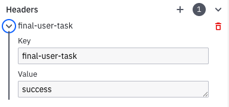
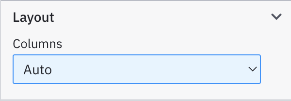
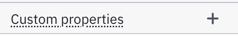

The Camunda SAP Business Technology Platform (BTP) plugin is an artifact run on BTP. It consists of a [UI5 app](https://ui5.sap.com/), a [CAP service layer and backend](https://cap.cloud.sap/) (using PostgreSQL), and an [approuter](https://www.npmjs.com/package/@sap/approuter) for traffic dispatching.

The BTP plugin connects to Camunda 8 SaaS to provide:

- A generic Fiori app for starting BPMN processes and displaying [Camunda Forms](/components/modeler/forms/camunda-forms-reference.md) in the Fiori design language.
- A generic endpoint to start BPMN processes with.

## Prerequisites

- locally, for configuring via `csap` only (see below): [Node.js >= 20 LTS](https://nodejs.org/en/about/previous-releases)

- We recommend creating an API client for your Camunda SaaS cluster with the full scope: `Zeebe,Tasklist,Operate,Optimize,Secrets`.

On SAP BTP:

- Cloud Foundry CLI](https://github.com/cloudfoundry/cli) with the [multiapps plugin](https://github.com/cloudfoundry/multiapps-cli-plugin) installed on the machine executing the deployment.

- SAP BTP subaccount with a [Cloud Foundry environment](https://discovery-center.cloud.sap/serviceCatalog/cloud-foundry-runtime?region=all) enabled and a [created space](https://help.sap.com/docs/btp/sap-business-technology-platform/create-spaces).
- A minimum of [4 GB storage quota and 4 GB runtime memory](https://help.sap.com/docs/btp/sap-business-technology-platform/managing-space-quota-plans).

- [Entitlements](https://help.sap.com/docs/btp/sap-business-technology-platform/managing-entitlements-and-quotas-using-cockpit) for:

  - BTP PostgreSQL, hyperscaler option
    - check that the [available BTP PostgreSQL, hyperscaler option, configuration options](https://help.sap.com/docs/postgresql-on-sap-btp/postgresql-on-sap-btp-hyperscaler-option/parameters) match your sizing plan, e.g. for multi-region DBs or high availability
    - the BTP plugin defaults to a minimum, only specifying PostgreSQL version 16 (see `/core/pg-options.json`) and a single DB instance, with no high availability
  - [Destination Service](https://discovery-center.cloud.sap/serviceCatalog/destination?service_plan=lite&region=all&commercialModel=btpea), `lite` plan
  - [Connectivity Service](https://discovery-center.cloud.sap/serviceCatalog/connectivity-service?region=all), `lite` plan
  - [Authorization and Trust Management Service](https://discovery-center.cloud.sap/serviceCatalog/authorization-and-trust-management-service?region=all), `application` plan

## Features

- just model User Tasks, they are picked up automatically and run/rendered by the BTP plugin


- equip the very last User Task with a custom header `final-user-task` and the value

  - `success` to display the last user task on the "happy path"
  - `fail` to use that user task to communicate a failed process to the user

  

- Auto-start a process via URL parameter using `run=<processID>`. For example, `https://<btp plugin url>/index.html?channelId=<id>&run=application-process`.

- For debugging purposes, add `debug=true` as the URL parameter. For example, `https://<btp plugin url>/index.html?channelId=<id>&run=application-process&debug=true`.

- `/inbound` endpoint for starting a BPMN process in Camunda

## Camunda Forms in SAP Fiori

- Layout: single row layout only, 
- No custom properties. 

### Supported form features and properties

|                  | Camunda Forms feature/property | Supported in Camunda BTP plugin? | Comments                                                                                                                                                                                                                 |
| ---------------- | ------------------------------ | -------------------------------- | ------------------------------------------------------------------------------------------------------------------------------------------------------------------------------------------------------------------------ |
| **Input**        |                                |                                  |                                                                                                                                                                                                                          |
|                  | Text field                     | :white_check_mark:               |                                                                                                                                                                                                                          |
|                  | Text area                      | :white_check_mark:               |                                                                                                                                                                                                                          |
|                  | Number                         | :white_check_mark:               |                                                                                                                                                                                                                          |
|                  | Date time                      | :white_check_mark:               | Only UTC values will be stored<br />- Date format "yyyy-MM-dd", for example "2025-02-29"12<br />- Hours format will be stored as the string "10:12:34 pm"<br />- 24 hours format will be stored as the string "22:12:34" |
|                  | Expression                     | :x:                              |                                                                                                                                                                                                                          |
|                  | File picker                    | :x:                              |                                                                                                                                                                                                                          |
| **Selection**    |                                |                                  |                                                                                                                                                                                                                          |
|                  | Checkbox                       | :white_check_mark:               |                                                                                                                                                                                                                          |
|                  | Checkbox group                 | :x:                              |                                                                                                                                                                                                                          |
|                  | Radio group                    | :white_check_mark:               | Only `static` options source is supported.                                                                                                                                                                               |
|                  | Select                         | :white_check_mark:               | Only `static` options source is supported.                                                                                                                                                                               |
|                  | Tag list                       | :x:                              |                                                                                                                                                                                                                          |
| **Presentation** |                                |                                  |                                                                                                                                                                                                                          |
|                  | Text view                      | :white_check_mark:               |                                                                                                                                                                                                                          |
|                  | Image view                     | :white_check_mark:               |                                                                                                                                                                                                                          |
|                  | Table                          | :x:                              |                                                                                                                                                                                                                          |
|                  | HTML view                      | :white_check_mark:               |                                                                                                                                                                                                                          |
|                  | Document preview               | :x:                              |                                                                                                                                                                                                                          |
|                  | Spacer                         | :x:                              |                                                                                                                                                                                                                          |
|                  | Separator                      | :x:                              |                                                                                                                                                                                                                          |
| **Containers**   |                                |                                  |                                                                                                                                                                                                                          |
|                  | Group                          | :x:                              |                                                                                                                                                                                                                          |
|                  | Dynamic list                   | :x:                              |                                                                                                                                                                                                                          |
|                  | iframe                         | :x:                              |                                                                                                                                                                                                                          |
| **Action**       |                                |                                  |                                                                                                                                                                                                                          |
|                  | Button                         | :x:                              |                                                                                                                                                                                                                          |

## Configuration and deployment

We strongly recommend to [use `csap`](./csap-cli.md) for setting up the BTP plugin. A manual configuration is cumbersome and error-prone, as it requires not only building all parts of the plugin, but also configuring the "glue" between them in various files. Instead, let `csap` do the heavy lifting for you.

In Camunda, no setup/config work is necessary to use the BTP plugin.

### Configuring the BTP Plugin using `csap`

Either walk yourself through the prompts or provide all information to the cli

- `csap setup` will guide you interactively.

- Assuming your [Camunda cluster's API credentials](/guides/setup-client-connection-credentials.md) are sourced in your shell environment, this will do the configuration for you:

```shell
csap setup --for btp-plugin \
	--camunda 8.7 \
	--deployment SaaS \
	--btpRoute camunda-btp-plugin.cfapps.eu10-004.hana.ondemand.com
```

The host name provided as `btpRoute` will be the URL to the BTP Plugin's app; following the example above: `https://camunda-btp-plugin.cfapps.eu10-004.hana.ondemand.com`

### Deploying to BTP

1. Log into the desired SAP BTP subaccount via the [Cloud Foundry `cli`](https://github.com/cloudfoundry/cli) (cf-cli):

```shell
$> cf login
API endpoint: https://api.cf. ...
...
```

2. `cd` to the folder `csap` logs after a successful build, e.g. `/tmp/camunda/8.6/sap-btp-plugin`
3. issue `cf deploy mta_archives/*.mtar`
   - add the `-f` switch to force update, e.g. by deploying the same version again, e.g. `cf deploy mta_archives/*.mtar -f`
   - consider adding `--delete-services` to recreate eventually failed service creation of previous deployment, e.g. `cf deploy mta_archives/*.mtar -f --delete-services`

For advanced deployment configuration, consider working with your SAP practice, starting from the created `mta.yaml` deployment descriptor (in the `$TMP` folder as output by `csap`)

## Working with the BTP Plugin

- describe "one-user multi-page flow" here

After deployment, the BTP Plugin is available at the `btpRoute` provided: `https://<btpRoute>`. If called manually, e.g. in the browser, it will redirect automatically to `/app/index.html?channelId=<unique id>` . The `<unique id>` aka "channel ID" links the output device to the BTP Plugin, representing a dedicated "output channel".

### Starting a BPMN process in the browser

Start any Camunda BPMN Process manually via the "hamburger" in the menu bar.


In the Popup, enter the ID of the BPMN to run.


Alternatively, the process can be auto-started by directly calling the URL

`https://<btp plugin url>/index.html?channelId=<random id>&run=fiori-bupa-search`

### Starting a BPMN process via API

Make `POST` http call to `https://<btpRoute>/backend/inbound` with this defined payload:

```json
{
	"bpmnProcessId": "processId", # ex above: fiori-bupa-search
  "user": "beck@renegade.org", # unique id of the user
  "wait": false, # or true to wait for the BPMN run to finish and get the result back
	"variables": { # optional
		"some_key": "some_value",
		"some_other_key": 10
	}
}
```

The advantage over Camunda REST API: use authentication realm between BTP and S/4 / ECC, no need for adminstrating additional credentials.
