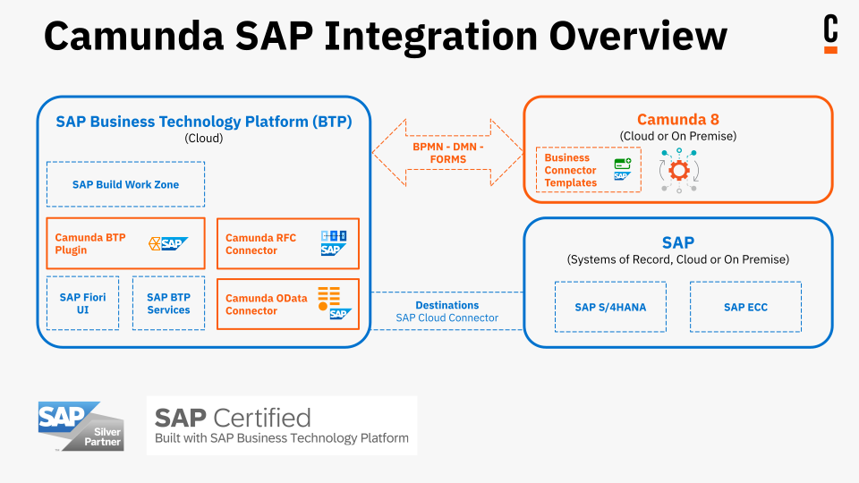

Use Camunda's SAP integration to integrate SAP S/4HANA or ECC functionality in Camunda processes and integrate them with SAP BTP services.

## About the integration

Camunda's SAP integration consists of several modules that can be used independently of one another:

| Module                                               | What it does                                                                                                                                                                                                                                                                                      |
| :--------------------------------------------------- | :------------------------------------------------------------------------------------------------------------------------------------------------------------------------------------------------------------------------------------------------------------------------------------------------ |
| [SAP OData outbound connector](./odata-connector.md) | Enable interaction with a SAP S/4HANA or ECC System via OData v2 + v4 APIs, directly from your BPMN model.                                                                                                                                                                                        |
| [SAP RFC outbound connector](./rfc-connector.md)     | Query Business Application Programming Interfaces (BAPIs) and remote-enabled function modules on SAP ECC systems.                                                                                                                                                                                 |
| [SAP BTP plugin](./btp-plugin.md)                    | - Use [Tasklist's](/components/tasklist/introduction-to-tasklist.md) forms in the Fiori UI.   - Trigger and manage SAP BTP services from [BPMN tasks](/components/modeler/bpmn/bpmn.md).   - Start BPMN process instances via inbound proxy endpoints, with support for custom variables. |

These features run within the customer's [SAP BTP instance](https://www.sap.com/products/technology-platform.html), requiring no proprietary Camunda setup. Instead, they leverage existing infrastructure with minimal prerequisites.

:::info
The Camunda SAP integration is **SAP Certified**, ensuring compliance with SAP's standards for compatibility, security, and performance. This certification provides added assurance for enterprise-grade deployments.
:::

## Technical requirements

All SAP integration modules operate in [hybrid mode](/guides/use-connectors-in-hybrid-mode.md), requiring the following:

- Credentials from an [API client](/components/console/manage-clusters/manage-api-clients.md) to connect to a cluster
- Configuration via environment variables only

Use the [CSAP CLI](./csap-cli.md) to prepare SAP integration modules for deployment. It's a command-line interface (CLI) that provides all the essential setup operations for each module.

To integrate SAP systems with Camunda, all integration artifacts must meet the following requirements:

- **Camunda version**  
  Camunda 8.5+

- **SAP BTP and Cloud Foundry**

  - The integration runs on SAP BTP, Cloud Foundry environment, that requires the [appropriate service](https://discovery-center.cloud.sap/serviceCatalog/cloud-foundry-runtime?region=all) setup.
  - [(Free) Destination Service](https://discovery-center.cloud.sap/serviceCatalog/destination?region=all&service_plan=lite&commercialModel=btpea) for system and service connectivity.

- **On-Premises SAP S/4HANA or ECC Systems _(if applicable)_** 
  If the SAP S/4HANA or ECC system is hosted on-premises, the following additional components are required:

  - [(Free) Connectivity Service](https://discovery-center.cloud.sap/serviceCatalog/connectivity-service?region=all) for secure communication.
  - [SAP Cloud connector](https://help.sap.com/docs/connectivity/sap-btp-connectivity-cf/cloud-connector), properly configured and connected to both, the SAP S/4HANA or ECC system and the BTP subaccount where the Camunda SAP integration artifacts will run.

- A **technical user** with the necessary access rights to the SAP S/4HANA and/or ECC system.

### SAP OData outbound connector

No additional requirements.

### SAP RFC outbound connector

- [(Free) SAP Authorization and Trust Management Service](https://discovery-center.cloud.sap/serviceCatalog/authorization-and-trust-management-service?region=all) to manage user authorizations and trust to identity providers.

### SAP BTP integration

- [(Free) SAP Authorization and Trust Management Service](https://discovery-center.cloud.sap/serviceCatalog/authorization-and-trust-management-service?region=all)
- [PostgreSQL on SAP BTP, hyperscaler option](https://discovery-center.cloud.sap/serviceCatalog/postgresql-hyperscaler-option?region=all)

For scaling out and up, either add multiple instances of an integration module (for example, the SAP OData connector) or equip an integration module with more runtime memory (for example, the SAP BTP plugin).

For advanced tuning, you can use all SAP BTP mechanisms, including the [(Free) Application Autoscaler](https://discovery-center.cloud.sap/serviceCatalog/application-autoscaler?service_plan=standard&region=all&commercialModel=btpea). SAP integration artifacts follow SAP BTP cloud development standards and are fully configurable like any custom SAP BTP app.
