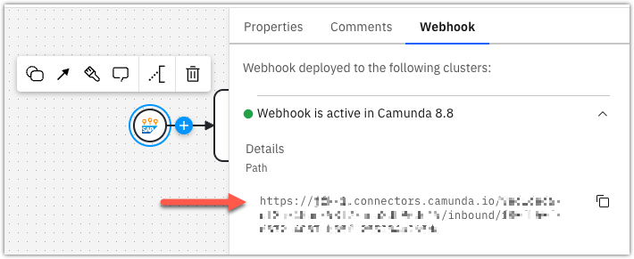
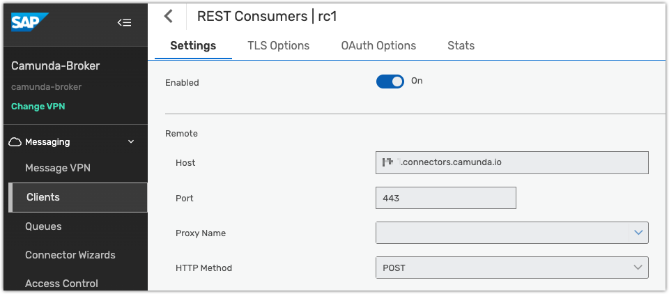
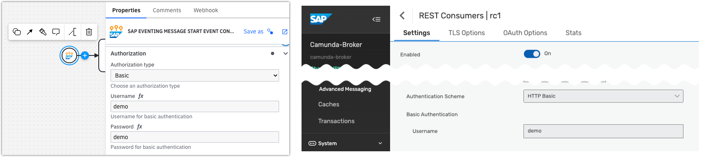
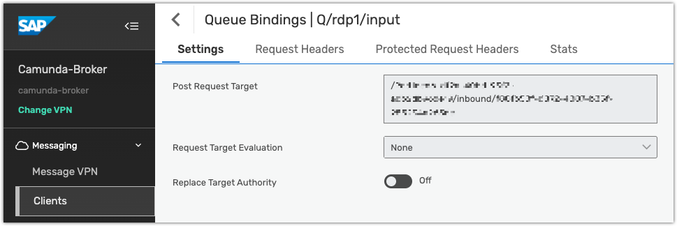
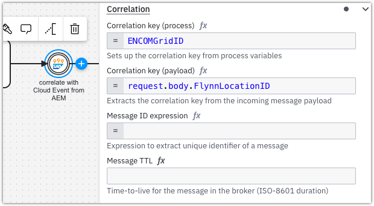
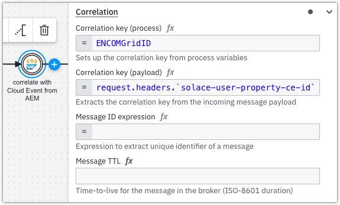
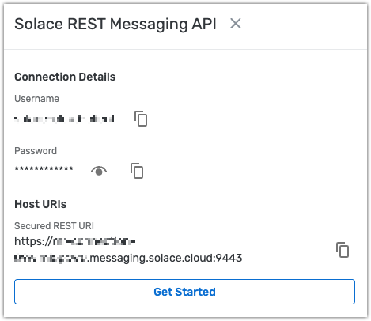
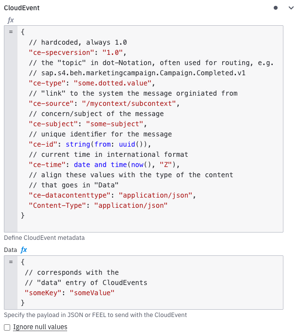

Camunda's SAP Eventing integration allows you to react on [CloudEvents](https://cloudevents.io/) sent from Advanced Event Mesh (AEM) and to send [CloudEvents](https://cloudevents.io/) to AEM.
It consits of three connectors

<!-- add links of Element Template from marketplace! -->

- **SAP Eventing Outbound Connector**  
  send CloudEvents to AEM
- **SAP Eventing Message Start Event Connector**  
  translate an incoming CloudEvent to a [BMPN message start event](https://docs.camunda.io/docs/next/components/modeler/bpmn/message-events/#message-start-events)
- **SAP Eventing Intermediate Event Connector**  
  translate an incoming CloudEvent from AEM to a [BPMN Intermediate Catch Event](https://docs.camunda.io/docs/next/components/modeler/bpmn/message-events/#intermediate-message-catch-events)

The integration uses `HTTP` as the Transport Protocol - the incoming connectors act as Webhooks, relaying the CloudEvent payload into the Process Instance.  
The outbound connector makes a `HTTP` `POST` request to an Advanced Event Mesh [topic](https://docs.solace.com/Messaging/Guaranteed-Msg/Topic-Endpoints.htm) or [queue](https://docs.solace.com/Messaging/Guaranteed-Msg/Queues.htm) endpoint.

:::info
SAP Advanced Event Mesh uses [Solace Event Broker](https://solace.com/products/event-broker/) as its core Event Bus. Thus, the names can be used largely interchangeably when the any corew eventing functionality is concerned.

## Prerequisite

Because `HTTP` is used as the transport protocol, AEM must be configured to use [REST messaging](https://docs.solace.com/API/REST/REST-get-start.htm). This allows for Publishers and Subscribers to work with HTTP. The following screenshots and configuration examples in Camunda build on the excellent "Publish/Subscribe" REST Tutorial from Solace available at https://tutorials.solace.dev/rest-messaging/publish-subscribe/

## Installation

- pull connectors from Marketplace

## Configuration

### SAP Eventing Message Start Event Connector: inbound CloudEvents → BPMN Message

When applying the `SAP Eventing Message Start Event Connector`, it creates a unique URL for a Webhook that starts a BPMN process.



:::info
The Webhook URL is only generated after initial deployment of the process.

This URL in turn needs to be configured in AEM. The host part of the URL (`https://<region>.connectors.camunda.io`) applies to the REST consumer:



In the same REST consumer configuration, the Authentication from AEM towards the Camunda Webhook needs to be set. The settings from the "Authorization" section of the Camunda Connector need to correspond with the "Authentication Scheme" in AEM:



The path of the Camunda incoming Webhook URL needs to be configured in the `Queue Binding` as the "POST Request Target" of the REST consumer:



The remaining configuration options of the `SAP Eventing Message Start Connector` correspond with those of the [regular Incoming Webhook Connector](https://docs.camunda.io/docs/next/components/connectors/protocol/http-webhook/) - with the exception of the default "Webhook response": replying with `OK` as the body in addition to the status code `200` explicitly acknowledges the receipt of the message from AEM in Camunda.


If a CloudEvent from AEM arrives in Camunda, all its `header` properties and the `body` payload is relayed as is to the process instance - either at Process Instance creation or while correlating the CloudEvent as BPMN message, depending on whether the `Start Eventing Message Start Event` connector is used or the `SAP Eventing Intermediate Event` connector.

### SAP Eventing Intermediate Event Connector: correlate CloudEvents as BPMN message

The `SAP Eventing Intermediate Event Connector` allows to "inject" a CloudEvent from AEM into a running Camunda BPMN Process Instance. This is achieved by utilizing the principle of BPMN [message correlation](https://docs.camunda.io/docs/next/components/connectors/protocol/http-webhook/#correlation) - any property of the CloudEvent can be used as the `correlation key` to map all event information to a Process Instance.

#### Correlation via CloudEvent body

The configuration options of the `SAP Eventing Message Start Event Connector` and the `SAP Eventing Intermediate Event Connector` are identical - with the excpetion, that the `Intermediate Event` must have a "Correlation" section set:



In the above example, the process variable `ENCOMGridID` is expected to be present in the Process Instance. It's value is matched against the CloudEvent's payload, represented by `request.body`, and the entry `FlynnLocationID` 's value - if they match, the CloudEvent is considered to be the published BPMN message that is correlated to the corresponding Process Instance.

#### Correlation via CloudEvent meta data

Because the SAP Eventing uses `HTTP` as the transport protocol, the CloudEvent standard requires all [CloudEvent Meta Data to be mapped into the HTTP headers](https://github.com/cloudevents/spec/blob/v1.0.2/cloudevents/bindings/http-protocol-binding.md). Additional, AEM requires these HTTP headers to be prepended with `Solace-User-Property-` in order to be presisted in the AEM event engine/storage. A typical CloudEvent "id", denoted by the propery "ce-id", is present in a CloudEvent HTTP binding in AEM as `Solace-User-Property-ce-id`

So for a CloudEvent ↔︎ BPMN message correlation based on CloudEvent Meta Data, the HTTP headers need to be properly addressed with eh `Solace-User-Property-` prefix.

Given this CloudEvent HTTP message arriving at Camunda...

```json
{
  "request": {
    "body": { "FlynnLocationID": "34.0522,-118.2437" },
    "headers": {
      "host": "<region>.connectors.camunda.io",
      "x-request-id": "956de0835ad61a211a20e4755315b413e",
      "x-real-ip": "12.123.123.456",
      "x-forwarded-host": "<region>.connectors.camunda.io",
      "x-forwarded-port": "443",
      "x-forwarded-proto": "https",
      "x-forwarded-scheme": "https",
      "x-scheme": "https",
      "content-length": "44",
      "authorization": "Basic CaMUnDakZW1v",
      "cache-control": "no-cache",
      "content-type": "application/json",
      "solace-delivery-mode": "Persistent",
      "solace-user-property-ce-specversion": "1.0",
      "solace-user-property-ce-type": "sap.s4.beh.encom.grid.program.v1",
      "solace-user-property-ce-source": "/alan/pager/buzz",
      "solace-user-property-ce-subject": "CLU-2.0",
      "solace-user-property-ce-id": "Argon-T-01",
      "solace-user-property-ce-time": "2018-04-05T03:56:24Z",
      "solace-user-property-ce-datacontenttype": "application/json",
      "user-agent": "Solace_PubSub+_Enterprise/10.11.1.167"
    },
    "params": {}
  },
  "connectorData": {},
  "documents": []
}
```

...correlating the CloudEvent property "ce-id" to the Process instance would have to be done by referencing the `solace-user-property-ce-id` header field:



Explicitly note the "backticks" notation of the header value `` request.headers.`solace-user-property-ce-id` `` in order to escape the dashes in the header field name!

### SAP Eventing Outbound Connector

The ` SAP Eventing Outbound Connector` allows sending CloudEvents to AEM. It uses the REST messaging capability of AEM to publish the CloudEvent via a `HTTP POST`.


#### Endpoint

The URL of the AEM Event Broker is taken "as is" and can be found by navigating in the Advanced Event Mesh main UI:

"Cluster Manager" → your Cluster → (Service Details) "Connect" → "Connect with Java" → "Solace REST Messaging API"

On the right handside of the UI, you'll see the FQDN of your AEM instance/broker.



#### Topic/Queue

Choose the respective publishing target and provide the path to either. Note that neither must start with a "/" - a safety check is provided in the Element Template.

#### Authorization

Choose one of `None`, `API key`, `Basic`, `OAuth 2.0` or `Bearer Token`, with `Basic` being the most common, as it is also recommended by the info in the Broker's "Connect" tab - see image above.

#### CloudEvent

Even though the mapping of CloudEvent metadata (such as `ce-id` or `ce-subject`) and its mandatory prepending with `Solace-User-Propery-` done by the AEM broker was described in the previous chapter on correlation, it is abstracted away here in the Oubound Connector: it is sufficient to use the CloudEvent's standard attributes for construing the meta data.

The data in the CloudEvent maps to a standard JSON body.

Both field allow for using [FEEL](https://docs.camunda.io/docs/next/components/modeler/feel/what-is-feel/) in them.



#### Other configuration options

All other configuration options are the same as for the [REST connector](https://docs.camunda.io/docs/next/components/connectors/protocol/rest/) - such as [Connection timeout](https://docs.camunda.io/docs/next/components/connectors/protocol/rest/#network-communication-timeouts) or [Output mapping](https://docs.camunda.io/docs/next/components/connectors/protocol/rest/#output-mapping).
