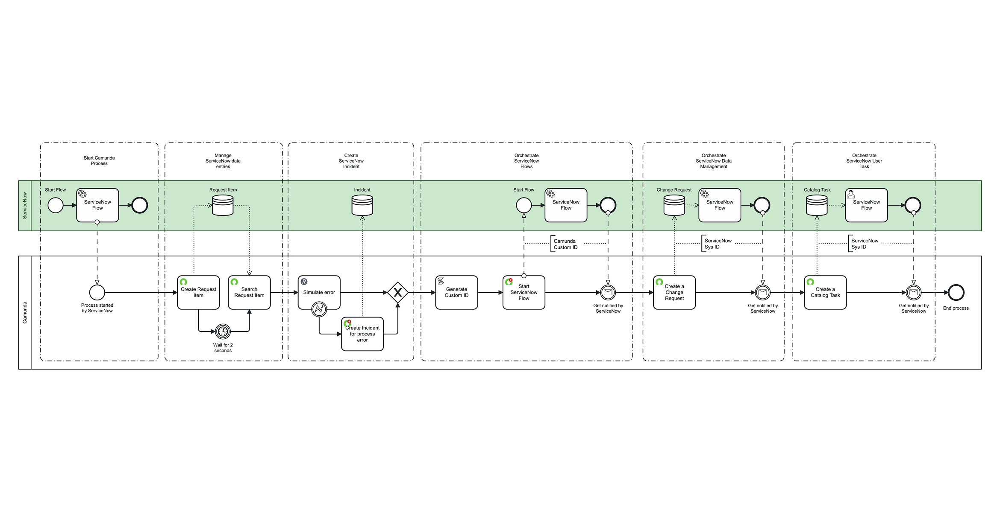

Use these blueprints to quickly implement common Camunda–ServiceNow integration scenarios.

Download the blueprint from the [Camunda Marketplace](https://marketplace.camunda.com/) and import it directly into Camunda Modeler.  
It provides **pre-configured processes** demonstrating best practices, reusable patterns, and realistic business use cases.

### Supported integration patterns

| Type              | Name                                   | Purpose                                                                                                              | Example                                                                                  | Built-in connectors           | ServiceNow Spoke                  |
| :---------------- | :------------------------------------- | :------------------------------------------------------------------------------------------------------------------- | :--------------------------------------------------------------------------------------- | :---------------------------- | :-------------------------------- |
| **Manage**        | Manage ServiceNow data entries         | Execute CRUD (Create, Read, Update, Delete) operations on any ServiceNow table.                                      | Create or modify a change request in ServiceNow.                                         | ServiceNow Outbound Connector | Not needed                        |
|                   | Create ServiceNow Incident             | Raise business errors from BPMN models that trigger ServiceNow incidents.                                            | Create or modify a change request in ServiceNow.                                         | ServiceNow Incident Handler   | Not needed                        |
| **Orchestration** | Start Camunda Process                  | Start a Camunda orchestration process from a ServiceNow Flow.                                                        | Trigger an end-to-end orchestration for employee onboarding.                             | Not needed                    | Camunda Spoke → Start Process     |
|                   | Orchestrate ServiceNow Flows           | Trigger a ServiceNow Flow within a Camunda orchestration and correlate using the ServiceNow `sys_id`.                | Interrupt a Camunda orchestration for an approval process executed in ServiceNow.        | ServiceNow Flow Starter       | Camunda Spoke → Correlate Message |
|                   | Orchestrate ServiceNow Data Management | Trigger a ServiceNow Flow when a dataset changes as part of a Camunda orchestration.                                 | Updating a dataset that triggers a flow for further processing.                          | ServiceNow Outbound Connector | Camunda Spoke → Correlate Message |
|                   | Orchestrate ServiceNow User Task       | Create a ServiceNow User Task from a Camunda orchestration. Users interact with the orchestration through this task. | Create a ServiceNow Catalog item for a user who needs to provide additional information. | ServiceNow Outbound Connector | Camunda Spoke → Correlate Message |
