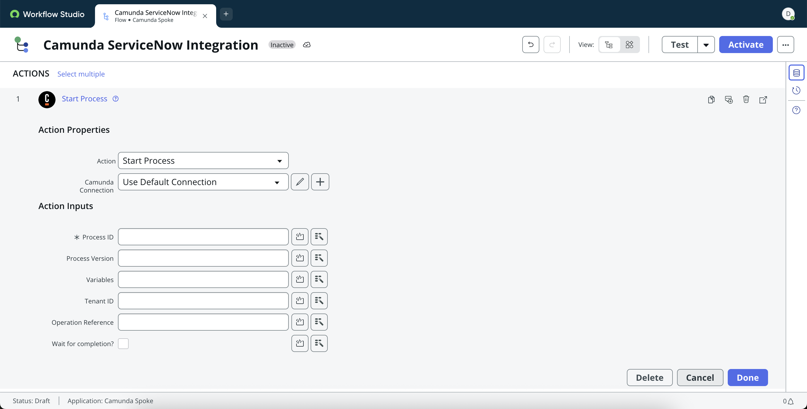
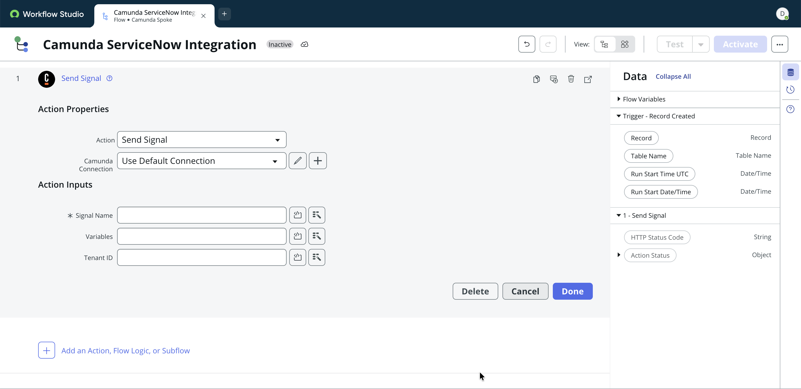
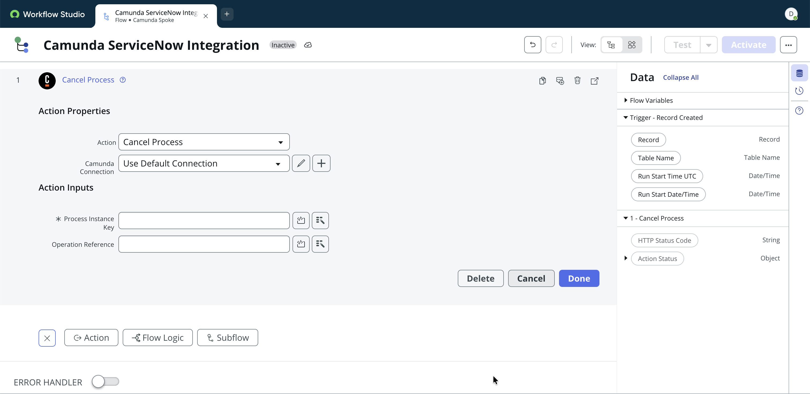

---
id: camunda-spoke
title: Camunda Spoke
description: "Use the Camunda Spoke in ServiceNow to start and interact with Camunda process instances from ServiceNow flows."


The **Camunda Spoke for ServiceNow** enables seamless orchestration between Camunda and ServiceNow, empowering your organization to automate cross-system workflows end to end.

With the Spoke installed on the ServiceNow side, you can initiate, signal, correlate or cancel Camunda process instances directly from the Flow Designer.

# Spoke actions in detail

## Start Process

Start a Camunda process from ServiceNow.



**Supported Inputs**

**Process ID:** The ID of the deployed BPMN process to start.
 Example: `handle_incident`

**Process Version:** (Optional) The version of the process to start. If empty, the latest deployed version is used.
 Example: `5`

**Variables:** (Optional) Process variables passed to Camunda as key-value pairs in JSON format.
 Example: `{ "invoiceId": "12345", "amount": 250 }`

Code Example:

```
const returnObject = {
    "request_item_number": fd_data.trigger.request_item.number.toString() || "",
    "request_sys_id": fd_data.trigger.request_item.sys_id.toString() || ""
};
return JSON.stringify(returnObject);
```

:::tip
When adding the JSON payload as code snippet, make sure to properly convert ServiceNow types into a JSON compatible format. In the example above, `sys_id` is a ServiceNow GUID, but needs to be a string for the JSON payload - thus the explicit conversion via `fd_data.trigger.request_item.sys_id.toString()`
:::

**Tenant ID:** (Optional) The tenant identifier for multi-tenant Camunda setups. Leave empty for single-tenant setups.
 Example: `hr-emea`

**Operation Reference:** (Optional) A user-defined reference key available in Camunda for tracking the operation.
Example: `camID`

**Wait for completion:** (Optional) Whether the flow waits until the Camunda process completes.

## Send Signal

Broadcast BPMN signals to one or many Camunda process instances


**Supported Inputs**

**Signal name:** The name of the BPMN signal to send. Must match the signal name defined in the process model. 
 Example: `sla_limit_exceeded`

**Variables:** (Optional) Process variables passed to Camunda as key-value pairs in JSON format.
 Example: `{ "invoiceId": "12345", "amount": 250 }`

**Tenant ID:** (Optional) The tenant identifier for multi-tenant Camunda setups. Leave empty for single-tenant setups. 
 Example: `hr-emea`

## Correlate Message

Correlate a running Camunda process instance from ServiceNow.


**Supported Inputs**

**Message name:** The name of the BPMN message to correlate with.
 Example: `managerApprovalDone`

**Correlation key:** The process variable value used to match the message to a specific process instance.
 Example: `approvalID`

## Cancel Process

Cancel a Camunda process instance from ServiceNow when needed.


**Supported Inputs**

**Process Instance Key:** The unique key identifying a running Camunda process instance to cancel.  
 Example: `2251799813685252`

**Operation Reference:** (Optional) A user-defined reference key available in Camunda for tracking the operation.
Example: `camID`

## Starting a ServiceNow process from Camunda

You can trigger a ServiceNow flow from Camunda by calling a REST API trigger endpoint.


**Supported Inputs**

**HTTP Method:** The HTTP method accepted by the flow.  
 Example: `POST`

**Path:** A custom URL path suffix for the trigger endpoint used by the ServiceNow Flow Starter Connector.  
Example: `/api/camun/my_flow_name`

**Requires authentication:** Whether incoming requests must include a valid ServiceNow authentication header. Enable this for production integrations.

**Roles:** (Optional) ServiceNow roles authorized to access the trigger endpoint.
