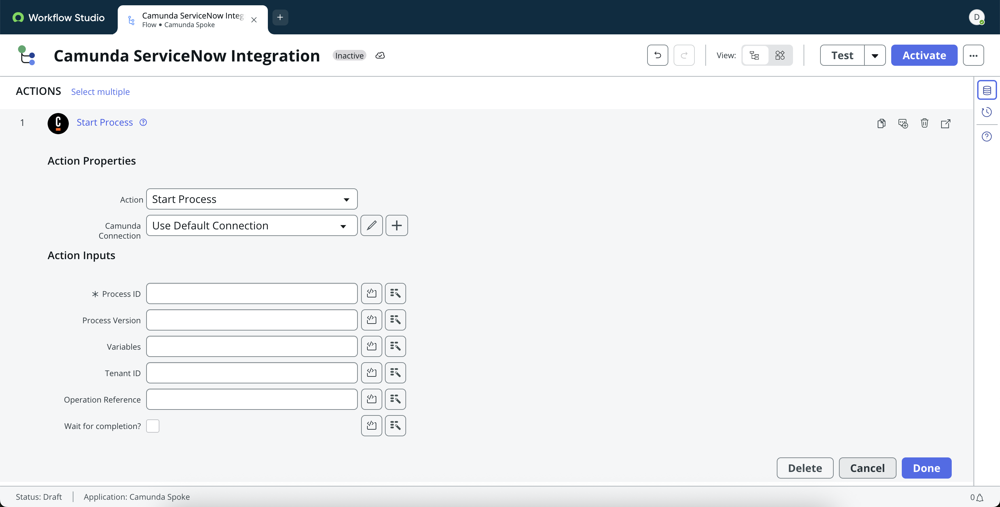
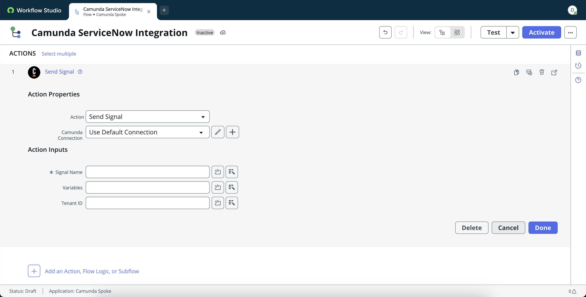
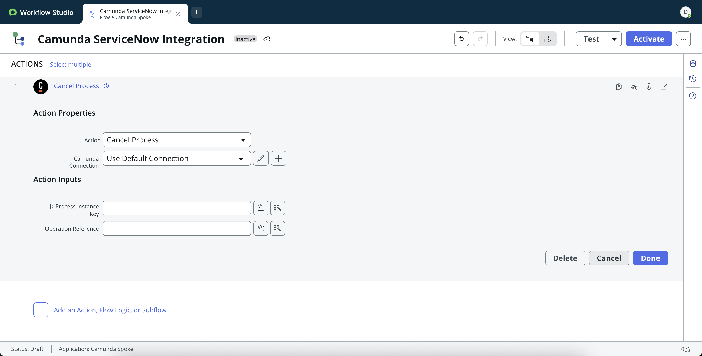
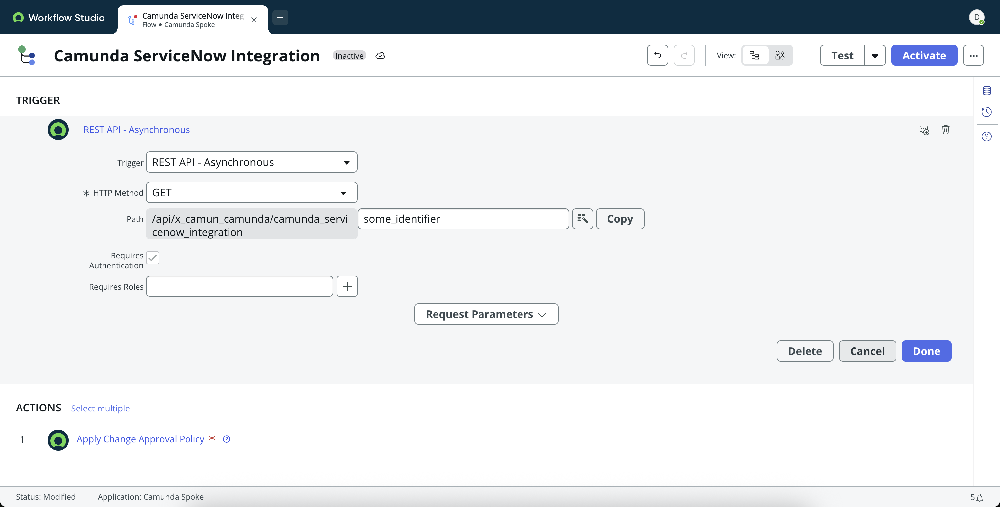

The Camunda Spoke for ServiceNow lets you orchestrate workflows between Camunda and ServiceNow, empowering your organization to automate cross-system workflows end to end.

With the Spoke installed in ServiceNow, you can start, signal, correlate, or cancel Camunda process instances directly from Flow Designer.

## Spoke actions

### Start rocess

Start a Camunda process from ServiceNow.



Supported inputs

**Process ID:** The ID of the deployed BPMN process to start.
Example: `handle_incident`

**Process Version:** (Optional) The version of the process to start. If empty, the latest deployed version is used.
Example: `5`

**Variables:** (Optional) Process variables passed to Camunda as key-value pairs in JSON format.
Example: `{ "invoiceId": "12345", "amount": 250 }`

#### Code example

```javascript
const returnObject = {
  request_item_number: fd_data.trigger.request_item.number.toString() || "",
  request_sys_id: fd_data.trigger.request_item.sys_id.toString() || "",
};
return JSON.stringify(returnObject);
```

:::tip
When you add the JSON payload as a code snippet, convert ServiceNow types to a JSON-compatible format. In the example above, `sys_id` is a ServiceNow GUID, but it must be converted to a string for the JSON payload. That is why the example uses `fd_data.trigger.request_item.sys_id.toString()`.
:::

**Tenant ID:** (Optional) The tenant identifier for multi-tenant Camunda setups. Leave empty for single-tenant setups.
Example: `hr-emea`

**Operation Reference:** (Optional) A user-defined reference key available in Camunda for tracking the operation.
Example: `camID`

**Wait for completion:** (Optional) Whether the flow waits until the Camunda process completes.

### Send signal

Broadcast BPMN signals to one or more Camunda process instances


Supported inputs

**Signal name:** The name of the BPMN signal to send. Must match the signal name defined in the process model.
Example: `sla_limit_exceeded`

**Variables:** (Optional) Process variables passed to Camunda as key-value pairs in JSON format.
Example: `{ "invoiceId": "12345", "amount": 250 }`

**Tenant ID:** (Optional) The tenant identifier for multi-tenant Camunda setups. Leave empty for single-tenant setups.
Example: `hr-emea`

### Correlate message

Correlate a running Camunda process instance from ServiceNow.


Supported inputs

**Message name:** The name of the BPMN message to correlate with.
Example: `managerApprovalDone`

**Correlation key:** The process variable value used to match the message to a specific process instance.
Example: `approvalID`

### Cancel process

Cancel a Camunda process instance from ServiceNow when needed.


Supported inputs

**Process Instance Key:** The unique key identifying a running Camunda process instance to cancel.  
 Example: `2251799813685252`

**Operation Reference:** (Optional) A user-defined reference key available in Camunda for tracking the operation.
Example: `camID`

### Start a ServiceNow process from Camunda

Camunda can trigger a ServiceNow flow by calling a REST API as the trigger endpoint in ServiceNow.



Supported inputs

**HTTP Method:** The HTTP method accepted by the flow.  
 Example: `POST`

**Path:** A custom URL path suffix for the trigger endpoint used by the ServiceNow Flow Starter Connector.  
Example: `/api/camunda/my_flow_name`

**Requires authentication:** Whether incoming requests must include a valid ServiceNow authentication header. Enable this for production integrations.

**Roles:** (Optional) ServiceNow roles authorized to access the trigger endpoint.
