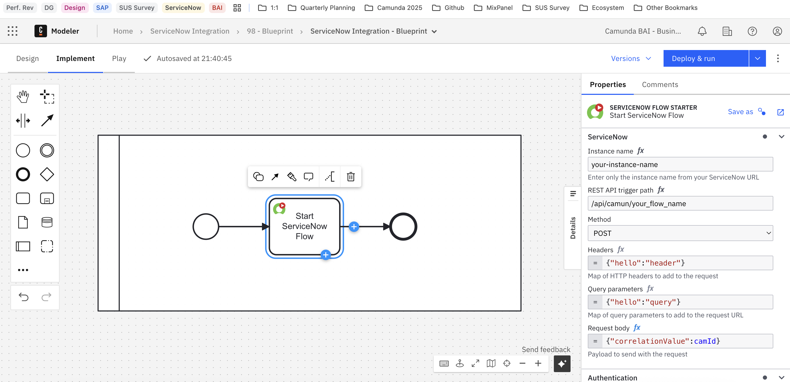

Start a ServiceNow Flow as part of a Camunda orchestration, and interact with the running Camunda process using the ServiceNow **Sys ID** as a correlation key.

The **ServiceNow Flow Starter** connector enables Camunda processes to trigger ServiceNow flows via REST API calls.  
This is particularly useful for orchestrating complex ServiceNow business logic, for example, triggering fulfillment, approvals, or catalog flows as part of an end-to-end process.

This connector also allows Camunda orchestrations to **be interrupted** for approval processes executed in ServiceNow.

:::important
The ServiceNow Flow Starter connector requires the **ServiceNow Integration Hub Enterprise Pack** and the **Flow Trigger – REST plugin** to be installed in your ServiceNow instance. See [prerequisites](../prerequisites.md).
:::

## Supported operation

| Operation        | Description                                                                  | Example use case                                                               |
| :--------------- | :--------------------------------------------------------------------------- | :----------------------------------------------------------------------------- |
| **Trigger Flow** | Starts a ServiceNow Flow Designer flow by calling its REST trigger endpoint. | Initiating catalog request flows or approval workflows from Camunda processes. |

## Configuration

In Camunda Modeler, configure the connector by selecting **ServiceNow Flow Starter** from the connector templates or by downloading it from the [Camunda Marketplace](https://marketplace.camunda.com/).

### Required fields

| Field                     | Description                                                                                                                          |
| :------------------------ | :----------------------------------------------------------------------------------------------------------------------------------- |
| **Instance name**         | Name of your ServiceNow instance (e.g., `your-instance-name`).                                                                       |
| **REST API trigger path** | REST API endpoint path for the ServiceNow flow to trigger (e.g., `/api/camun/my_flow_name`).                                         |
| **Method**                | HTTP method to use for the request. Supported methods: `POST`, `GET`, `PUT`, `PATCH`, `DELETE`.                                      |
| **Headers**               | Optional map of HTTP headers to include in the request (e.g., `{"hello":"header"}`).                                                 |
| **Query parameters**      | Optional map of query parameters to add to the request URL (e.g., `{"hello":"query"}`).                                              |
| **Request body**          | Payload sent to the ServiceNow flow, typically containing input variables or correlation data (e.g., `{"correlationValue": camId}`). |
| **Authentication**        | ServiceNow credentials (username and password).                                                                                      |

:::tip
Authentication - Store your ServiceNow credentials securely as [Camunda secrets](/components/console/manage-clusters/manage-secrets.md) and reference them in the connector configuration (e.g. `{{secrets.snUser}}`).
:::

_Configuration of the Flow Starter connector in Camunda Modeler._

## Example: Trigger ServiceNow Flow

This connector configuration shows how to start a ServiceNow flow from a Camunda process.

| Field                     | Example Value                 |
| :------------------------ | :---------------------------- |
| **Instance name**         | `your-instance-name`          |
| **REST API trigger path** | `/api/camun/your_flow_name`   |
| **Method**                | `POST`                        |
| **Headers**               | `{"hello": "header"}`         |
| **Query parameters**      | `{"hello": "query"}`          |
| **Request body**          | `{"correlationValue": camId}` |
| **Username**              | `{{secrets.snUser}}`          |
| **Password**              | `{{secrets.snPwd}}`           |
