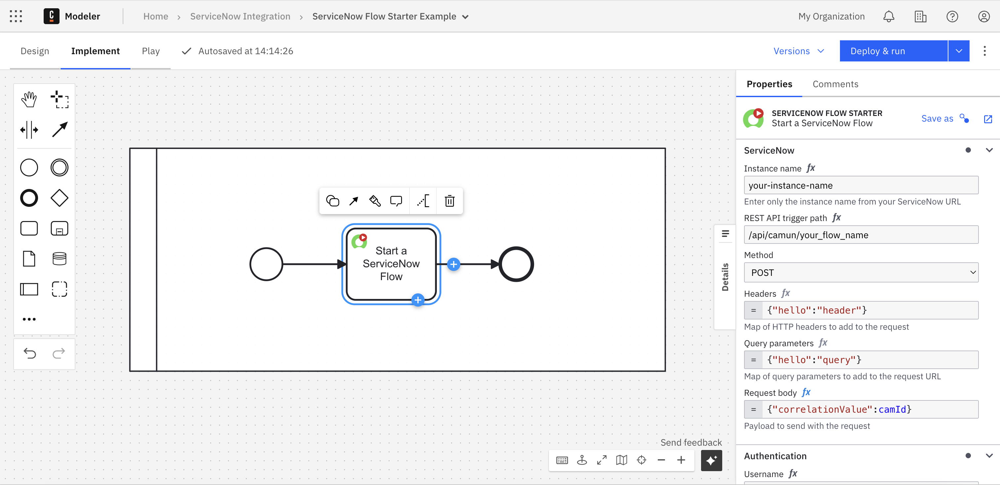

Start a ServiceNow Flow as part of a Camunda orchestration, and interact with the running Camunda process by using the ServiceNow **Sys ID** as a correlation key.

The ServiceNow Flow Starter enables Camunda processes to trigger ServiceNow flows using REST API calls.
This is especially useful when you want Camunda to orchestrate complex ServiceNow business logic—for example, triggering fulfillment, approvals, or catalog flows as part of an end-to-end process.

You can start a ServiceNow Flow as part of a Camunda orchestration and interact with the running Camunda process by using the ServiceNow Sys ID as a correlation key.
This also allows you to interrupt a Camunda orchestration for an approval process executed in ServiceNow.

> ⚠️ The Flow Starter Connector requires the **ServiceNow Integration Hub Enterprise Pack** and the **Flow Trigger – REST plugin** to be installed in your ServiceNow instance. See [prerequisites](../prerequisites.md)

---

## Supported Operation

| Operation | Description | Example Use Case |
|----------|-------------|-------------------|
| **Trigger Flow** | Starts a ServiceNow Flow Designer flow by calling its REST trigger endpoint. | Initiating catalog request flows or approval workflows from Camunda processes. |

---

## Configuration

In Camunda Modeler, configure the connector by selecting **ServiceNow Flow Starter** from the connector templates or download it from the Camunda Marketplace.

The following fields are typically required:

| Field | Description |
|-------|-------------|
| **Instance name** | Only the name of your ServiceNow instance (e.g. `your-instance-name`). |
| **REST API trigger path** | The REST API endpoint path for the ServiceNow flow you want to trigger (e.g. `/api/camun/my_flow_name`). |
| **Method** | The HTTP method to use for the request. Supported methods: `POST`, `GET`, `PUT`, `PATCH`, `DELETE`.|
| **Headers** | Optional map of HTTP headers to include in the request (e.g. `{"hello":"header"}`). |
| **Query parameters** | Optional map of query parameters to add to the request URL (e.g. `{"hello":"query"}`).|
| **Request body** | Payload sent to the ServiceNow flow, typically containing input variables or correlation data (e.g. `{"correlationValue": camId}`). |
| **Authentication** | ServiceNow credentials (username and password) stored securely in Camunda Secrets and referenced in the connector configuration. |

---

 
 

  
Configuration of the Flow Starter in Camunda Modeler.

 

## Example: Trigger ServiceNow Flow

This example shows how to trigger a ServiceNow Flow Designer flow from a Camunda process.

| Field                    | Example Value                                                             |
|---------------------------|---------------------------------------------------------------------------|
| **Instance name**         | `your-instance-name`                                                      |
| **REST API trigger path** | `/api/camun/your_flow_name`                                               |
| **Method**                | `POST`                                                                    |
| **Headers**               | `{"hello": "header"}`                                |
| **Query parameters**      | `{"hello": "query"}`                                 |
| **Request body**          | `{"correlationValue": camId}`                        |
| **Username**              | `{{secrets.snUser}}`                                                      |
| **Password**              | `{{secrets.snPwd}}`                                                       |
