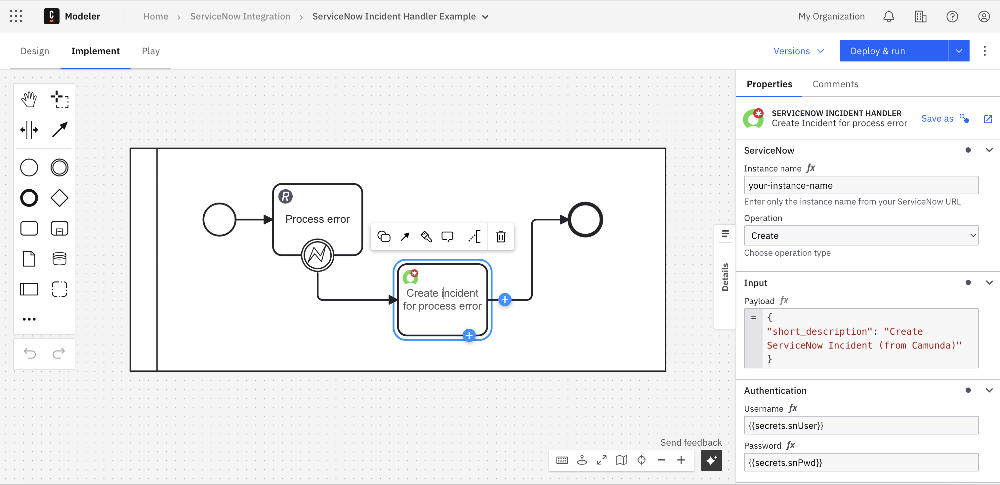

The **ServiceNow Incident Handler** is a specialized connector for the ServiceNow `incident` table. It allows Camunda processes to create, read, update, and delete incidents without needing to manually configure table names.

This connector is ideal for IT service management scenarios where incidents are automatically logged and managed as part of end-to-end process automation.

## Supported operations

| Operation  | Description                                                   | Example Use Case                                               |
| :--------- | :------------------------------------------------------------ | :------------------------------------------------------------- |
| **Create** | Creates a new incident in ServiceNow.                         | Logging an incident automatically when a process task fails.   |
| **Read**   | Retrieves details of an existing incident using its `sys_id`. | Checking the current status of an incident.                    |
| **Update** | Updates fields on an existing incident.                       | Changing incident priority or assignment group mid-process.    |
| **Delete** | Removes an incident by its `sys_id`.                          | Cleaning up test or temporary incidents after automation runs. |

## Configuration

In Camunda Modeler, configure the connector by selecting **ServiceNow Incident Handler** from the connector templates or download it from the Camunda Marketplace.

The following fields are typically required:

| Field              | Description                                                                            |
| :----------------- | :------------------------------------------------------------------------------------- |
| **Instance name**  | Only the name of your ServiceNow instance (e.g. `your-instance-name`).                 |
| **Operation**      | One of `Create`, `Read`, `Update`, or `Delete`.                                        |
| **Payload**        | JSON data representing incident fields (for Create and Update operations).             |
| **Sys ID**         | Unique identifier of the incident record for `Read`, `Update`, or `Delete` operations. |
| **Authentication** | ServiceNow credentials (username and password).                                        |

:::tip
Authentication - Store your ServiceNow credentials securely as [Camunda secrets](/components/console/manage-clusters/manage-secrets.md) and reference them in the connector configuration (e.g. `{{secrets.snUser}}`).
:::

  
_Configuration of the Incident Handler connector in Camunda Modeler._

## Example: Create incident

This connector configuration shows how to **create** a new incident entry in ServiceNow from a Camunda process.

| Field             | Example value                                                        |
| :---------------- | :------------------------------------------------------------------- |
| **Instance name** | `your-instance-name`                                                 |
| **Operation**     | `Create`                                                             |
| **Payload**       | `{"short_description": "Create ServiceNow Incident (from Camunda)"}` |
| **Username**      | `{{secrets.snUser}}`                                                 |
| **Password**      | `{{secrets.snPwd}}`                                                  |

## Example: Update incident priority

This connector configuration updates the **priority** field of an existing incident.

| Field             | Example value        |
| :---------------- | :------------------- |
| **Instance name** | `your-instance-name` |
| **Operation**     | `Update`             |
| **Sys ID**        | `{{incidentSysId}}`  |
| **Payload**       | `{"priority": "2"}`  |
| **Username**      | `{{secrets.snUser}}` |
| **Password**      | `{{secrets.snPwd}}`  |
