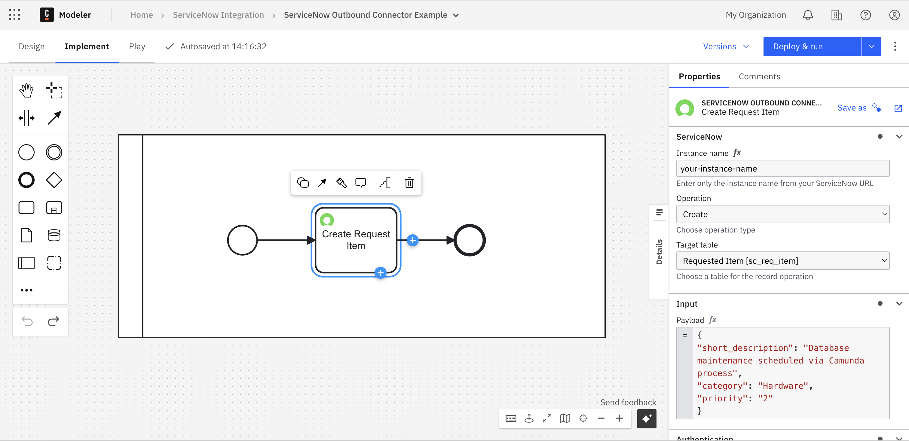
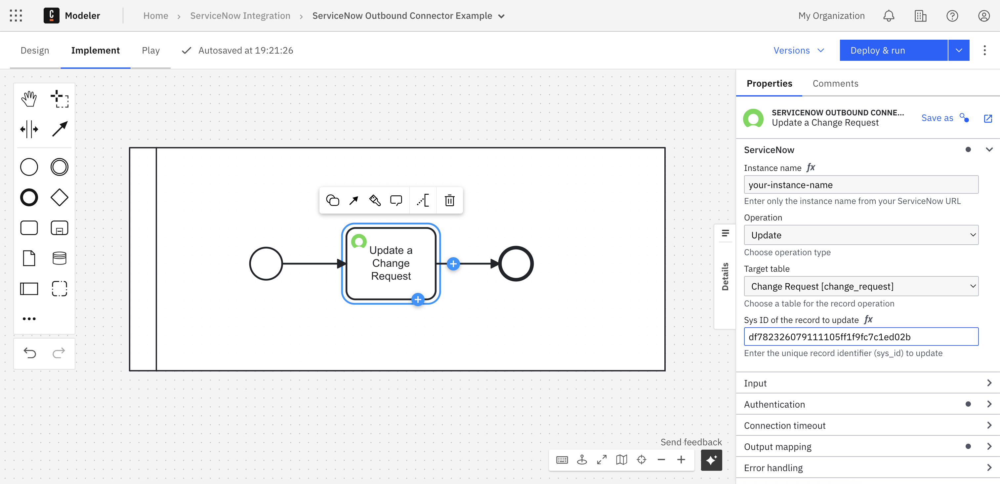

Use the ServiceNow outbound connector to perform CRUD operations on any ServiceNow table directly from Camunda processes.

This connector interacts with ServiceNow tables via REST APIs, enabling powerful integrations without custom scripts.

## Supported operations

| Operation | Description                                                                  | Example use case                                                 |
| :-------- | :--------------------------------------------------------------------------- | :--------------------------------------------------------------- |
| Create    | Insert a new record into a ServiceNow table.                                 | Create a new incident or service request from a Camunda process. |
| Read      | Retrieve records from a ServiceNow table using query parameters or `sys_id`. | Look up user details or check incident status.                   |
| Update    | Modify fields of an existing record identified by `sys_id`.                  | Update ticket status or assignment group.                        |
| Delete    | Remove a record from a table by `sys_id`.                                    | Delete temporary or test records after processing.               |

## Configure the connector

In Camunda Modeler, select **ServiceNow Outbound Connector** from the connector templates or download it from the [Camunda Marketplace](https://marketplace.camunda.com/).

### Required fields

| Field            | Description                                                                                             |
| :--------------- | :------------------------------------------------------------------------------------------------------ |
| Instance name    | Name of your ServiceNow instance (e.g., `your-instance-name`).                                          |
| Operation        | One of `Create`, `Read`, `Update`, or `Delete`.                                                         |
| Target table     | The target ServiceNow table (e.g., `incident`, `sc_task`, `sc_req_item`).                               |
| Payload          | JSON data sent to ServiceNow for `Create` and `Update` operations.                                      |
| Query parameters | For `Read` operations. Use `^` to separate multiple filter conditions (e.g., `active=true^priority=1`). |
| Sys ID           | Required for `Update` and `Delete` operations to identify the target record.                            |
| Authentication   | ServiceNow credentials (username and password).                                                         |

:::tip
Store ServiceNow credentials securely as [Camunda secrets](/components/console/manage-clusters/manage-secrets.md) and reference them in the connector configuration (e.g., `{{secrets.snUser}}` and `{{secrets.snPwd}}`).
:::

  
_Example configuration of the Create operation in Camunda Modeler._

> When using `Read`, `Update`, or `Delete`, the `sys_id` field becomes available in the connector properties to specify the target record.

<!-- _Example showing the `sys_id` field for Update operation._ -->

## Example: Create a requested item

| Field         | Example value                                                                                                          |
| :------------ | :--------------------------------------------------------------------------------------------------------------------- |
| Instance name | `your-instance-name`                                                                                                   |
| Operation     | `Create`                                                                                                               |
| Target table  | Requested item [sc_req_item]                                                                                           |
| Payload       | `{"short_description": "Database maintenance scheduled via Camunda process", "category": "Hardware", "priority": "2"}` |
| Username      | `{{secrets.snUser}}`                                                                                                   |
| Password      | `{{secrets.snPwd}}`                                                                                                    |
