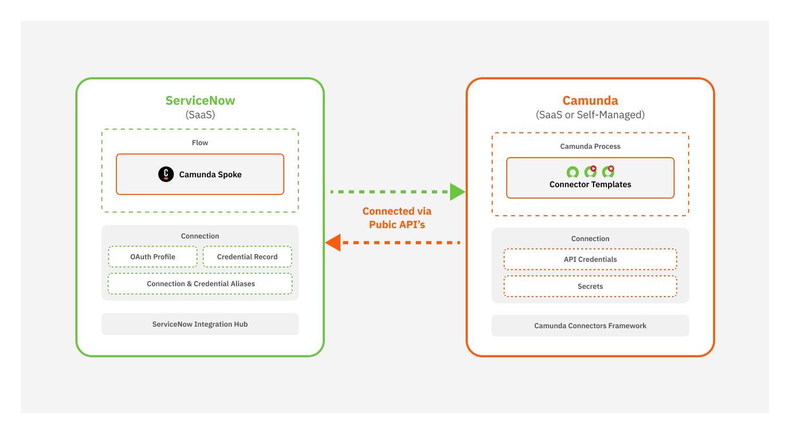

Use Camunda to automate workflows that interact with ServiceNow IT Service Management (ITSM), enabling seamless communication between BPMN processes and ServiceNow workflows.

## Key features

The integration enables you to:

- Bi-directionally integrate Camunda and ServiceNow to orchestrate flows and processes.
- Orchestrate activities inside ServiceNow and across systems end-to-end using BPMN.
- Manage records in ServiceNow: create, read, modify, or delete any record directly from Camunda processes.

## Audience

This documentation is intended for:

- Developers implementing workflows that interact with ServiceNow.
- Solution architects designing process automation across Camunda and ServiceNow.
- Administrators managing integration configuration and security.

## About the integration

Camunda’s ServiceNow integration combines:

- Custom actions in the ServiceNow Camunda Spoke to start or correlate Camunda processes from ServiceNow.
- Built-in connectors and element templates to interact with ServiceNow tables and flows from Camunda processes.

## Architecture

  
_This diagram shows how Camunda and ServiceNow interact._

## Integration features

The integration provides bi-directional orchestration using two main components: the Camunda Spoke and built-in connectors.

### Camunda Spoke in ServiceNow

| Action            | Description                                                      |
| :---------------- | :--------------------------------------------------------------- |
| Start process     | Start a Camunda process from ServiceNow.                         |
| Correlate message | Correlate a running Camunda process instance from ServiceNow.    |
| Send signal       | Broadcast BPMN signals to one or many Camunda process instances. |
| Cancel process    | Cancel a Camunda process instance from ServiceNow when needed.   |

### ServiceNow connectors in Camunda

| Connector                                                         | Description                                                                                           |
| :---------------------------------------------------------------- | :---------------------------------------------------------------------------------------------------- |
| [ServiceNow Outbound Connector](connectors/outbound-connector.md) | Execute CRUD operations on any ServiceNow table.                                                      |
| [ServiceNow Flow Starter](connectors/flow-starter.md)             | Start a ServiceNow flow from a Camunda process (requires ServiceNow Integration Hub Enterprise Pack). |
| [ServiceNow Incident Handler](connectors/incident-handler.md)     | Create and manage incidents in ServiceNow directly from a Camunda process.                            |
