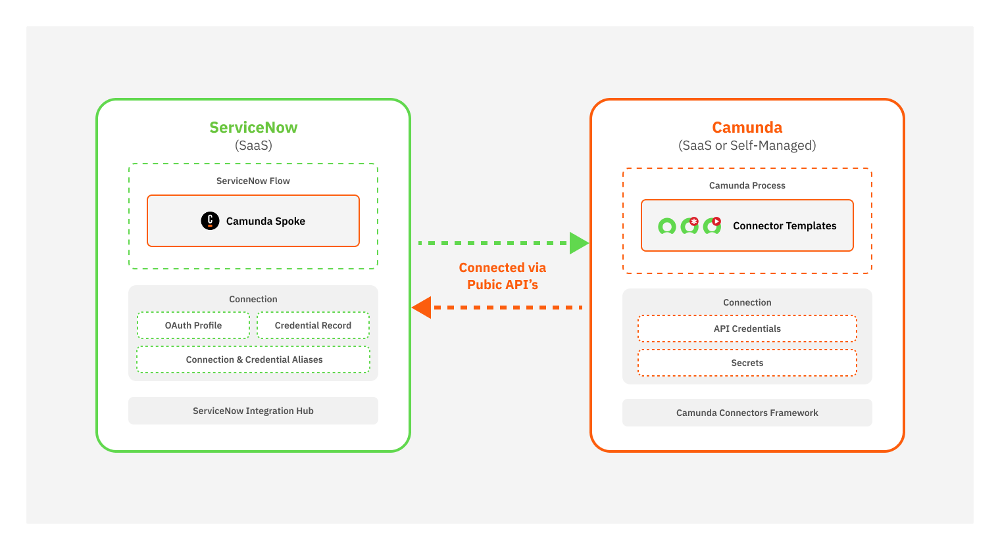

Extend the power of your process automation by integrating Camunda with ServiceNow.  
This integration enables seamless communication between your BPMN workflows and ServiceNow IT Service Management (ITSM), helping you automate routine tasks, orchestrate complex cross-system scenarios, and accelerate service delivery.

## Key features

The ServiceNow integration enables:

- **Bi-directional integration between ServiceNow and Camunda**  
  Seamless communication between ServiceNow flows and Camunda processes to bring orchestration capabilities to ServiceNow.

- **End-to-end orchestration for ServiceNow**  
  Orchestrate activities inside ServiceNow and across other systems end-to-end using BPMN (Business Process Model and Notation).

- **Manage records within ServiceNow**  
  Create, read, modify, or delete any ServiceNow record from a BPMN orchestration.

## Audience

This documentation is intended for:

- **Developers** implementing workflows that interact with ServiceNow.
- **Solution architects** designing process automation across Camunda and ServiceNow.
- **Administrators** managing integration configuration and security.

## About the integration

Camunda’s ServiceNow integration follows a **hybrid approach** that combines:

- **Custom actions in the ServiceNow Camunda Spoke** for initiating or correlating Camunda processes from ServiceNow.
- **Camunda connectors and element templates** for interacting with ServiceNow tables and flows from Camunda processes.

## Architecture

_This diagram shows how Camunda and ServiceNow interact with each other._

## Integration features

The Camunda ServiceNow integration provides **bi-directional orchestration** through two main components: the **Camunda Spoke** and **Camunda connectors**.

### Camunda Spoke in ServiceNow

| Spoke actions         | Description                                                      |
| :-------------------- | :--------------------------------------------------------------- |
| **Start process**     | Start a Camunda process from ServiceNow.                         |
| **Correlate message** | Correlate a running Camunda process instance from ServiceNow.    |
| **Send signal**       | Broadcast BPMN signals to one or many Camunda process instances. |
| **Cancel process**    | Cancel a Camunda process instance from ServiceNow when needed.   |

### ServiceNow connectors in Camunda

| Connector                                                             | Description                                                                                           |
| :-------------------------------------------------------------------- | :---------------------------------------------------------------------------------------------------- |
| [**ServiceNow Outbound Connector**](connectors/outbound-connector.md) | Execute CRUD operations on any ServiceNow table.                                                      |
| [**ServiceNow Flow Starter**](connectors/flow-starter.md)             | Start a ServiceNow flow from a Camunda process (requires ServiceNow Integration Hub Enterprise Pack). |
| [**ServiceNow Incident Handler**](connectors/incident-handler.md)     | Create and manage incidents in ServiceNow directly from a Camunda process.                            |
