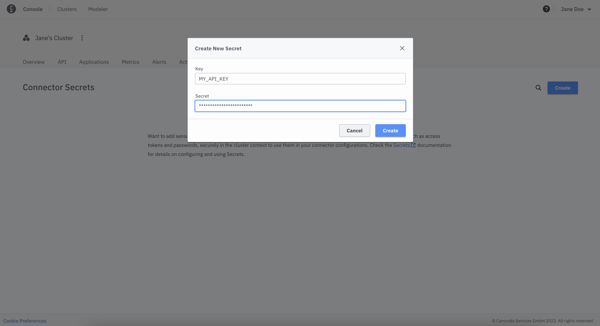

Create secrets and reference them in your Connectors without exposing sensitive information in your BPMN processes.

:::note Warning
**Connector Secrets** are managed at the cluster level so ensure you deploy your processes to the cluster that contains the necessary secrets.
If you deploy and the secret is missing then Operate will show an incident.
:::

To create a new secret, go to your cluster and take the following steps:

1. Select the **Connector Secrets** tab

2. Click on **Create**
3. Provide a **Key** for your secret that you will use to reference your secret from your Connector
4. Provide the **Secret** that will be assigned to the **Key**

5. Click on **Create** and view your new secret in the list

Now you can reference your secret like this: `secrets.MY_API_KEY` in any Connector field in the Properties Panel that is marked with the FEEL Expression icon: .

:::note Warning
`secrets.*` is a reserved syntax. please don't use it for other purposes than referencing our secrets in any of your variables or FEEL expressions.
If you use the syntax and deploy, the Engine will search a secret and Operate will show an incident.
:::