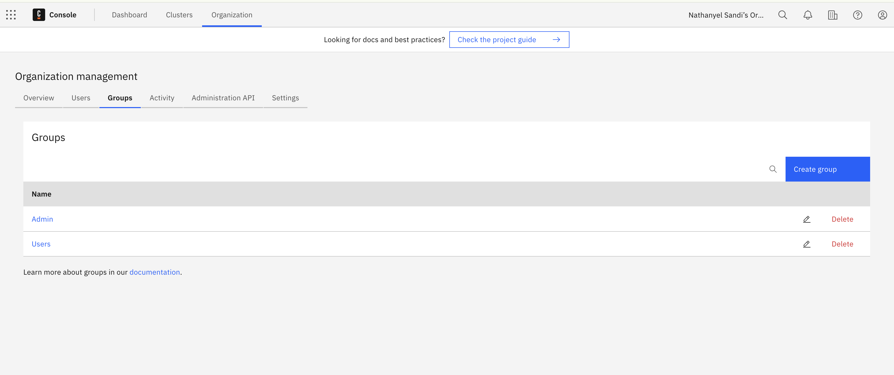
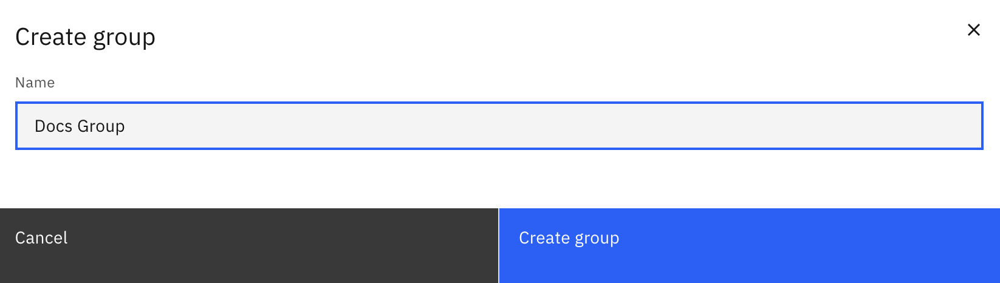
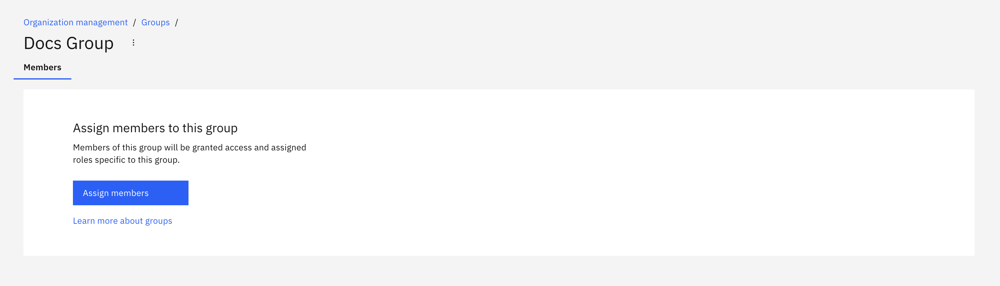

User Groups are a way to organize users in the system. They can be used to control the level of access a user or group has to perform tasks in the system via [user task restrictions](user-task-access-restrictions.md).

### Creating a group

To create a group, navigate to the Organization section of the console and click on the "Groups" tab.

Click the "Create Group" button and fill in the required fields.

#### Adding users to a group

To add users to a group, navigate to the Organization section of the console and click on the "Users" tab.

Select the user you want to add to a group and click the "Assign" button. Select the group you want to add the user to and click "Assign Members".

