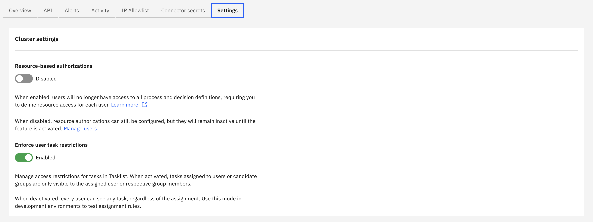

:::caution
User task access restrictions are enabled by default on SaaS.
:::

User task access restrictions allow you to control the level of access a [user](../../console/manage-organization/manage-users.md) or
[group](user-groups.md) has to perform BPMN user tasks where they are candidates.

### User task access restrictions

User task access restrictions are used in Tasklist to control task access for a
user or [group](user-groups.md). The restrictions are
related to the candidate users or groups set up on user task definitions.

For example, if a task has a candidate group named `Team A` and a candidate user named `example`, only the
users that belong to `Team A` and the user `example` will have access to the task.

### Enabling/Disabling user task access restrictions

User task access restrictions are enabled by default. To disable them, navigate to the `Settings` section of the console and click on the `Enforce user task restrictions` tab to Enable/Disable the functionality.

When activated, tasks assigned to users or candidate groups are only visible to the assigned user or respective group members. When deactivated, every user can see any task, regardless of the assignment.
