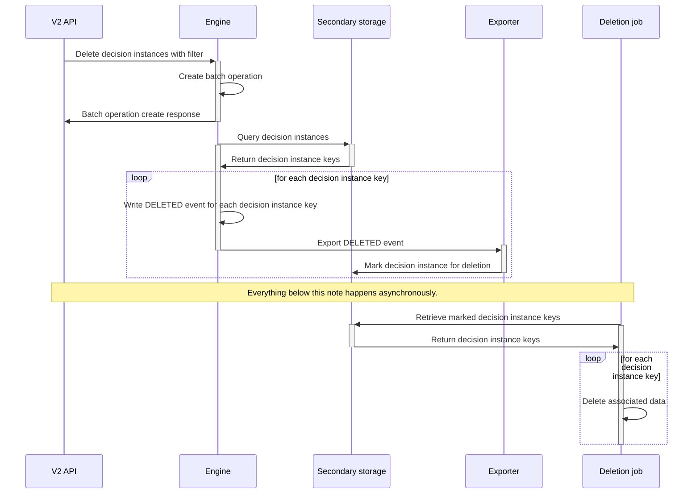

Use decision instance deletion to permanently remove all data associated with a decision evaluation instance.

:::warning
Deletion is irreversible. Restore deleted data only by restoring a backup of your cluster.
:::

- Delete a single decision instance using the [delete decision instance endpoint](/apis-tools/orchestration-cluster-api-rest/specifications/delete-decision-instance.api.mdx).
- Delete multiple decision instances using the [delete decision instances endpoint](/apis-tools/orchestration-cluster-api-rest/specifications/delete-decision-instances-batch-operation.api.mdx).

## Eventual consistency

Decision instance deletion runs asynchronously. Depending on how many decision instances are deleted, it may take time for the data to be removed and for the decision instance to disappear from Operate.

## Technical details

This section explains how decision instance deletion is handled internally to clarify timing and consistency behavior.

Deleting one or more decision instances uses [batch operations](./batch-operations.md).

The Zeebe engine queries secondary storage for decision instances to delete. For each instance found, the engine writes a delete command to the log, which produces a deleted event.

Exporters consume the deleted event and write a record to secondary storage marking the decision instance for deletion. An asynchronous scheduled task then deletes all data associated with each marked decision instance.

