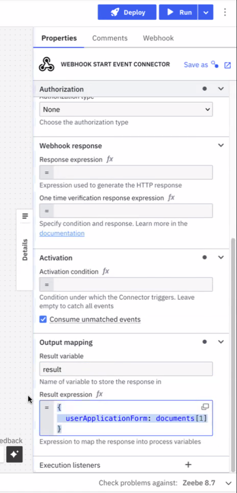
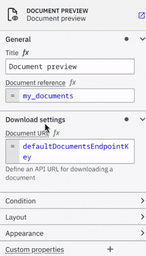
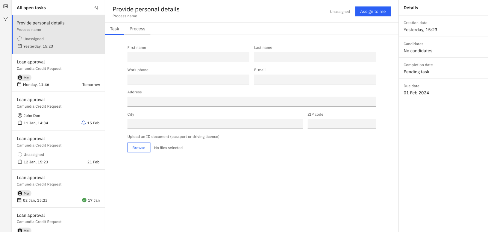

Offering more robust document handling capabilities within Camunda SaaS and Self-Managed, users can now efficiently manage large volumes of binary data such as PDFs and images across both development and production environments. This assists with streamlining business processes involving document uploads, storage, and management, enhancing workflow efficiency and compliance without compromising the performance or integrity of active workflows.

Across the unified Camunda 8 platform, use document handling to store, track, and manage documents utilizing the [Camunda 8 API](/apis-tools/camunda-api-rest/specifications/create-documents.api.mdx), Connectors, Forms, and Tasklist.

## Storage integration

### SaaS

A [Google Cloud Platform](https://cloud.google.com/storage) storage integration is configured for SaaS and handled by Camunda.

#### Limitations

- One bucket per cluster is permitted with SaaS.
- This storage integration is handled and configured by Camunda. While this is not dynamically configurable by the cluster, it is provided as environment configuration.
- **Maximum file size**: 10 MB per file.
- **File expiration time/time-to-live (TTL) policy**: 30 days by default. Clients for Connectors and Forms may specify a custom expiration date when uploading documents.

### Self-Managed

<!--- Does this content belong here, or should we link to it from the SM docs? --->

Use [AWS S3](https://aws.amazon.com/s3/) storage and bucket creation per cluster to securely store and retrieve documents in an external, scalable storage solution, and to ensure storage is properly isolated and managed for each environment.

#### Limitations

<!--- same limitations as SaaS? if so, make one section --->

<!--- insert section regarding API capabilities? --->

## Use cases and capabilities

Document handling may be beneficial for several use cases. For example:

- [Upload a document via the inbound webhook Connector](#upload-a-document-via-inbound-webhook-connector), and later retrieve the document content in another Connector invocation to store it in a third-party system.
- [Upload a document via public form](#upload-a-document-via-public-form) to start the process, view and download files displayed in the task's form, and retrieve the document later in a Connector invocation to send it to a third-party system.

### Upload a document via inbound webhook Connector

[Access created documents](/components/connectors/protocol/http-webhook.md) in both the response expression and the result expression, where the `documents` object contains the references for created documents.

<!--- Explain how to then retrieve the document in another Connector to store it in a third-party system or provide a screenshot with some text --->

Review the list of [outbound Connectors](#outbound-connectors) below which currently support retrieving the document content to store in a third-party system.

### Upload a document via public form

A [form](/components/modeler/forms/camunda-forms-reference.md) can display documents with the [document preview component](/components/modeler/forms/form-element-library/forms-element-library-document-preview.md):

With the [filepicker form element](/components/modeler/forms/form-element-library/forms-element-library-filepicker.md), you may also [upload multiple files at once](/components/modeler/forms/form-element-library/forms-element-library-filepicker.md#configurable-properties). This can be dynamically set using an [expression](/components/modeler/feel/language-guide/feel-expressions-introduction.md):

For additional guidance on supported file formats, refer to the [MDN Web Docs](https://developer.mozilla.org/en-US/docs/Web/HTML/Element/input/file#unique_file_type_specifiers).

With Tasklist, users may then view and download files displayed in the task's form.

:::note
If you change the **Document URL** under **Download settings**, this feature will not work for public start forms because there is no valid session.
:::

#### Outbound Connectors

The [Connector SDK](/components/connectors/custom-built-connectors/connector-sdk.md) is enhanced to provide document support in property/variable bindings.

For the following outbound Connectors, you may include a **Request body** under **Payload** in the properties panel to send with your request:

- [REST](/components/connectors/protocol/rest.md) - Supports storing the response as a document.
- [Email](/components/connectors/out-of-the-box-connectors/email.md) - Supports sending Camunda documents as attachments, or storing incoming attachments as Camunda documents.
- [Amazon Textract](/components/connectors/out-of-the-box-connectors/amazon-textract.md) - Can read the input document directly from the Camunda document store.
- [Amazon Bedrock](/components/connectors/out-of-the-box-connectors/amazon-bedrock.md) - Supports consuming documents as inputs for conversations.
- [Amazon S3](/components/connectors/out-of-the-box-connectors/amazon-s3.md) - Supports uploading documents from (or downloading documents to) the Camunda document store.
- [Box](/components/connectors/out-of-the-box-connectors/box.md) - Supports uploading documents from (or downloading documents to) the Camunda document store.

<!--- need to outline what this looks like for each supported connector in the related connector documentation, and link to these sections instead of the connector as done above --->
