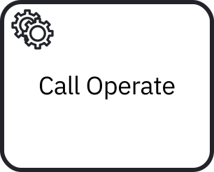

import propertiesNoTemplate from './assets/element-templates/properties-no-template.png'
import propertiesWithTemplate from './assets/element-templates/properties-with-template.png'

An **element template** extends the [Modeler](../modeler/about-modeler.md) with domain-specific diagram elements, such as service and user tasks. They allow you to customize how a BPMN element is displayed and how it can be configured by process developers.

The example below shows how a generic service task can be transformed into a customized user interface that guides users through its configuration:

| Without an element template                                                                        | With an element template                                                                          |
| -------------------------------------------------------------------------------------------------- | ------------------------------------------------------------------------------------------------- |
|  |  |
|               |               |

:::tip
[Connector templates](../connectors/custom-built-connectors/connector-templates.md) are a specific type of element template.
:::
