## Introduction

### Overview

Execution Listeners (EL) in Camunda 8 allow users to react to various events in the workflow execution lifecycle by
executing custom logic. This feature provides flexibility and control over the process execution, enabling complex data handling,
external system interactions, and process monitoring without cluttering the BPMN model with technical details.

### Benefits

- **Automate pre and post-execution logic:** Simplifies process models by removing the need for additional technical steps.
- **Enhanced monitoring:** Provides real-time notifications and data export capabilities.
- **Improved process control:** Facilitates complex variable handling and decision-making within the workflow.

### Use cases

- Pre and post-processing actions for activities.
- Real-time notifications about process instance progress.
- Data export for reporting.
- Decoupled processes and data synchronization.
- Dynamic variable fetching and calculation before gateway and event elements.

## Getting started

### Start listeners

Triggers custom logic before the element is processed. Useful for initial data setup or preconditions.

### End listeners

Triggers custom logic after the element is processed. Ideal for cleanup operations or post-processing tasks.

### Enabling Execution Listeners

Execution Listeners are enabled by configuring them in the BPMN model.
Ensure the necessary extensions and configurations are in place before deploying process definitions with EL.

## Parameters and configuration

### Parameters

| Parameter     | Type                     | Required | Description                                                  |
| :------------ | :----------------------- | :------: | ------------------------------------------------------------ |
| **eventType** | `string`, `fixed values` |   Yes    | Specifies when the EL should be executed (`start` or `end`). |
| **type**      | `string`, `expression`   |   Yes    | Defines the job worker type.                                 |
| **retries**   | `string`, `expression`   |    No    | Number of retries if a failure occurs (default is `3`).      |

### Example configuration

```xml
<extensionElements>
  <zeebe:executionListeners>
    <zeebe:executionListener eventType="start" type="custom_start_listener"/>
    <zeebe:executionListener eventType="end" type="custom_end_listener" retries="5"/>
  </zeebe:executionListeners>
</extensionElements>
```

## Supported elements

Execution Listeners can be applied to a variety of BPMN elements, enabling custom logic execution at different points within a process.
The following table provides a comprehensive overview of which elements support `start` and `end` ELs.
Note that for some elements, support is conditional, such as with non-interrupting escalation events.

|      **Element Type**       | Sub-Type            | Start EL |          End EL          |
| :-------------------------: | :------------------ | :------: | :----------------------: |
|          **Tasks**          |                     |    ✅    |            ✅            |
|                             | Business Rule Task  |    ✅    |            ✅            |
|                             | User Task           |    ✅    |            ✅            |
|                             | Script Task         |    ✅    |            ✅            |
|                             | Service Task        |    ✅    |            ✅            |
|                             | Send Task           |    ✅    |            ✅            |
|                             | Receive Task        |    ✅    |            ✅            |
|                             | Manual Task         |    ✅    |            ✅            |
|         **Events**          |                     |          |                          |
|       _Start Events_        |                     |          |                          |
|                             | None                |    ❌    |            ✅            |
|                             | Message             |    ❌    |            ✅            |
|                             | Signal              |    ❌    |            ✅            |
|                             | Timer               |    ❌    |            ✅            |
| _Intermediate Catch Events_ |                     |          |                          |
|                             | Message             |    ✅    |            ✅            |
|                             | Timer               |    ✅    |            ✅            |
|                             | Signal              |    ✅    |            ✅            |
|                             | Link                |    ✅    |            ✅            |
| _Intermediate Throw Events_ |                     |          |                          |
|                             | None                |    ✅    |            ✅            |
|                             | Message             |    ✅    |            ✅            |
|                             | Escalation          |    ✅    | ✅ (if not interrupting) |
|                             | Signal              |    ✅    |            ✅            |
|                             | Compensation        |    ✅    |            ✅            |
|                             | Link                |    ✅    |            ✅            |
|      _Boundary Events_      |                     |          |                          |
|                             | Error               |    ❌    |            ✅            |
|                             | Message             |    ❌    |            ✅            |
|                             | Timer               |    ❌    |            ✅            |
|                             | Signal              |    ❌    |            ✅            |
|                             | Escalation          |    ❌    |            ✅            |
|                             | Compensation        |    ❌    |            ❌            |
|        _End Events_         |                     |          |                          |
|                             | None                |    ✅    |            ✅            |
|                             | Error               |    ✅    |            ❌            |
|                             | Message             |    ✅    |            ✅            |
|                             | Terminate           |    ✅    |            ✅            |
|                             | Escalation          |    ✅    | ✅(if not interrupting)  |
|                             | Signal              |    ✅    |            ✅            |
|                             | Compensation        |    ✅    |            ✅            |
|        **Gateways**         |                     |          |                          |
|                             | Inclusive Gateway   |    ✅    |            ❌            |
|                             | Exclusive Gateway   |    ✅    |            ❌            |
|                             | Parallel Gateway    |    ✅    |            ❌            |
|                             | Event-based Gateway |    ✅    |            ❌            |
|        **Processes**        |                     |          |                          |
|                             | Process Instance    |    ✅    |            ✅            |
|      **Subprocesses**       |                     |          |                          |
|                             | Embedded Subprocess |    ✅    |            ✅            |
|                             | Call Activities     |    ✅    |            ✅            |
|                             | Event Subprocess    |    ✅    |            ✅            |

## Limitations

- **Unsupported elements**: Some elements do not support `start` or `end` listeners due to their processing nature.
  For more details refer to the table of [supported elements](#supported-elements).

- **Duplicate listeners**: Execution listeners must have unique combinations of `eventType` and `type`.
  If multiple listeners with the same `eventType` and `type` are defined, it will result in an validation error.
  While it's possible to have listeners of the same `type` if they are associated with different `eventType` values.

- **Interrupting Escalation Events**: For Intermediate Throw and End events with an interrupting escalation event,
  `end` listeners will not be executed. The escalation event terminates the element's processing immediately upon activation,
  bypassing any defined `end` listeners.

## Workarounds for unsupported Execution Listeners

While some BPMN elements do not support `start` or `end` ELs, there are several workarounds to achieve
similar functionality for specific elements. Here are the recommended strategies:

### Start Events (Start ELs)

**Workaround:** Use `start` listeners of process instances or subprocesses to cover the missing `start` listeners for specific start events.

<details>
  <summary><strong>Example:</strong></summary>

```xml
<process id="processWithStartListeners" isExecutable="true">
    <extensionElements>
        <zeebe:executionListeners>
            // highlight-next-line
            <zeebe:executionListener eventType="start" type="process_start_listener"/>
        </zeebe:executionListeners>
    </extensionElements>
    <startEvent id="startEvent" name="startEvent">
        <outgoing>flow1</outgoing>
    </startEvent>
  <!-- other elements -->
</process>
```

</details>

### Boundary Events (Start ELs)

**Workaround:** Place the start logic in the `start` ELs of the main activity to which the boundary event is attached.

<details>
  <summary><strong>Example:</strong></summary>

```xml
<process>
    <!-- other elements -->
    <serviceTask id="mainActivity" name="mainActivity">
        <extensionElements>
            <zeebe:taskDefinition type="test_service_task"/>
            <zeebe:executionListeners>
                // highlight-next-line
                <zeebe:executionListener eventType="start" type="service_task_start_listener"/>
            </zeebe:executionListeners>
        </extensionElements>
    </serviceTask>
    <boundaryEvent attachedToRef="mainActivity" id="boundarySignalEvent" name="boundary_signal_event">
        <extensionElements>
            <zeebe:executionListeners>
                <zeebe:executionListener eventType="end" retries="3" type="end_execution_listener_job"/>
            </zeebe:executionListeners>
        </extensionElements>
        <signalEventDefinition id="signalEventDefinition" signalRef="signalRef"/>
    </boundaryEvent>
    <!-- other elements -->
</process>
<signal id="signalRef" name="my_signal"/>
```

</details>

### Gateways (End ELs)

**Workaround:** Use `start` ELs on the element following the gateway to execute the required logic. This allows handling of any post-execution tasks in a dedicated element.

<details>
  <summary><strong>Example:</strong></summary>

```xml
<!-- other elements -->
<exclusiveGateway default="toServiceTaskFlow" id="exclusiveGateway" name="exclusiveGateway">
    <outgoing>toServiceTaskFlow</outgoing>
</exclusiveGateway>
<sequenceFlow id="toServiceTaskFlow" sourceRef="exclusiveGateway" targetRef="task"/>
<serviceTask id="task" name="task">
    <extensionElements>
        <zeebe:taskDefinition type="service_task_after_gateway"/>
        <zeebe:executionListeners>
            // highlight-next-line
            <zeebe:executionListener eventType="start" type="task_after_gateway_start_listener"/>
        </zeebe:executionListeners>
    </extensionElements>
    <incoming>toServiceTaskFlow</incoming>
</serviceTask>
<!-- other elements -->
```

</details>

By understanding these workarounds, you can effectively design workflows to accommodate the limitations of ELs
and maintain the flexibility and control of your process executions.

## Usage

### Job Workers

To process EL jobs, a Job Worker should be defined. Job Workers handle specific tasks by subscribing to jobs of a
particular type and executing the associated business logic. They allow for flexible and reusable logic in workflows.
For more detailed information on how to create and manage Job Workers,
refer to the [Camunda Job Workers documentation](/components/concepts/job-workers.md) & [Job Worker example](apis-tools/java-client-examples/job-worker-open.md).

## Variables

### Scope

Variables set during the completion of an EL job are local to the element where the EL is defined.
This design choice helps to prevent global variable scope cluttering, ensuring that the variables
are contained within the context of the specific element they are associated with.

### Dynamic variable handling

Execution Listeners enable the dynamic fetching and calculation of variables for the next steps in the process,
based on the current data. This functionality is particularly useful for elements such as gateways and events,
allowing for more informed decision-making and precise control over process flow.

#### Gateways

- [Inclusive](/components/modeler/bpmn/inclusive-gateways/inclusive-gateways.md), [Exclusive](/components/modeler/bpmn/exclusive-gateways/exclusive-gateways.md), [Event-Based Gateways](/components/modeler/bpmn/event-based-gateways/event-based-gateways.md): Use ELs to calculate and set variables that determine the outgoing
  path from these gateways. The custom logic executed by ELs can evaluate current data and set the necessary variables
  to guide the process flow correctly.

#### Intermediate Catch Events

- [Message Events](/components/modeler/bpmn/message-events/message-events.md#intermediate-message-catch-events): Variables set by ELs can be used to define the message correlation key,
  ensuring that the correct message is matched with the event.
- [Timer Events](/components/modeler/bpmn/timer-events/timer-events.md#intermediate-timer-catch-events): ELs can define timer expressions based on the calculated variables, enabling dynamic timer configurations.
- [Signal Events](/components/modeler/bpmn/signal-events/signal-events.md#signal-intermediate-catch-events): Variables can determine the signal name, allowing for flexible signal handling based on the current process state.

## Element processing flow

Understanding where Execution Listeners fit into the element processing flow is crucial for designing efficient workflows.
The following flowchart visualizes the element processing flow with Execution Listeners:

```mermaid
flowchart LR
    subgraph Activation
        ElementActivation["Element Activation"]
        StartExecutionListeners["Start Execution Listeners"]
        FinalizeActivation["Finalize Activation"]
    end

    subgraph Execution
        ElementExecution["Element Execution"]
    end

    subgraph Completion
        EndExecutionListeners["End Execution Listeners"]
        ElementCompletion["Element Completion"]
        FinalizeCompletion["Finalize Completion"]
    end

    ElementActivation -->|if 'start' ELs configured| StartExecutionListeners
    StartExecutionListeners:::execution-listeners --> FinalizeActivation
    ElementActivation --> FinalizeActivation
    FinalizeActivation --> ElementExecution
    ElementExecution --> ElementCompletion
    ElementCompletion -->|if 'end' ELs configured| EndExecutionListeners
    EndExecutionListeners:::execution-listeners --> FinalizeCompletion
    ElementCompletion --> FinalizeCompletion

    classDef execution-listeners fill:gray
```



<details>
  <summary><strong>Element lifecycle steps</strong></summary>
  <p>When an element with ELs is processed in Zeebe, the following steps outline its lifecycle, highlighting where <code>start</code> and <code>end</code> ELs are executed:</p>
  <h4>Element Activation:</h4>
  <p>The process instance reaches the element and begins its activation. This initial phase prepares the element for execution and typically includes:</p>
  <ul>
    <li><em>Apply Input Mappings</em> (if applicable): Input variables are mapped to the element's local scope.</li>
  </ul>
  <h4>Start Execution Listeners:</h4>
  <p>If <code>start</code> ELs are defined, they are executed. These listeners can perform setup tasks and have access to input variables (if any defined).</p>
  <h4>Finalize Activation:</h4>
  <p>The element completes any additional actions required for activation. This usually includes:</p>
  <ul>
    <li><em>Subscribe to Events</em> (if applicable): The element subscribes to any events it needs to listen for during its execution.</li>
    <li><em>Element Activated</em>: The element is fully activated and ready to perform its primary function.</li>
  </ul>
  <h4>Element Execution:</h4>
  <p>The core activity of the element is carried out. This step represents the main purpose of the BPMN element (e.g., a task being performed).</p>
  <h4>Element Completion:</h4>
  <p>Once the primary activity is finished, the element begins its completion phase, which includes:</p>
  <ul>
    <li><em>Apply Output Mappings</em> (if applicable): Output variables are mapped from the element's local scope to the global scope.</li>
    <li><em>Unsubscribe from Events</em> (if applicable): The element unsubscribes from any events it was listening for.</li>
  </ul>
  <h4>End Execution Listeners:</h4>
  <p>During the element completion stage, if <code>end</code> ELs are defined, they are executed after applying output mappings (if any defined). These listeners can perform cleanup tasks and have access to output variables.</p>
  <h4>Finalize Completion:</h4>
  <p>The element executes any additional actions required for element completion and execution transits to the next element.</p>
  <p>By placing custom logic at strategic points within the element lifecycle, you can enhance process control, improve data handling, and integrate seamlessly with external systems.</p>
</details>

## FAQ

### Common questions

- **Can execution listeners be used with all BPMN elements?**
  - No, some elements have limitations due to their processing nature. See the table of [supported elements](#supported-elements).

### Troubleshooting

- **Execution Listener not triggering**
  - Verify the configuration and ensure the element supports the specified listener type.

## Learn more

- [Variables](/components/concepts/variables.md)
- [Expressions](/components/concepts/expressions.md)
- [Job workers (basics)](/components/concepts/job-workers.md)
- [Job workers (Java client)](/apis-tools/java-client/job-worker.md)
