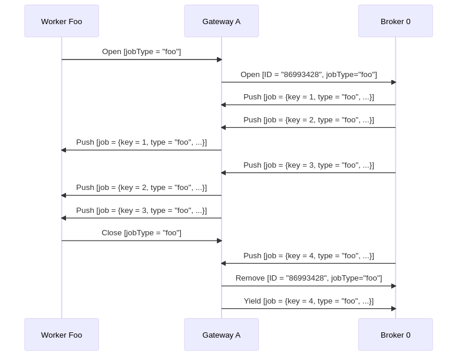

A **job worker** is a service capable of performing a particular task in a process. Each time such a task needs to be performed, this is represented by a **job**.

A job has the following properties:

- **Type**: Describes the work item and is defined in each task in the process. The type is referenced by workers to request the jobs they are able to perform.
- **Custom headers**: Additional static metadata that is defined in the process. Custom headers are used to configure reusable job workers (e.g. a `notify Slack` worker might read out the Slack channel from its header.)
- **Key**: Unique key to identify a job. The key is used to hand in the results of a job execution, or to report failures during job execution.
- **Variables**: The contextual/business data of the process instance required by the worker to do its work.

## Requesting jobs

Job workers request jobs of a certain type on a regular interval (i.e. polling). This interval and the number of jobs requested are configurable in the [Zeebe client](/apis-tools/working-with-apis-tools.md).

If one or more jobs of the requested type are available, [Zeebe](/components/zeebe/zeebe-overview.md) (the workflow engine inside Camunda 8) streams activated jobs to the worker. Upon receiving jobs, a worker performs them and sends back a `complete` or `fail` command for each job, depending on if the job could be completed successfully.

For example, the following process might generate three different types of jobs: `process-payment`, `fetch-items`, and `ship-parcel`:


Three different job workers, one for each job type, could request jobs from Zeebe:


Many workers can request the same job type to scale up processing. In this scenario, Zeebe ensures each job is sent to only one of the workers.

Such a job is considered activated until the job is completed, failed, or the job activation times out.

On requesting jobs, the following properties can be set:

- **Worker**: The identifier of the worker used for auditing purposes.
- **Timeout**: The time a job is assigned to the worker. If a job is not completed within this time, it can be reassigned by Zeebe to another worker.
- **MaxJobsToActivate**: The maximum number of jobs which should be activated by this request.
- **FetchVariables**: A list of required variable names. If the list is empty, all variables of the process instance are requested.

### Long polling

Ordinarily, a request for jobs can be completed immediately when no jobs are available.

To find a job to work on, the worker must poll again for available jobs. This leads to workers repeatedly sending requests until a job is available.

This is expensive in terms of resource usage, because both the worker and the server are performing a lot of unproductive work. Zeebe supports **long polling** for available jobs to better utilize resources.

With **long polling**, a request is kept open while no jobs are available. The request is completed when at least one job becomes available.

**Long polling** is set during [job activation with the parameter `request-timeout`](../../apis-tools/zeebe-api/gateway-service.md#activatejobs-rpc).

### Job queuing

Zeebe decouples creation of jobs from performing the work on them. It is always possible to create jobs at the highest possible rate, regardless if there is a job worker available to work on them. This is possible because Zeebe queues jobs until workers request them.

This increases the resilience of the overall system. Camunda 8 is highly available so job workers don't have to be highly available. Zeebe queues all jobs during any job worker outages, and progress resumes as soon as workers are available.

This also insulates job workers against sudden bursts in traffic. Because workers request jobs, they have full control over the rate at which they take on new jobs.

## Completing or failing jobs

After working on an activated job, a job worker informs Camunda 8 that the job has either `completed` or `failed`.

- When the job worker completes its work, it sends a `complete job` command along with any variables, which in turn is merged into the process instance. This is how the job worker exposes the results of its work.
- If the job worker can not successfully complete its work, it sends a `fail job` command. Fail job commands include the number of remaining retries, which is set by the job worker.
  - If `remaining retries` is greater than zero, the job is retried and reassigned.
  - If `remaining retries` is zero or negative, an [incident](/components/concepts/incidents.md) is raised and the job is not retried until the incident is resolved.

When failing a job it is possible to specify a `retry back off`. This back off allows waiting for a specified amount of time before retrying the job.
This could be useful when a job worker communicates with an external system. If the external system is down, immediately retrying the job will not work.
This will result in an incident when the retries run out. Using the `retry back off` delays the retry. This allows the external system some time to recover.
If no `retry back off` the job is immediately retried.

When completing or failing jobs with [variables](components/concepts/variables.md), the variables are merged into the process at the job's associated task:

- When `Completing a job` the variables are propagated from the scope of the task to its higher scopes.
- When `Failing a job` the variables are only created in the local scope of the task.

:::tip Failing a job with variables

There are several advantages when failing a job with variables. Consider the following use cases:

- You can fail a job and raise an incident by setting the job `retries` to zero. In this case, it would be useful to provide some additional details through a variable when the incident is analyzed.
- If your job worker can split the job into smaller pieces and finish some but not all of these, it can fail the job with variables indicating which parts of the job were successfully finished which weren't. Such a job should be failed with a positive number of retries so another job worker can pick it up again and continue where the other job worker left off. The job can be completed when all parts are finished by a job worker successfully.

:::

### Using job result

Job workers can provide a **job result** for [user task listeners](components/concepts/user-task-listeners.md).

Job results are used to define:

1. **Corrections**: Updates to specific user task attributes, such as assignee, due date, follow-up date, candidate users, candidate groups, and priority, before the task transition is finalized. For more details, see [correcting user task data](components/concepts/user-task-listeners.md#correcting-user-task-data).
2. **Denial**: Indicates that the lifecycle transition should be explicitly denied. Denying the task lifecycle transition rolls back the user task to the previous state, and discards any corrections made by previous listeners. For more details, see [denying the operation](components/concepts/user-task-listeners.md#denying-the-operation).

Below is an example of using job result:

```java
final JobHandler userTaskListenerHandler =
    (jobClient, job) -> {
        boolean shouldDeny = someValidationLogic(job);

        jobClient
            .newCompleteCommand(job)
            // highlight-start
            .withResult(
                new CompleteJobResult()
                    .correctAssignee("john_doe")
                    .correctPriority(42)
                    .deny(shouldDeny)) // deny based on validation logic
            // highlight-end
            .send();
    };
```

If both corrections and denial are provided in the same job result (for example, `.correctAssignee(...)` and `.deny(true)`), the job completion command will be rejected. To avoid this, ensure the job is either completed with corrections (without denial set to `true`) or denied (without corrections).

:::info

The `corrections` and `deny` features are currently available only for user task listener jobs.

:::

## Timeouts

If the job is not completed or failed within the configured job activation timeout, Zeebe reassigns the job to another job worker. This does not affect the number of `remaining retries`.

A timeout may lead to two different workers working on the same job, possibly at the same time. If this occurs, only one worker successfully completes the job. The other `complete job` command is rejected with a `NOT FOUND` error.

The fact that jobs may be worked on more than once means that Zeebe is an "at least once" system with respect to job delivery and that worker code must be idempotent. In other words, workers **must** deal with jobs in a way that allows the code to be executed more than once for the same job, all while preserving the expected application state.

### Timeout update

When a job worker activates a job it can specify a timeout for how long the job should remain activated. For example, this timeout can be updated in the following scenarios:

- When there are jobs which have an elastic timespan. They can potentially run for five minutes, but can be also 24+ hours. That can cause a problem when the workers picking up the jobs do not know in advance how long the given process takes, thus they can't accurately estimate a timeout.

- In case of a long-running job. The scenario can occur where there is a problem with the job worker, but the task will be unavailable until the timeout is reached.

In the scenarios described above, job timeout can be dynamically extended or shortened using `UpdateJobTimeout` gRPC command. This command takes a duration. This is not the duration with which the timeout will be extended or shortened. Instead, this will be the new duration the timeout is set to from the current time. This allows to not only extend the timeout of a job, but also to shorten the timeout.

That means the worker does not need to estimate job timeout accurately at the very beginning. It can use some “standard” initial value and then extend or shorten the timeout as necessary.

A job worker should not wait until the last second to update a job timeout as some time might be needed to process the update and there is a chance that in between the job could already time out. A buffer should be applied to avoid this issue.

Job timeout can be updated [using the `UpdateJobTimeout` command](../../apis-tools/zeebe-api/gateway-service.md#updatejobtimeout-rpc).

## Job streaming

It's also possible to use job workers in a streaming fashion, such that jobs are automatically activated and pushed downstream to workers without requiring an extra round of polling, which greatly cuts down on overall latency.

### How it works

Job streaming works by having the worker open a long living gRPC unidirectional stream from the client to the gateway. The gateway then aggregates logically equivalent streams and registers each of these aggregated streams to every broker.

:::note
Two streams are considered logically equivalent if they would both activate the same job in the exact same way. More concretely, this means if they:

- Target the same job type
- Have the same worker name
- Have the same job activation timeout
- Have the same fetch variables

:::

On the broker side, whenever a job is made activate-able (e.g. a service task is activated, a job times out, a job failed and is retried, etc.), if there is one or more streams for this job type, a random one is picked, the job is activated and pushed to it. As the job makes it way back to the gateway which owns this stream, a random client associated with it is picked, and the job is forwarded to it.

:::note
The RNG used to randomly pick streams and clients provides a good uniform distribution for the same underlying set, which is a cheap way of evenly distributing the load _as long as the stream set remains stable_.
:::

To help visualize the process in general, here is a sequence diagram which shows a single worker opening a job stream for jobs of type "foo" against a cluster consisting of a single gateway and a single broker. It receives some jobs, and when it closes, one job that was pushed asynchronously is returned to the broker:



### Backpressure

To avoid workers overloaded with too many jobs, e.g. running out of memory:

- The workers rely on the [built-in gRPC flow control mechanism](https://grpc.io/docs/guides/flow-control/).
- Or, if lacking for your language of choice, [the built-in HTTP/2 stream flow control](https://httpwg.org/specs/rfc7540.html#FlowControl), e.g. Golang implementation of gRPC.

Essentially, as jobs are pushed downstream from the broker to the client, they're first buffered in the gateway where the direct client connection resides. The gateway only sends as much data as the client can consume over a specific connection. If it notices its send buffers fill up, it marks a client as `not-ready`. This can happen, for example, if the client's receive method is blocked/suspended.

If a client is not ready to receive a job, the gateway instead tries to re-route the job to another logically equivalent worker. If this fails (e.g. all workers connected to a specific gateway are not ready), the job is returned to the broker. There, it may be retried to another gateway, if and only if it has a logically equivalent worker.

#### Implementing backpressure

If you're using the raw `StreamActivatedJobs` RPC, or want to add support for this to your client of choice, the criteria to apply backpressure is to stall the underlying HTTP/2 transport. To do so, you may need to block the thread in which the gRPC stream is running (e.g. Java), or suspend the coroutine (e.g. Kotlin, Go). Once the transport stops receiving, this causes the gateway's send buffers to fill up, and effectively apply backpressure.

If you wish to test this, you can do so by simulating a very slow worker with your new implementation. Then, start generating many jobs on the server side (e.g. create many process instances with lots of jobs). You should then observe backpressure via server side metrics, or many `Job.YIELD` commands written to the log.

Refer to the [Java and Go implementations](https://github.com/camunda/camunda/tree/main/clients) for more information.

#### Detecting backpressure

There are different ways to detect backpressure.

On the client side, you can use the job worker metrics to do so. For example, by subtracting the rate of handled jobs (i.e. `zeebe.client.worker.job.handled`) from the rate of activated jobs (i.e. `zeebe.client.worker.job.activated`), you can estimate the rate of queued jobs. If this is too close to the `maxJobsActive` consistently, this may indicate you need to scale your worker deployment.

:::note
If you're using Prometheus, you can use the following query to estimate the queue size of your workers. We recommend adding a job type label to be able to group per workload, e.g. `sum(zeebe_client_worker_job_activated_total - zeebe_client_worker_job_handled_total) by (jobType)`
:::

On the server side (e.g. if you're running a self-managed cluster), you can measure the rate of jobs which are not pushed due to clients which are not ready via the metric `zeebe_broker_jobs_push_fail_try_count_total{code="BLOCKED"}`. If the rate of this metric is high for a sustained amount of time, it may be a good indicator that you need to scale your workers. Unfortunately, on the server side we don't differentiate between clients, so this metric doesn't tell you which worker deployment needs to be scaled. We thus recommend using client metrics whenever possible.

### Proxying

If you're using a reverse proxy or a load balancer between your worker and your gateway, you may need to configure additional parameters to ensure the job stream is not closed unexpectedly with an error. If you observe regular 504 timeouts, read our guide on [job streaming](../../../self-managed/zeebe-deployment/zeebe-gateway/job-streaming).

### Troubleshooting

Since this feature requires a good amount of coordination between various components over the network, we've built in some tools to help monitor the health of the job streams.

#### Metrics

We expose several metrics which help check whether the feature is working.

- `zeebe_gateway_job_stream_push_total`: Allows you to derive the rate at which a gateway is pushing jobs out to clients. If this is much less than the broker's pushed count, this could indicate an issue between the broker and the gateway: jobs are getting lost, the gateway is overloaded, etc.
- `zeebe_gateway_job_stream_clients`: The number of open job stream client calls on the gateway. This can help you figure out if your workers are well load balanced across your gateways.
- `zeebe_gateway_job_stream_streams`: The number of aggregated streams per gateway.
- `zeebe_gateway_job_stream_servers`: The amount of known brokers (or stream servers) per gateway. This should always be the number of brokers in your cluster. If this is less, this could indicate a clustering issue between your gateways and brokers (e.g. temporary network partition).
- `zeebe_gateway_job_stream_push_fail_try_total`: The count of failed push attempts. This includes pushes which eventually succeeded (e.g. tried worker `A`, failed, rerouted to worker `B` which succeeded), and as such may be higher than the total number of pushes. This can be useful to narrow down on which gateways errors are coming from, or if a gateway has a higher number of faulty or blocked clients.
- `zeebe_broker_jobs_pushed_count_total`: Allows you to derive the rate at which a broker is pushing jobs out to all streams. This can help you figure out if the broker is the bottleneck when it comes to throughput.
- `zeebe_broker_open_job_stream_count`: The count of job streams registered on the broker. This should be the sum of all gateway aggregated streams.
- `zeebe_broker_jobs_push_fail_try_count_total`: The count of failed job push attempts registered by a given broker. This includes pushes which eventually succeeded (e.g. tried all workers on gateway A, failed, then rerouted to gateway B where it succeeded), and as such may be higher than the total number of pushes. It's useful to detect if a specific gateway is producing errors which may otherwise be hidden by other gateways picking up the slack.

#### Actuator endpoint

Each broker and gateway exposes a new actuator endpoint - `/actuator/jobstreams` - accessible via the monitoring port. For example, if you run Zeebe locally with the default monitoring port, it would be accessible under `localhost:9600/actuator/jobstreams`.

This returns the current view of the registered job streams, where `client` refers to client streams opened on the gateway, and `remote` refers to the aggregated gateway streams as opened on each broker.

For example, if jobs of a given type are not activated, but a worker is opened for this type, you can verify first if it exists in one of the gateways as a client stream. Once you've found it, grab its ID, and verify that you can find it as a consumer of a remote stream on each broker.

If it's not present in the gateway as a client stream, restart your worker. If it's not present as a consumer in one of the brokers, this indicates a bug. As a workaround, restart your gateway, which will cause some interruption in your service, but will force all streams for this gateway to be recreated properly.
