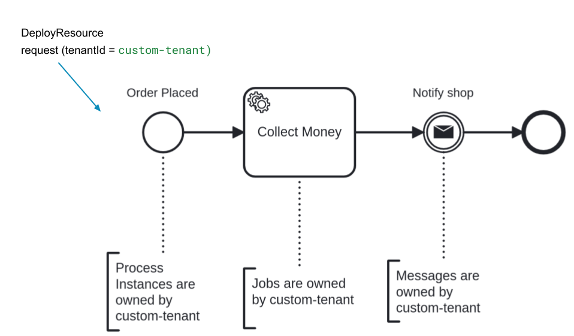

:::info
Multi-tenancy is currently only supported for Camunda 8 Self-Managed. It is not yet available on SaaS.
:::

Multi-tenancy in Camunda 8 allows a single installation to host multiple tenants — such as departments, teams, or external clients — while maintaining per-tenant isolation of data and processes in a shared environment.

The following sections take a closer look at how multi-tenancy works in Camunda 8.

### Isolation of data and processes

In a multi-tenant installation, each tenant's data and processes are logically isolated from one another.
This means that one tenant's workflows, data models, and process configurations do not interfere with or impact the operations of other tenants. Each tenant operates in a separate and secure space within the same Camunda 8 instance.

### Resource sharing

Despite the isolation, multi-tenancy allows for efficient resource sharing. Tenants can leverage the same
Camunda 8 software installation, reducing infrastructure costs and resource overhead. This shared model optimizes resource utilization and ensures that Camunda 8 remains cost-effective.

### Efficient administration

Administrators can manage all tenants from [Identity](../identity/tenant.md). This simplifies the process of monitoring and maintaining different tenant environments, making administrative tasks more efficient and reducing overhead.

### Security

Security is a paramount concern in multi-tenant installations. Robust access control mechanisms ensure that
tenants cannot access each other's data or processes. Security measures are in place to maintain the privacy and integrity of each tenant's information.

## Example of tenant membership

When a user attempts to deploy a process model or start a process instance, the system verifies their tenant assignments.

For example, consider a user who is a member of `Tenant A` but not `Tenant B`.

1.  **Deploying a process model:**

    - If the user deploys a process model to `Tenant A`, the Orchestration Cluster verifies their assignment. If successful, the process is deployed and its instances belong to `Tenant A`.
    - If the user deploys the same process model to `Tenant B`, the access check fails and the deployment is rejected.

2.  **Running process instances:**
    - When the user queries for process instances, they will only see instances belonging to `Tenant A`.

This ensures that data and processes are properly isolated between tenants, and users can only interact with resources they are authorized to access.

## How does it work?

Camunda 8 implements multi-tenancy by relying on tenant identifiers in a single Camunda 8 installation. The data of all tenants is stored in the same storage. Isolation is provided by appending a tenant identifier to each data entry (ex. process definition, process instance, job, etc.)

### The tenant identifier

The tenant identifier will be set as a property to any data produced by Camunda 8. When multi-tenancy checks are disabled, all data is mapped to the `<default>` tenant identifier.

:::note
The `<default>` tenant identifier is a reserved identifier and it can't be modified by users.
:::

Organizations can add additional tenants. Identity verifies that the tenant identifiers satisfy the following criteria:

- Alphanumeric characters
- Dashes (`-`)
- Underscores (`_`)
- Dots (`.`)
- A maximum length of 31 characters.

### Inherited tenant ownership

Tenant ownership in Camunda 8 is hierarchical. A user may only deploy resources to an authorized tenant and any Camunda 8 data produced from these resources will belong to the same tenant. The following diagram provides a nice example on how tenant ownership is inherited.

