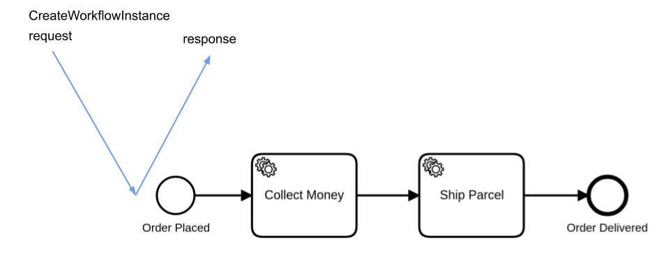
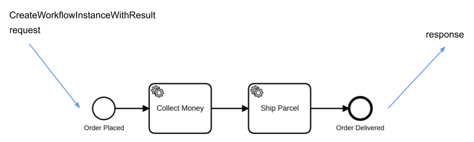

Depending on the process definition, an instance of it can be created in several ways.

Camunda 8 supports the following ways to create a process instance:

- [`CreateProcessInstance` commands](#commands)
- [Message event](#message-event)
- [Timer event](#timer-event)

## Commands

A process instance is created by sending a command specifying the BPMN process ID, or the unique key of the process.

There are two commands to create a process instance, outlined in the sections below.

### Create and execute asynchronously

A process that has a [none start event](/components/modeler/bpmn/none-events/none-events.md#none-start-events) is started explicitly using **[CreateProcessInstance](/apis-tools/zeebe-api/gateway-service.md#createprocessinstance-rpc)**.

This command creates a new process instance and immediately responds with the process instance ID. The execution of the process occurs after the response is sent.



<details>
   <summary>Create a process instance via Orchestration Cluster REST API</summary>
   <p>

```
curl -L 'http://localhost:8080/v2/process-instances' \
-H 'Content-Type: application/json' \
-H 'Accept: application/json' \
-d '{
  "processDefinitionKey": "2251799813685249”,
  "processDefinitionVersion": 1
}'
```

Response:

```
{
  "processDefinitionId": "order-process",
  "processDefinitionVersion": 1,
  "processDefinitionKey": "2251799813685249",
  "processInstanceKey": "2251799813686019"
}
```

See the [API reference for process instance creation](/apis-tools/orchestration-cluster-api-rest/specifications/create-process-instance.api.mdx) for more information, including additional request fields and code samples.

   </p>
 </details>

### Create and await results

Typically, process creation and execution are decoupled. However, there are use cases that need to collect the results of a process when its execution is complete.

**[CreateProcessInstanceWithResult](/apis-tools/zeebe-api/gateway-service.md#createprocessinstancewithresult-rpc)** allows you to “synchronously” execute processes and receive the results via a set of variables. The response is sent when the process execution is complete.



This command is typically useful for short-running processes and processes that collect information.

If the process mutates system state, or further operations rely on the process outcome response to the client, consider designing your system for failure states and retries.

:::note
When the client resends the command, it creates a new process instance.
:::

<details>
   <summary>Create a process instance and await results via Orchestration Cluster REST API</summary>
   <p>

```
curl -L 'http://localhost:8080/v2/process-instances' \
-H 'Content-Type: application/json' \
-H 'Accept: application/json' \
-d '{
  "processDefinitionId": "order-process”,
  "processDefinitionVersion": 1,
  "awaitCompletion": true,
  "variables": { "orderId": "1234" }
}'
```

Response:

```
{
  "processDefinitionId": "order-process",
  "processDefinitionVersion": 1,
  "variables": { "orderId": "1234" }
  "processDefinitionKey": "2251799813685249",
  "processInstanceKey": "2251799813686019",
}
```

See the [API reference for process instance creation](/apis-tools/orchestration-cluster-api-rest/specifications/create-process-instance.api.mdx) for more information, including additional request fields and code samples.

   </p>
 </details>

Failure scenarios applicable to other commands are applicable to this command as well. Clients may not get a response in the following cases even if the process execution is completed successfully:

- **Connection timeout**: If the gRPC deadlines are not configured for long request timeout, the connection may be closed before the process is completed.
- **Network connection loss**: This can occur at several steps in the communication chain.
- **Failover**: When the node processing this process crashes, another node continues the processing. The other node does not send the response because the request is registered on the first one.
- **Gateway failure**: If the gateway the client is connected to fails, nodes inside the cluster cannot send the response to the client.

### Run process segment

The [`create and execute asynchronously`](#create-and-execute-asynchronously) and [`create and await results`](#create-and-await-results) commands both start the process instance at their default initial element: the single [none start event](/components/modeler/bpmn/none-events/none-events.md#none-start-events). Camunda 8 also provides a way to create a process instance starting or ending at user-defined element(s).

:::info
This is an advanced feature. Camunda recommends to only use this functionality for testing purposes. The none start event is the defined beginning of your process. Most likely the process is modeled with the intent to start all instances from the beginning.
:::

#### Start instructions

To start the process instance at a user-defined element, you need to provide start instructions along with the command. Each instruction describes how and where to start a single element.

By default, the instruction starts before the given element. This means input mappings of that element are applied as usual.

Multiple instructions can be provided to start the process instance at more than one element.
You can activate the same element multiple times inside the created process instance by referring to the same element ID in more than one instruction.

#### Runtime instructions

By default, the process execution continues normally until the end of the process. To change this behavior and end the process instance after a specific element completes or terminates, provide runtime instructions. Each runtime instruction specifies the ID of one element whose completion or termination ends the process instance.

You can provide multiple runtime instructions to terminate the process instance after multiple elements—for example, when a process has multiple parallel flows.

:::note
Start and runtime instructions have the same [limitations as process instance modification](/components/concepts/process-instance-modification.md#limitations), e.g., it is not possible to start or end at a sequence flow.
:::

Start and runtime instructions are supported for both `CreateProcessInstance` commands. Both instruction sets can be used separately or together to achieve different scenarios.

<details>
   <summary>Create a process instance with a start and a runtime instruction</summary>
   <p>

The example below shows how to create a process instance that starts at a user-defined element and terminates after it, so that only the specified segment of the process is executed.

```
curl -L 'http://localhost:8080/v2/process-instances' \
-H 'Content-Type: application/json' \
-H 'Accept: application/json' \
-d '{
  "processDefinitionId": "order-process”,
  "processDefinitionVersion": -1,
  "startInstructions": [
    {
      "elementId": "ship_parcel"
    }
  ],
  "runtimeInstructions": [
    {
      "type": "TERMINATE_PROCESS_INSTANCE",
      "afterElementId": "ship_parcel"
    }
  ]
  "variables": { "orderId": "1234" }
}'
```

See the [API reference for process instance creation](/apis-tools/orchestration-cluster-api-rest/specifications/create-process-instance.api.mdx) for more information, including additional request fields and code samples.

   </p>
 </details>

## Events

Process instances are also created implicitly via various start events. Camunda 8 supports message start events and timer start events.

### Message event

A process with a [message start event](/components/modeler/bpmn/message-events/message-events.md#message-start-events) can be started by publishing a message with the name that matches the message name of the start event.

For each new message a new instance is created.

### Timer event

A process can also have one or more [timer start events](/components/modeler/bpmn/timer-events/timer-events.md#timer-start-events). An instance of the process is created when the associated timer is triggered. Timers can also trigger periodically.

## Business ID

### What is a business ID?

A business ID is a domain-specific identifier you can assign to a process instance. Unlike the system-generated process instance key, it represents a domain concept such as an order number, case reference, or customer ticket ID.

A business ID does **not need to be unique** unless uniqueness control is enabled. See [Uniqueness control](#uniqueness-control) for details.

For example, consider a process that ships book orders where each order already has an identifier in your order management system. When you start the process to ship an order, you can use the order ID as the business ID. This lets you easily find all process instances related to a particular order.

You set the business ID at process instance creation time via the `businessId` field in the creation request. The business ID is **immutable**; once set, it cannot be changed or removed for the lifetime of the process instance. The maximum length for a business ID is **256 characters**.

:::note
The business ID feature is currently only available through the API (REST and gRPC) and the official clients. Creating process instances from other tools such as Web Modeler does not support setting a business ID.
:::

<details>
   <summary>Create a process instance with a business ID via Orchestration Cluster REST API</summary>
   <p>

```
curl -L 'http://localhost:8080/v2/process-instances' \
-H 'Content-Type: application/json' \
-H 'Accept: application/json' \
-d '{
  "processDefinitionId": "order-process",
  "processDefinitionVersion": 1,
  "businessId": "order-1234"
}'
```

See the [API reference for process instance creation](/apis-tools/orchestration-cluster-api-rest/specifications/create-process-instance.api.mdx) for more information, including additional request fields and code samples.

   </p>
 </details>

### Propagation to child instances

When a process instance with a business ID creates a child process instance via a [call activity](/components/modeler/bpmn/call-activities/call-activities.md), the business ID is automatically propagated to the child.

Each child instance inherits the same business ID as its parent. As a result, the entire process hierarchy ultimately shares the root instance's business ID, and child instances cannot override it. This lets you trace an entire process hierarchy using a single domain identifier.

### Retrieving process instances by business ID

The business ID is available as a property on the process instance. You can use it to look up or filter process instances through the API:

- [Get process instance](/apis-tools/orchestration-cluster-api-rest/specifications/get-process-instance.api.mdx) — retrieve a single process instance and inspect its `businessId` field.
- [Search process instances](/apis-tools/orchestration-cluster-api-rest/specifications/search-process-instances.api.mdx) — filter process instances using the `businessId` field to find all instances linked to a specific business case.

### Uniqueness control

With uniqueness control, you can ensure that only one active root process instance exists for a given **process definition, tenant, and business ID**. This prevents duplicate processing of the same business case.

Uniqueness is checked against **active root process instances**.

- A **root process instance** is a process instance that was started directly, not created by a call activity. Child process instances created via call activities don't count toward the uniqueness check, even though they inherit the parent's business ID.
- When uniqueness control is enabled, creating a root process instance is rejected if another **root** process instance of the same process definition is already active with the same business ID. The rejection returns an `ALREADY_EXISTS` error (HTTP `409 Conflict`).
- Once a process instance is no longer active (completed or terminated), you can use its business ID to create a new process instance.

:::note Retroactive enforcement
Uniqueness control is **retroactive**. When you enable it, business IDs that were already assigned to active process instances _before_ the feature was turned on are taken into account. This prevents duplicate instances from being created after the feature is enabled, even if duplicates already existed before activation.
:::

Uniqueness control is opt-in. Enable it using the configuration property [`camunda.process-instance-creation.business-id-uniqueness-enabled`](/self-managed/components/orchestration-cluster/core-settings/configuration/properties.md#process-instance-creation). For SaaS, configure this in the cluster configuration via Console. For Self-Managed, set it in the application config (for example, `application.yaml` or as an environment variable).

:::note
When a business ID is specified, the partition for the new process instance is determined deterministically by **hashing the business ID**, rather than using the default round-robin distribution. This ensures that uniqueness checks occur on a single partition.

Be aware that this may result in uneven distribution of instances across partitions if business IDs are not well distributed.
:::

#### Multi-tenancy scope

In a multi-tenant environment, uniqueness is enforced **per tenant and process definition**. Process instances belonging to different tenants can use the same business ID and process definition without conflict. For example, two active root process instances in different tenants may share the same business ID and process definition.

### Process instance migration

When a process instance with a business ID is [migrated](/components/concepts/process-instance-migration.md) to a different process definition, the business ID is preserved and carried over to the **target** process definition. The business ID remains immutable; it cannot be changed or removed as part of the migration. After migration, the **source** process definition is no longer associated with the business ID.

Migration intentionally **bypasses uniqueness control checks**, because migration operates on existing instances rather than creating new ones. It is a deliberate operator action with accountability provided by the audit log. As a result:

- Migration is never rejected due to a business ID conflict at the target process definition. The target definition may end up with more than one active root process instance with the same business ID.
- When uniqueness control is enabled, a new process instance with the same business ID can be created for the **source** process definition, since it is no longer associated with the migrated instance.

### Limitations

- You cannot currently search related entities (for example, jobs, user tasks, or incidents) **directly by business ID**.
- When using [cluster scaling](/self-managed/components/orchestration-cluster/zeebe/operations/cluster-scaling.md) to increase the number of partitions, new process instances created with a business ID are only distributed across the original set of partitions, not to any newly added partitions.

## Tags

Process instance tags are lightweight, immutable labels you can attach when creating a process instance via the API or clients. Tags are inherited by all jobs created from that instance. They help downstream workers and external systems make quick routing or decision choices without inspecting full variable payloads.

### Tag format and constraints

- A tag is a case-sensitive string.
- Format (regex): `^[A-Za-z][A-Za-z0-9_\-:.]{0,99}$`
  - Must start with a letter (A–Z or a–z).
  - Remaining characters may be alphanumeric, underscore (`_`), hyphen (`-`), colon (`:`), or dot (`.`).
- Length: 1–100 characters.
- Maximum of 10 unique tags per process instance (duplicates are ignored).
- Order is not guaranteed; treat the set as unordered.
- Tags cannot be modified after creation

If validation fails during process instance creation (for example, too many tags, invalid pattern, or length), the create request is rejected with a 4xx error.

### Semantics

- Tags are included in process instance search responses and in activated job payloads.
- Tags are immutable after creation - cannot be added, changed, or removed after process instance has been created.
- Search filtering uses AND semantics: an instance must contain all requested tags (it may contain additional tags). Partial or wildcard matching is not supported.
- Tags are exported with the process instance and with job entities starting in 8.8 by the default exporters.
- Tags are not shown in web applications (such as Operate and Tasklist) — they are API/client-only metadata.

### Use cases

- Routing and prioritization (for example, `priority:high`)
- Business or domain identifiers from internal or third-party systems (for example, `reference:1234`, `team:accounting`, `origin:crm`)
- Cross-system correlation keys without exposing full variable payloads (for example, `trace-id:abcd-1234`, `crm-id:3004`)
- Analytics segmentation (for example, `region:emea`, `channel:web`)
- Feature rollout or experiment grouping (for example, `experiment:checkout-v2`)

### Guidelines

- Do not store secrets or PII; tags propagate with jobs and exports.
- Prefer concise `key:value` or `key` patterns for consistency.
- Use variables (not tags) for mutable or large data.
- Establish internal naming conventions (for example, prefixes like `env:` or `dept:`) for governance.

### Examples

Create with tags:

```bash
curl -L 'http://localhost:8080/v2/process-instances' \
  -H 'Content-Type: application/json' \
  -H 'Accept: application/json' \
  -d '{
    "processDefinitionId": "order-process",
    "processDefinitionVersion": 3,
    "tags": ["channel:web", "reference:1234", "region:emea"],
    "variables": { "orderId": "1234" }
  }'
```

## Next steps

- [About Modeler](/components/modeler/about-modeler.md)
- [Automating a process using BPMN](/components/modeler/bpmn/automating-a-process-using-bpmn.md)
