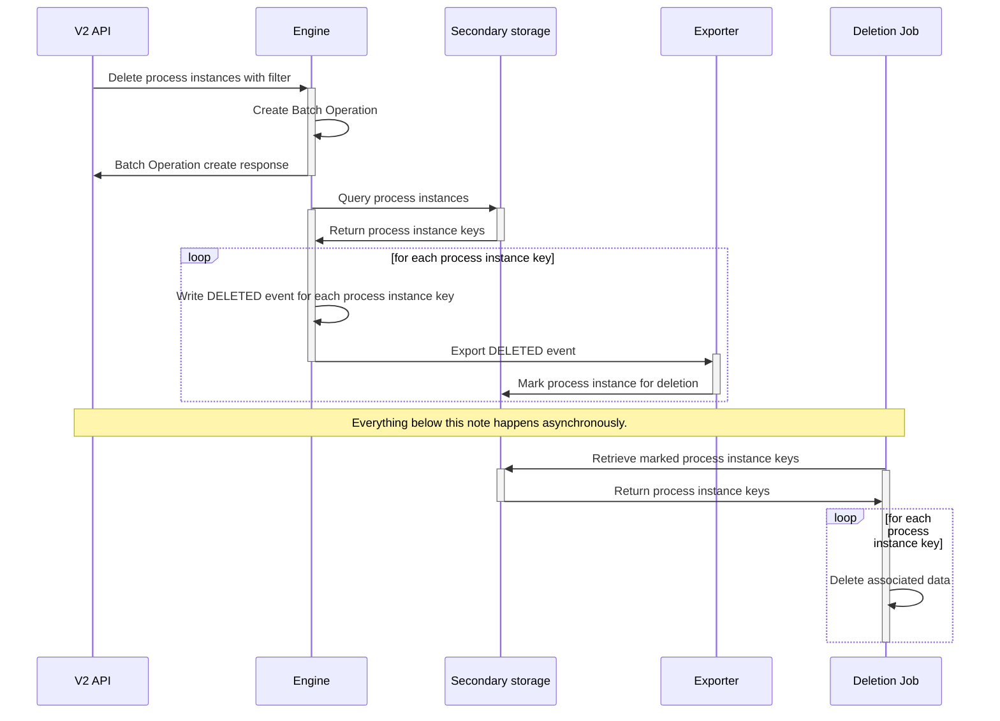

Process instance deletion allows you to delete all data associated with a completed or terminated process instance.
Deleting a process is irreversible. Restoring the data is only possible by restoring a backup of your cluster.

Deleting a process instance is done using the [Orchestration Cluster API](/apis-tools/orchestration-cluster-api-rest/specifications/delete-process-instance.api.mdx).

:::note
You can also delete a process instance using Operate's UI by following [the user guide](../operate/userguide/delete-finished-instances.md).
:::

## Call activities

### Deleting a called process instance

When deleting a process instance that was created using a call activity, the parent process instance is not affected.
Only the data of the called process instance is deleted. In Operate you can still see the parent process instance, but
will be unable to click through to the called process instance.

### Deleting a parent process instance

When deleting a process containing a call activity, the called process instance is not affected. Only the data of the
parent process instance is deleted. In Operate you can still see the called process instance, but when navigating to it,
you will be presented with an empty screen.

## Limitations

You can only delete process instances that are in a completed or terminated state. This is to ensure data consistency
and integrity within the system. If your process instance is still active, consider canceling it first using the
[cancel process instance API](/apis-tools/orchestration-cluster-api-rest/specifications/cancel-process-instance.api.mdx).

## Eventual consistency

When you delete process instances this will be executed asynchronously. Depending on the number of process instances to
delete, it may take some time until the data is deleted and the process instance is no longer visible in Operate.

## Technical details

Deleting one or more process instances utilizes [batch operations](./batch-operations.md). The Zeebe engine queries all
process instances to delete from secondary storage. For each of the instances found, a delete command is written to the log,
which in turn results in deleted event.

The exporters consume the deleted event. For each of the events it will write a record to secondary storage, marking the
process instance for deletion. An asynchronous, scheduled task will go over the marked process instances and delete all
data associated with it.

