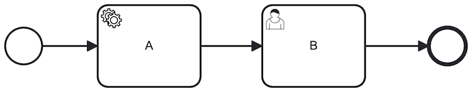
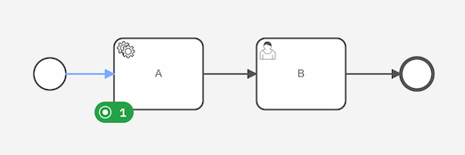
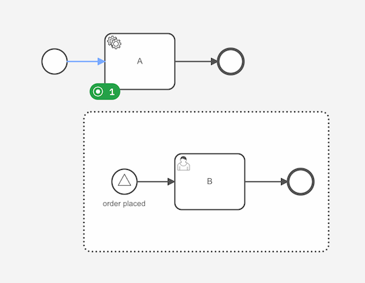
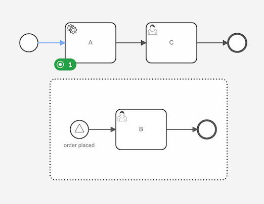

:::danger Experimental feature
Process instance migration is an experimental feature which is still under development.
We recommend using it with care and trying out migrations in a test environment before doing so on production.

Pause all interactions with your process instance before migration, including:

- All related job workers
- Publishing any related messages
- Triggering timers at the time of migration

Allow the process instance to reach a wait state (its awaiting input) to continue.

:::

Process instance migration fits a running process instance to a different process definition.
This can be useful when the process definition of a running process instance needs changes due to bugs or updated requirements.

:::tip
To repair a broken process instance without making changes to the process definition, use [process instance modification](./process-instance-modification.md) instead.
:::

Use the [migration command](/apis-tools/grpc.md#migrateprocessinstance-rpc) to change the process model of a running process instance.

:::note
You can also migrate your process instances using Operate's UI by following [the user guide](../operate/operate-introduction.md).

<!-- TODO: Update the guide's link to: `../operate/userguide/process-instance-migration.md` -->

:::

## Changing the process instance flow for inactive parts

Process instance migration allows you to adjust the process model of your process instance to fit to new requirements.

Let's consider an example.

The process instance below contains a completed start event, an active service task `A`, and an end event.
Once you complete the service task `A`, the process will reach the end event.


However, the requirements of our process have changed.

Instead of completing the process, we want to add a user task `B` after the service task `A` and before the end event.



We can create new process instances according to this new process model after deploying it, but we also want our active process instances to receive the update and reach user task `B` when service task `A` is completed.

<!--
I'm using process, process model, and process definition interchangeably, because I don't know what's best.
Using it interchangeably might help users pick up an understanding of what we mean (some may know it as a model, others as a process).
But, it's also inconsistent.
Should we use all terms or should we select a specific one.
The API refers to it as the "process instance's process definition" and the "target process definition".
-->

To achieve this, we can migrate our process instance from its current process to the newly deployed one. You must provide a migration plan with mapping instructions to the target process definition to clarify your intentions.

In our example, we'll provide a mapping instruction from source element ID `A` to target element ID `A`. This means we expect any active element instances of element with ID `A` to be migrated to the element with ID `A` in the target process.
Therefore, our process instance will continue to be active at service task `A`.



After migrating our process instance, we can now complete the service task `A` to reach user task `B`.

Process instance migration allows you to change the inactive parts of the process instance. In our example, we placed a user task `B` between the active service task `A` and the inactive end event. We did not change the active service task `A`, just the steps that follow.

## Changing the active elements

Sometimes your requirements change so much that the currently active element no longer exists in the new process version.

Consider the following example: the process contains a completed exclusive gateway, taking the sequence flow to the service task `A` which is currently active.
It did not take the sequence flow to service task `B`, so it is inactive.


Due to changed requirements, our process model no longer contains the exclusive gateway, nor the service tasks `A` and `B`.
Instead, it only contains a new service task `C`.


We can migrate the active service task `A` to this new service task `C` by providing a mapping instruction from source element ID `A` to target element ID `C`.


:::note
You cannot map an element to an element of a different type.
An active service task of a process instance can only be mapped to a service task in the target process.
It cannot be mapped to a user task as this changes the element type.

Also note that the [jobs, expressions, and input mappings](#jobs-expressions-and-input-mappings) are not recreated.
So, while service task `C` is active in the target process, the associated job still has the job type from when it was associated to service task `A`.
:::

:::tip
If you need to adjust the job type to its new element, you can use [process instance modification](./process-instance-modification.md) to recreate the service task.
Simply cancel the service task instance, and add a new instance of the service task.


:::

## Process definitions and versions

So far, we've only discussed migrating a process instance to a new version of its process definition.

You are free to migrate your process instance:

- From an older version to a newer version of the same process definition.
- From a newer version to an older version of the same process definition.
- To a different process definition altogether.

:::note
You do not have to provide a mapping instruction from the process instance's process ID to the target process ID.
:::

## Event subscriptions

When migrating, the process instance's event subscriptions are recreated, i.e. the process instance unsubscribes from errors, escalations, messages, signals, and timers in its current process definition, and subscribes to the events in the target process definition. We subscribe to the events in the target process by evaluating the related expressions again.

:::note
This means that once migrated, new timers, message subscriptions, and signal subscriptions are created with new keys and potentially different values.
:::

Let's consider an active service task and a signal event sub-process.
The [signal](../modeler/bpmn/signal-events/signal-events.md#signals) name is defined as a static value (`order placed`).



In the target process, we add a user task after the service task.
We leave the signal event sub process unchanged.
On migrating the process instance, we unsubscribe it from the `order_placed` signal and subscribe to the signal again in the target process.
Once migrated, a broadcasted `order_placed` signal will trigger the event sub process just like before.



:::warning
Recreation of the event subscription can produce unwanted results when re-evaluating the related expressions.
:::

Consider an active service task with a timer boundary event.
The timer is defined as a static duration of three hours (`PT3H`).
Just before we migrate the process instance, there are only 30 minutes left until the timer triggers.
But, this timer is canceled and a new timer is created with a duration of three hours when migrating the process instance.
Once migrated, the timer will not trigger in three hours instead of 30 minutes.

<!-- TODO: we could mention that we plan to support timer migration in a future version -->

## Jobs, expressions, and input mappings

While event subscriptions are recreated for migrated elements, we do not recreate jobs, reevaluate expressions, and reapply input mappings of the active elements.
Any existing variables and jobs continue to exist with the same values as previously assigned.

Let's consider an active service task that created a job when it was activated with type `send_mail`.
In the target process definition, the job type expression is changed as follows:

```feel
= order.next_step
```

However, on migrating the process instance this new job type expression is not evaluated.
Instead, the job keeps all properties it had before the migration, including the job type.

:::tip
You can use [process instance modification](./process-instance-modification.md) to terminate and activate the service task if you want to create the job according to the new service task's definitions.
This results in new keys for the service task as well as the job.
:::

## Limitations

Not all process instances can be migrated to another process definition.
In the following cases, the process instance can't apply the migration plan and rejects the migration command.

- Process instance migration can only migrate active process instances, i.e. existing process instances that have not yet been completed, terminated, or banned.
- All active elements require a mapping.
- The number of active elements cannot be changed. You can use [process instance modification](./process-instance-modification.md) to achieve this instead.
- The target process definition must exist in Zeebe, i.e. it must be deployed and not yet deleted.
- The migration plan can only map each `sourceElementId` once.
- A mapping instruction's `sourceElementId` must refer to an element existing in the process instance's process definition.
- A mapping instruction's `targetElementId` must refer to an element existing in the target process definition.

The following limitations exist that may be supported in future versions:

- Only elements of the following types can be migrated:
  - A process instance
  - A service task
- The following scenarios cannot be migrated:
  - A process instance with an incident
  - A process instance that is started from a call activity, i.e. a child process instance
  - An element that becomes nested in a newly added sub-process
  - An element that was nested in a sub-process is no longer nested in that sub-process
- Mapping instructions cannot change the element type

A full overview of error codes can be found in the [migration command](/apis-tools/grpc.md#migrateprocessinstance-rpc).

:::tip
If your specific case is not (yet) supported by process instance migration, you can use [cancel process instance](../../apis-tools/grpc.md#cancelprocessinstance-rpc) and [create and start at a user-defined element](./process-instance-creation.md#create-and-start-at-a-user-defined-element) to recreate your process instance in the other process definition.
Note that this results in new keys for the process instance and its associated variables, element instances, and other entities.
:::
