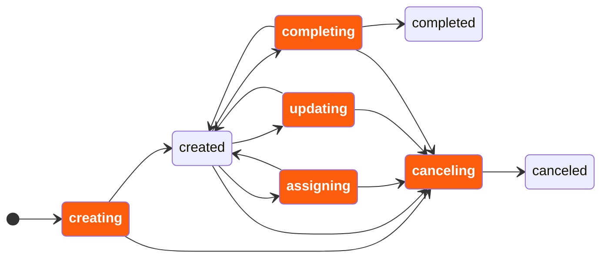

A user task listener allows users to react to specific user task lifecycle events.

:::tip
Try out our [getting started with user task listeners guide](../../guides/user-task-listener.md).
:::

## About user task listeners

User task listeners provide flexibility and control over [user task](/components/modeler/bpmn/user-tasks/user-tasks.md) behavior:

- They can react to user task lifecycle events, such as assigning and completing.
- They can access user task data, such as the assignee, to execute task-specific business logic.
- They can dynamically correct user task data during execution, allowing adjustments to key attributes such as the assignee, due date, and priority.
- They can deny state transitions, rolling back the task to its previous state, which enables validation of task lifecycle changes.

### Use cases

User task listeners are useful in the following scenarios:

- Implementing complex user task assignment or reassignment logic.
- Validating user task lifecycle changes, e.g. completing with valid variables.
- Notifying users of new task assignments with contextual information.
- Reacting to task completions with custom logic.

### User task lifecycle

A user task has the following lifecycle.
A user task listener can react to the events highlighted in orange.



### Blocking behavior

User task listeners operate in a blocking manner, meaning the user task lifecycle transition is paused until the task listener completes. This ensures that any corrections or validations defined by the task listener are fully applied before the task transition continues.

## Trigger a user task listener

The supported user task listener events can be triggered in the following ways.

| Event        | Triggered                                                                                                                                                                                                                                                                                                                                                                                                                                                                                                                                                                                                                                     |
| :----------- | :-------------------------------------------------------------------------------------------------------------------------------------------------------------------------------------------------------------------------------------------------------------------------------------------------------------------------------------------------------------------------------------------------------------------------------------------------------------------------------------------------------------------------------------------------------------------------------------------------------------------------------------------- |
| `creating`   | <ul><li>When a process instance reaches a user task.</li></ul>                                                                                                                                                                                                                                                                                                                                                                                                                                                                                                                                                                                |
| `assigning`  | <ul><li>When the [assign user task API](/apis-tools/orchestration-cluster-api-rest/specifications/assign-user-task.api.mdx) is called.</li><li>When activating a user task that [specifies an `assignee`](/components/modeler/bpmn/user-tasks/user-tasks.md#assignments) in the process.</li><li>When a user task is assigned using the [Tasklist interface](/components/tasklist/userguide/managing-tasks.md#assign-tasks).</li></ul>                                                                                                                                                                                                        |
| `updating`   | <ul><li>When the [update user task API](/apis-tools/orchestration-cluster-api-rest/specifications/update-user-task.api.mdx) is called. </li><li>When the [update element instance variables API](/apis-tools/orchestration-cluster-api-rest/specifications/create-element-instance-variables.api.mdx) is called on a user task instance.</li><li>When the [set variables RPC](/apis-tools/zeebe-api/gateway-service.md#setvariables-rpc) is called on a user task instance.</li><li>When variables are set at a user task scope using the [Operate interface](/components/operate/userguide/resolve-incidents-update-variables.md).</li></ul> |
| `completing` | <ul><li>When a user task is completed using the [Tasklist interface](/components/tasklist/userguide/managing-tasks.md#complete-a-task).</li><li>When the [complete user task API](/apis-tools/orchestration-cluster-api-rest/specifications/complete-user-task.api.mdx) is called.</li></ul>                                                                                                                                                                                                                                                                                                                                                  |
| `canceling`  | <ul><li>When a canceling process instance terminates a user task.</li><li>When a [catch event](/components/modeler/bpmn/events.md) interrupts a user task.</li></ul>                                                                                                                                                                                                                                                                                                                                                                                                                                                                          |

Once triggered, the workflow engine creates a job that you can process using a job worker.

## Define a user task listener

You can configure user task listeners per BPMN user task element.

### User task listener properties

Each user task listener has the following properties:

| Property    | Description                                                                                                                                        |
| :---------- | :------------------------------------------------------------------------------------------------------------------------------------------------- |
| `eventType` | Specifies the user task event that triggers the listener. Supported values are `creating`, `assigning`, `updating`, `completing`, and `canceling`. |
| `type`      | The name of the job type.                                                                                                                          |
| `retries`   | The number of retries for the user task listener job.                                                                                              |

:::note
If multiple user task listeners of the same `eventType` (such as multiple `assigning` listeners) are defined on the same user task, they are executed sequentially, one after the other, in the order they are defined in the BPMN model.
:::

## Implement a user task listener

User task listeners are implemented using [job workers](/components/concepts/job-workers.md), similar to execution listeners and service task jobs. The job worker processes the task listener job, can apply corrections, and may optionally deny the lifecycle transition.

See [open a job worker](/apis-tools/java-client-examples/job-worker-open.md) for an example of how to create a job worker and handler that can also process user task listener jobs.

### Accessing user task data

User task-specific data, such as `assignee` and `priority`, is accessible through the job headers of the user task listener job.
These are merged together with the user task's [task headers](/components/modeler/bpmn/user-tasks/user-tasks.md#task-headers).
The following attributes can be retrieved using reserved header names:

| Attribute           | Header name                          |
| :------------------ | :----------------------------------- |
| `action`            | `io.camunda.zeebe:action`            |
| `assignee`          | `io.camunda.zeebe:assignee`          |
| `candidateGroups`   | `io.camunda.zeebe:candidateGroups`   |
| `candidateUsers`    | `io.camunda.zeebe:candidateUsers`    |
| `changedAttributes` | `io.camunda.zeebe:changedAttributes` |
| `dueDate`           | `io.camunda.zeebe:dueDate`           |
| `followUpDate`      | `io.camunda.zeebe:followUpDate`      |
| `formKey`           | `io.camunda.zeebe:formKey`           |
| `priority`          | `io.camunda.zeebe:priority`          |
| `userTaskKey`       | `io.camunda.zeebe:userTaskKey`       |

Below is an example of accessing the `assignee` value from the headers in Java:

```java
final JobHandler userTaskListenerHandler =
    (jobClient, job) -> {
        // Access the 'assignee' from the job headers
        // highlight-start
        final String assignee = job.getCustomHeaders()
            .get("io.camunda.zeebe:assignee");
        // highlight-end

        System.out.println("The assignee for this user task is: " + assignee);

        // remaining job handler logic
    };
```

Each header provides user task metadata that can be leveraged to customize the behavior of the user task listener job. Use these headers to retrieve necessary information about the user task in your job handler implementation.

#### Changed attributes

The `changedAttributes` attribute lists which user task attributes have changed with the event.

:::note
User task data corrections are taken into account.
For example, consider a user task with three `assigning` listeners defined.
When assigning the user task, the first listener sees the `assignee` attribute in the `changedAttributes`.
If it corrects the priority, a subsequent assigning listener sees both the `assignee` and the `priority` attributes as changed attributes.
Now, this second listener corrects the priority back to the value it had before assigning.
The third listener sees only the `assignee` attribute as changed attribute, because the priority is no longer changed with the event.
:::

### Correcting user task data

User task listeners can correct user task data before the lifecycle transition is finalized. Corrections allow user task listeners to update specific attributes of the user task, such as the assignee, due date, follow-up date, candidate users, candidate groups, and priority. These corrections are immediately available to any subsequent task listeners and are applied to the user task when the lifecycle transition is finalized, without triggering the `UPDATING` lifecycle event.

If a lifecycle transition is denied by a listener, no corrections are applied to the user task.

Below is an example of how to correct the user task data from a job worker while completing the user task listener job in Java:

```java
final JobHandler completeTaskListenerJobWithCorrectionsHandler =
    (jobClient, job) ->
        jobClient
            .newCompleteCommand(job)
            // highlight-start
            .withResult(
                new CompleteJobResult()
                    .correctAssignee("john_doe") // assigns the user task to 'john_doe'
                    .correctDueDate(null) // preserves the current 'dueDate' of the user task
                    .correctFollowUpDate("") // clears the 'followUpDate'
                    .correctCandidateUsers(List.of("alice", "bob")) // sets candidate users
                    .correctCandidateGroups(List.of()) // clears the candidate groups
                    .correctPriority(80)) // sets the priority to 80
            // highlight-end
            .send();

client.newWorker()
    .jobType("user-task-listener-completion") // type of the user task listener job
    .handler(completeTaskListenerJobWithCorrectionsHandler)
    .open();
```

#### On correcting the assignee

The assignee can be corrected in the `creating` listener only if the process hasn't specified an assignee for this user task already. For example, if the user task's `assignee` expression evaluates to `null`.

:::tip
To set an assignee when creating the user task, review [specifying the assignee in the process](components/modeler/bpmn/user-tasks/user-tasks.md#assignments), or verify the assignee is not yet defined by the process by [accessing the `assignee` attribute in the job headers](#accessing-user-task-data).

To change the assignee specified by the process, correct it with the `assigning` event.
:::

### Denying the lifecycle transition

User task listeners can deny the user task lifecycle transition belonging to the lifecycle event. For example, it can deny the completion of a task in reaction to the completing event, effectively preventing a user request to complete the task.

When a lifecycle transition is denied:

- **Corrections discarded**: Any corrections made by preceding listeners within the same lifecycle transition are discarded.
- **Task state preserved**: The user task retains its state and data as if the lifecycle event never occurred.

This capability is particularly useful for implementing validation logic or enforcing business rules before allowing a user task lifecycle transition to proceed.

Below is an example of how to deny a user task lifecycle transition from a job worker while completing the user task listener job in Java:

```java
final JobHandler denyUserTaskLifecycleTransitionHandler =
    (jobClient, job) ->
        jobClient
            .newCompleteCommand(job)
            // highlight-start
            .withResult()
            .deny(true)
            // highlight-end
            .send();
```

Not all events can be denied. For example, it's not possible to deny the creation or cancelation of a user task.
Currently, user task listeners can deny the lifecycle transition for the following events:

- `assigning`
- `updating`
- `completing`

## Expression evaluation and incident behavior

### Expression evaluation

User task listener properties, such as job `type` or `retries`, are evaluated right before the job creation for the listener.

### Incident recovery

If a user task listener job fails or its expression evaluation raises an [incident](/components/concepts/incidents.md), the lifecycle transition is paused until the incident is resolved.

There are two types of incidents for task listeners:

- **Expression evaluation failure**: Raised when a listener property expression fails to evaluate. After the incident is resolved, the entire lifecycle transition is retried, re-executing all listeners configured for the transition, including those that previously completed successfully.
- **Job failure**: If a listener job fails, it is retried according to the `retries` property. If all retries are exhausted and the job still fails, an incident is raised. Once resolved, only the failed listener job is retried, allowing the lifecycle transition to resume without re-executing successfully completed listeners.

## Limitations

User task listeners have the following limitations:

- **No variable handling**: User task listener jobs cannot be completed if variables are provided.
- **No BPMN error throwing**: Throwing BPMN errors from user task listener jobs is not supported.

## Related resources

- [Job workers (basics)](/components/concepts/job-workers.md)
- [Job workers (Java client)](/apis-tools/java-client/job-worker.md)
- [Incidents](/components/concepts/incidents.md)
- [Expressions](/components/concepts/expressions.md)
- [Execution listeners](/components/concepts/execution-listeners.md)
- [User tasks](/components/modeler/bpmn/user-tasks/user-tasks.md)
