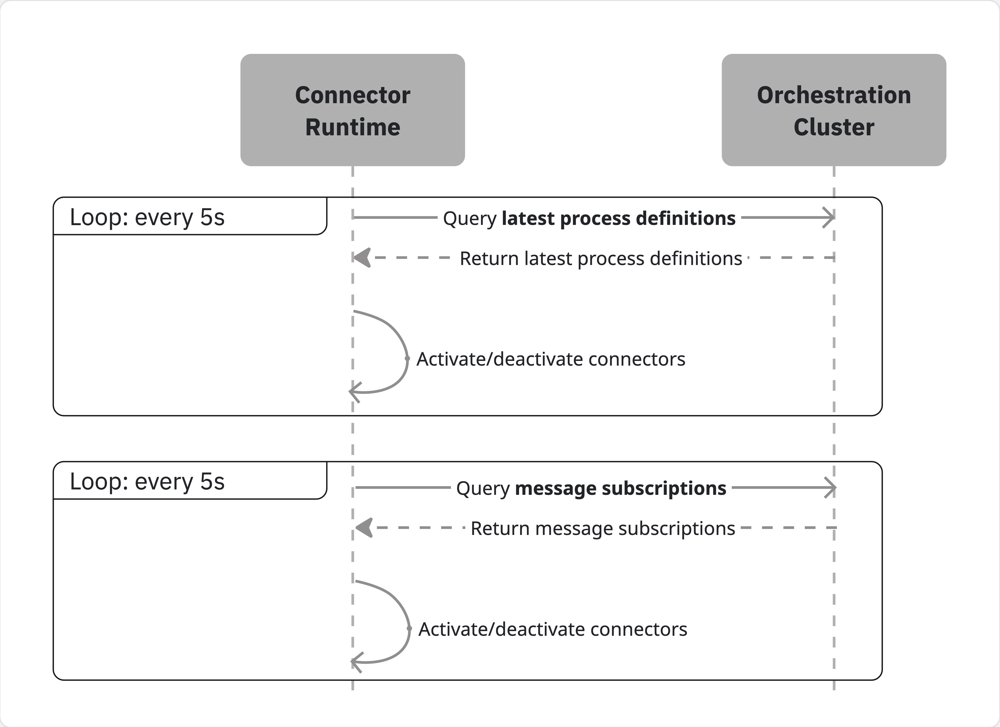
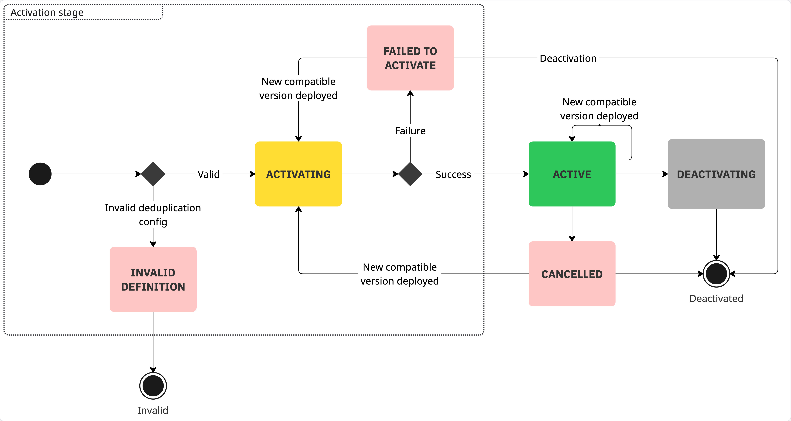

Inbound

Inbound connectors in Camunda have a lifecycle that depends on process definition deployments.
It is important to understand this lifecycle to work with inbound connectors effectively.

This page explains when inbound connectors are activated and deactivated, what can affect their execution, and how to monitor their status.

## Inbound connector executables

An **executable** is an instance of an inbound connector that is managed by the connector runtime.

An executable is mapped to one or several **process definitions** deployed to engine.
In the simplest case, deploying a new process definition will create a new executable in the connector runtime.
However, in general, one executable can be reused for multiple inbound connector elements in the diagram. See [Deduplication](./deduplication.md) to learn more.

## Reacting to process definition deployments

The connector runtime maintains an internal state that tracks:

- **latest versions** of process definitions
- previous versions of process definitions that have **active message subscriptions**

The following endpoints of the Orchestration Cluster API are used as data sources:

- [Search process definitions](/docs/apis-tools/orchestration-cluster-api-rest/specifications/search-process-definitions.api.mdx)
- [Search message subscriptions](/docs/apis-tools/orchestration-cluster-api-rest/specifications/search-message-subscriptions.api.mdx)

If a process definition matches at least one of these two criteria (i.e. it is either the latest version of that process definition, or it has active instances waiting on message subscriptions), the connector runtime will create an executable for every inbound connector element in that process and keep it active as long as these criteria are met.

If a process definition is deleted from the engine; or it is replaced with a newer version of the same process, and has no active message subscriptions, the connector runtime will deactivate the related executables.

## Lifecycle overview

The lifecycle of an executable starts when the connector runtime reacts to a change in the engine state and decides that a new executable is needed to reflect it correctly.

- **INVALID DEFINITION**: If the deduplication configuration is invalid, the runtime will save the executable with the state **INVALID DEFINITION**.
  This can happen for a number of reasons. Refer to the dedicated [Deduplication](./deduplication.md) guide to learn more.
- **FAILED TO ACTIVATE**: The runtime attempts to activate an executable. If an activation attempt fails, the executable is saved with the state **FAILED TO ACTIVATE**.
- **ACTIVE**: When the executable is successfully activated, it will stay in the **ACTIVE** state. This means the executable is ready and listening to external events in the third-party system.
- **CANCELED:** The active executable can encounter an unrecoverable error. In this case, it may transition to the **CANCELED** state. This is rare, and most connectors will have robust error handling with retries to deal with transient errors like temporary network issues.

When a new process version is deployed, the connector runtime will check if it is possible to deduplicate inbound connectors in the new version with any of the executables that are already active. If so, it will update the running executable. This will also lead to a restart attempt if the executable was in an inactive state (**CANCELED** or **FAILED TO ACTIVATE**).

When the active executable is no longer needed (i.e. the process version it originates from is no longer the latest, and there are no active instances waiting on message subscriptions), the runtime will deactivate it.
