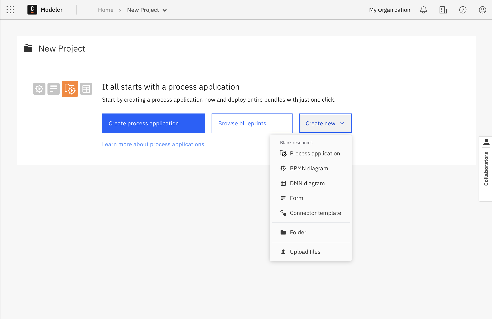

import Tabs from "@theme/Tabs";
import TabItem from "@theme/TabItem";

The **Connector template generator** simplifies the creation of connector templates in Web Modeler. Whether building from scratch or using existing specifications, this generator provides a user-friendly interface for creating custom connectors.

To launch the template generator, Select a web modeler project, Click the **Create new** button and select **Connector template**.

## Configure template details

Each Connector template needs the following information:

- **Name:** Choose a clear and easily understandable name. Include the brand name if the template connects to a service or tool. Otherwise, describe the Connector template's main feature.
- **Description:** Keep the description brief and clear. Describe the main features and benefits of the Conenctor template in several lines. Avoid using technical terms or complicated language.
- **Icon:** We support SVG, PNG, and JPEG formats, with a file size limit of 8 KB. Upload a custom icon for the connector template to override the default BPMN symbol when used in a diagram.

This step is optional, but we recommend it as a best practice. By default, we generate a generic name and use a default BPMN symbol if no custom icon is provided. You can add or edit these fields after the template is created.

## Start from Blank

Define your Connector template manually, specifying parameters, inputs, and outputs tailored to your specific use case.
When selecting **Start from blank**, add template details and click **Create template** button.
Once the template is created, you will be redirected to the [template editor](/components/connectors/manage-connector-templates/).
For more information on connector templates and how to use them effectively, refer to the [Custom-Built Connectors documentation](components/connectors/custom-built-connectors/connector-templates/).

## Start from API Definition

Generate a Connector template automatically by importing an OpenAPI specification or Postman collection.
In the "Import Data Source" section, you can upload the API definition file from a URL or select a file from your system. We support JSON and YAML formats, and the file size limit is 1024 KB.

After the import is complete, choose the desired actions from the list of supported methods. Click "Create template" to generate the template, and you'll be redirected to the [template editor](/components/connectors/manage-connector-templates/) for further customization.

For more information on connector templates and how to use them effectively, refer to the [Custom-Built Connectors documentation](components/connectors/custom-built-connectors/connector-templates/).
