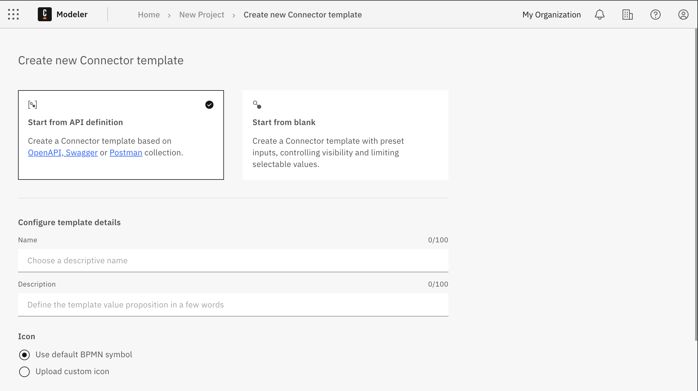

You can configure and automatically generate a custom [Connector template](/components/connectors/custom-built-connectors/connector-templates.md) in Web Modeler.

You can start from a blank template or import an existing API definition such as an [OpenAPI specification](https://swagger.io/resources/open-api/), [Swagger specification](https://swagger.io/resources/open-api/), or a [Postman collection](https://www.postman.com/collection/). For example, download a Postman collection as a YAML file, import this into the generator, and choose which methods to include in the generated template.

## Generate a Connector template

To generate a Connector template:

1. Select the Modeler project you want to create the template in.
1. Click **Create new**, and select **Connector template** to open the **Create new Connector template** screen.
   

1. Select the template starting point.

   - **Start from API definition**: Import an existing API definition file as a starting point for the template. If you select this option, the **Import data source** section is shown below the template details.

   - **Start from blank**: Start from a blank template.

1. Configure the template details in the **Configure template details** section.

   - **Name:** Enter a clear and easily understood name for the template. For example, include the brand name if the template connects to a service or tool, or indicate the template's main feature.

   - **Description:** Enter a description for the template. For example, describe the template's main features and benefits.

   - **Icon:** Use a default BPMN symbol as the template icon in a BPMN diagram, or upload a custom icon. Supported icon formats are SVG, PNG, and JPEG, with a maximum file size limit of 8 KB. Icons must be a minimum of 512 x 512 pixels in size.

     - **Import from URL**: Enter the URL for the image you want to import, and click **Import icon**.
     - **Upload file**: Drag and drop a file into the upload area, or click the link and select a file to upload.

   :::note
   If you do not configure the template details at this point, a default name is generated and a default BPMN symbol selected. You can edit these template details after the template is created.
   :::

1. If you selected the **Start from API definition** option, the **Import data source** section is shown. Select and upload an API definition. JSON and YAML file formats are supported, with a maximum file size limit of 1024 KB.

   1. Select the format you are going to upload (OpenAPI or Postman).
   1. Upload the API definition.

      - **Import from URL**: Enter the URL for the API definition you want to import, and click **Import icon**.
      - **Upload file**: Drag and drop a file into the upload area, or click the link and select a file to upload.

   1. After the import is complete, select which actions to include in the template from the generated list of supported methods.
      

1. Click **Create template** to create and open the newly generated Connector template in the [template editor](/components/connectors/manage-connector-templates.md).

:::info
For more information on working with and configuring Connector templates, see [Connector templates](/components/connectors/custom-built-connectors/connector-templates.md).
:::
