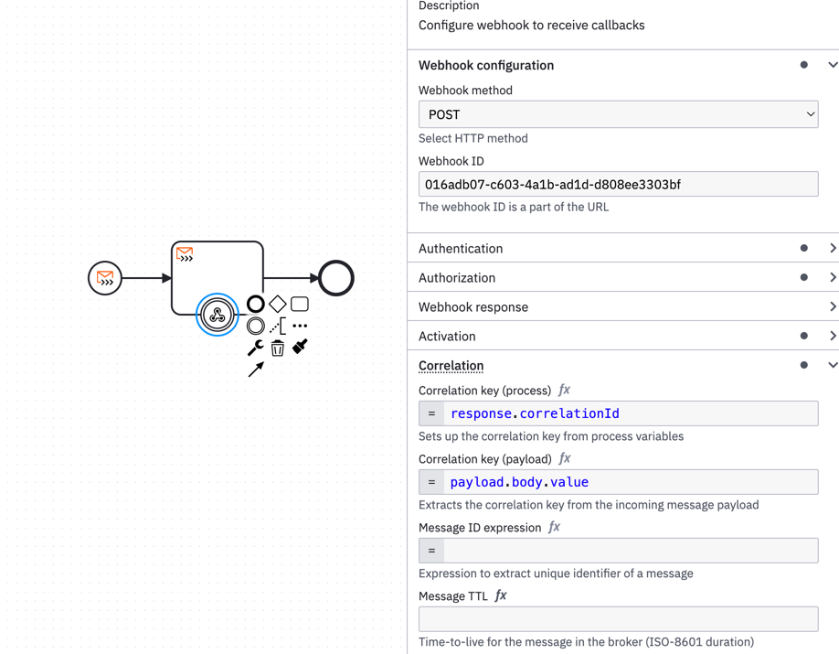

import Tabs from "@theme/Tabs";
import TabItem from "@theme/TabItem";

Connectors are available [out-of-the-box (OOTB)](/components/connectors/out-of-the-box-connectors/available-connectors-overview.md) and come with [Connector templates](/components/connectors/manage-connector-templates.md) which customize how a BPMN element is shown,
and how it can be configured by process developers. Connector templates are a specific kind of [element templates](/components/modeler/desktop-modeler/element-templates/about-templates.md), which can also be used when creating custom Connectors via the [Connector SDK](/components/connectors/custom-built-connectors/connector-sdk.md).

Additionally, the [Camunda Marketplace](/components/modeler/web-modeler/camunda-marketplace.md) provides Connectors by Camunda partners and community contributors.

Before developing one, you'll need to decide what you would like to achieve with your Connector. Currently, the options are:

- Starting a BPMN process, triggered by external service - Use [inbound start event Connector template](#inbound-start-event-connector-templates).
- Continue process with an intermediate catch event emitted by external service call - Use [inbound intermediate catch event Connector templates](#inbound-intermediate-catch-event-connector-templates).
- Trigger an external service - Use [outbound Connector template](#outbound-connector-templates).

:::note
Do not confuse **Connector templates** with the **[Connector template](https://github.com/camunda/connector-template-outbound)**,
which is used to supply boilerplate code and configuration when developing a new custom Connector.
:::

## Inbound start event Connector templates

You can, for example, allow the user to model and configure the following **HTTP Webhook Connector** by providing
a simple JSON configuration:

<Tabs groupId="connectorTemplateInbound" defaultValue="process" values={
[
{label: 'Process modeling view', value: 'process' },
{label: 'Connector template configuration', value: 'json' }
]
}>

<TabItem value='process'>


</TabItem>

<TabItem value='json'>

```json
{
  "$schema": "https://unpkg.com/@camunda/zeebe-element-templates-json-schema/resources/schema.json",
  "name": "Webhook Connector",
  "id": "io.camunda.connectors.webhook.WebhookConnector.v1",
  "version": 1,
  "description": "Configure webhook to receive callbacks",
  "documentationRef": "https://docs.camunda.io/docs/components/connectors/out-of-the-box-connectors/http-webhook/",
  "category": {
    "id": "connectors",
    "name": "Connectors"
  },
  "appliesTo": ["bpmn:StartEvent"],
  "elementType": {
    "value": "bpmn:StartEvent"
  },
  "groups": [
    {
      "id": "endpoint",
      "label": "Webhook Configuration"
    },
    {
      "id": "activation",
      "label": "Activation"
    },
    {
      "id": "variable-mapping",
      "label": "Variable Mapping"
    }
  ],
  "properties": [
    {
      "type": "Hidden",
      "value": "io.camunda:webhook:1",
      "binding": {
        "type": "zeebe:property",
        "name": "inbound.type"
      }
    },
    {
      "type": "Hidden",
      "value": "ConfigurableInboundWebhook",
      "binding": {
        "type": "zeebe:property",
        "name": "inbound.subtype"
      }
    },
    {
      "label": "Webhook ID",
      "type": "String",
      "group": "endpoint",
      "binding": {
        "type": "zeebe:property",
        "name": "inbound.context"
      },
      "description": "The webhook ID is a part of the URL"
    },
    {
      "id": "shouldValidateHmac",
      "label": "HMAC authentication",
      "group": "endpoint",
      "description": "Choose whether HMAC verification is enabled. <a href='https://docs.camunda.io/docs/components/connectors/out-of-the-box-connectors/http-webhook/#make-your-http-webhook-connector-for-receiving-messages-executable' target='_blank'>See documentation</a> and <a href='https://docs.camunda.io/docs/components/connectors/out-of-the-box-connectors/http-webhook/#example' target='_blank'>example</a> that explains how to use HMAC-related fields",
      "value": "disabled",
      "type": "Dropdown",
      "choices": [
        {
          "name": "Enabled",
          "value": "enabled"
        },
        {
          "name": "Disabled",
          "value": "disabled"
        }
      ],
      "binding": {
        "type": "zeebe:property",
        "name": "inbound.shouldValidateHmac"
      }
    },
    {
      "label": "HMAC secret key",
      "description": "Shared secret key",
      "type": "String",
      "group": "endpoint",
      "optional": true,
      "binding": {
        "type": "zeebe:property",
        "name": "inbound.hmacSecret"
      },
      "condition": {
        "property": "shouldValidateHmac",
        "equals": "enabled"
      }
    },
    {
      "label": "HMAC header",
      "description": "Name of header attribute that will contain the HMAC value",
      "type": "String",
      "group": "endpoint",
      "optional": true,
      "binding": {
        "type": "zeebe:property",
        "name": "inbound.hmacHeader"
      },
      "condition": {
        "property": "shouldValidateHmac",
        "equals": "enabled"
      }
    },
    {
      "label": "HMAC algorithm",
      "group": "endpoint",
      "description": "Choose HMAC algorithm",
      "value": "sha_256",
      "type": "Dropdown",
      "choices": [
        {
          "name": "SHA-1",
          "value": "sha_1"
        },
        {
          "name": "SHA-256",
          "value": "sha_256"
        },
        {
          "name": "SHA-512",
          "value": "sha_512"
        }
      ],
      "binding": {
        "type": "zeebe:property",
        "name": "inbound.hmacAlgorithm"
      },
      "condition": {
        "property": "shouldValidateHmac",
        "equals": "enabled"
      }
    },
    {
      "label": "Condition",
      "type": "String",
      "group": "activation",
      "feel": "required",
      "optional": true,
      "binding": {
        "type": "zeebe:property",
        "name": "inbound.activationCondition"
      },
      "description": "Condition under which the Connector triggers. Leave empty to catch all events. <a href='https://docs.camunda.io/docs/components/connectors/out-of-the-box-connectors/http-webhook/#make-your-http-webhook-connector-for-receiving-messages-executable' target='_blank'>See documentation</a>"
    },
    {
      "label": "Variables",
      "type": "String",
      "group": "variable-mapping",
      "feel": "required",
      "binding": {
        "type": "zeebe:property",
        "name": "inbound.variableMapping"
      },
      "description": "Map variables from the webhook payload (request) to start the process with. When blank, entire payload is copied over. <a href='https://docs.camunda.io/docs/components/connectors/out-of-the-box-connectors/http-webhook/#make-your-http-webhook-connector-for-receiving-messages-executable' target='_blank'>See documentation</a>"
    }
  ],
  "icon": {
    "contents": "data:image/svg+xml,%3Csvg id='icon' xmlns='http://www.w3.org/2000/svg' width='18' height='18' viewBox='0 0 32 32'%3E%3Cdefs%3E%3Cstyle%3E .cls-1 %7B fill: none; %7D %3C/style%3E%3C/defs%3E%3Cpath d='M24,26a3,3,0,1,0-2.8164-4H13v1a5,5,0,1,1-5-5V16a7,7,0,1,0,6.9287,8h6.2549A2.9914,2.9914,0,0,0,24,26Z'/%3E%3Cpath d='M24,16a7.024,7.024,0,0,0-2.57.4873l-3.1656-5.5395a3.0469,3.0469,0,1,0-1.7326.9985l4.1189,7.2085.8686-.4976a5.0006,5.0006,0,1,1-1.851,6.8418L17.937,26.501A7.0005,7.0005,0,1,0,24,16Z'/%3E%3Cpath d='M8.532,20.0537a3.03,3.03,0,1,0,1.7326.9985C11.74,18.47,13.86,14.7607,13.89,14.708l.4976-.8682-.8677-.497a5,5,0,1,1,6.812-1.8438l1.7315,1.002a7.0008,7.0008,0,1,0-10.3462,2.0356c-.457.7427-1.1021,1.8716-2.0737,3.5728Z'/%3E%3Crect id='_Transparent_Rectangle_' data-name='&lt;Transparent Rectangle&gt;' class='cls-1' width='32' height='32'/%3E%3C/svg%3E"
  }
}
```

</TabItem>
</Tabs>

## Inbound intermediate catch event Connector templates

You can, for example, allow the user to model and configure the following **HTTP Webhook Connector** by providing
a simple JSON configuration:

<Tabs groupId="connectorTemplateInbound" defaultValue="process" values={
[
{label: 'Process modeling view', value: 'process' },
{label: 'Connector template configuration', value: 'json' }
]
}>

<TabItem value='process'>


</TabItem>

<TabItem value='json'>

```json
{
  "$schema": "https://unpkg.com/@camunda/zeebe-element-templates-json-schema/resources/schema.json",
  "name": "Webhook Connector",
  "id": "io.camunda.connectors.webhook.WebhookConnectorIntermediate.v1",
  "version": 1,
  "description": "Configure webhook to receive callbacks",
  "documentationRef": "https://docs.camunda.io/docs/components/connectors/out-of-the-box-connectors/http-webhook/",
  "category": {
    "id": "connectors",
    "name": "Connectors"
  },
  "appliesTo": ["bpmn:IntermediateCatchEvent", "bpmn:IntermediateThrowEvent"],
  "elementType": {
    "value": "bpmn:IntermediateCatchEvent",
    "eventDefinition": "bpmn:MessageEventDefinition"
  },
  "groups": [
    {
      "id": "endpoint",
      "label": "Webhook Configuration"
    },
    {
      "id": "activation",
      "label": "Activation"
    },
    {
      "id": "variable-mapping",
      "label": "Variable Mapping"
    }
  ],
  "properties": [
    {
      "type": "Hidden",
      "value": "io.camunda:webhook:1",
      "binding": {
        "type": "zeebe:property",
        "name": "inbound.type"
      }
    },
    {
      "type": "Hidden",
      "generatedValue": {
        "type": "uuid"
      },
      "binding": {
        "type": "bpmn:Message#property",
        "name": "name"
      }
    },
    {
      "type": "Hidden",
      "value": "ConfigurableInboundWebhook",
      "binding": {
        "type": "zeebe:property",
        "name": "inbound.subtype"
      }
    },
    {
      "label": "Webhook ID",
      "type": "String",
      "group": "endpoint",
      "binding": {
        "type": "zeebe:property",
        "name": "inbound.context"
      },
      "description": "The webhook ID is a part of the URL"
    },
    {
      "id": "shouldValidateHmac",
      "label": "HMAC authentication",
      "group": "endpoint",
      "description": "Choose whether HMAC verification is enabled. <a href='https://docs.camunda.io/docs/components/connectors/out-of-the-box-connectors/http-webhook/#make-your-http-webhook-connector-for-receiving-messages-executable' target='_blank'>See documentation</a> and <a href='https://docs.camunda.io/docs/components/connectors/out-of-the-box-connectors/http-webhook/#example' target='_blank'>example</a> that explains how to use HMAC-related fields",
      "value": "disabled",
      "type": "Dropdown",
      "choices": [
        {
          "name": "Enabled",
          "value": "enabled"
        },
        {
          "name": "Disabled",
          "value": "disabled"
        }
      ],
      "binding": {
        "type": "zeebe:property",
        "name": "inbound.shouldValidateHmac"
      }
    },
    {
      "label": "HMAC secret key",
      "description": "Shared secret key",
      "type": "String",
      "group": "endpoint",
      "optional": true,
      "binding": {
        "type": "zeebe:property",
        "name": "inbound.hmacSecret"
      },
      "condition": {
        "property": "shouldValidateHmac",
        "equals": "enabled"
      }
    },
    {
      "label": "HMAC header",
      "description": "Name of header attribute that will contain the HMAC value",
      "type": "String",
      "group": "endpoint",
      "optional": true,
      "binding": {
        "type": "zeebe:property",
        "name": "inbound.hmacHeader"
      },
      "condition": {
        "property": "shouldValidateHmac",
        "equals": "enabled"
      }
    },
    {
      "label": "HMAC algorithm",
      "group": "endpoint",
      "description": "Choose HMAC algorithm",
      "value": "sha_256",
      "type": "Dropdown",
      "choices": [
        {
          "name": "SHA-1",
          "value": "sha_1"
        },
        {
          "name": "SHA-256",
          "value": "sha_256"
        },
        {
          "name": "SHA-512",
          "value": "sha_512"
        }
      ],
      "binding": {
        "type": "zeebe:property",
        "name": "inbound.hmacAlgorithm"
      },
      "condition": {
        "property": "shouldValidateHmac",
        "equals": "enabled"
      }
    },
    {
      "label": "Correlation key (process)",
      "type": "String",
      "group": "activation",
      "feel": "required",
      "description": "Sets up the correlation key from process variables",
      "binding": {
        "type": "bpmn:Message#zeebe:subscription#property",
        "name": "correlationKey"
      },
      "constraints": {
        "notEmpty": true
      }
    },
    {
      "label": "Correlation key (payload)",
      "type": "String",
      "group": "activation",
      "feel": "required",
      "binding": {
        "type": "zeebe:property",
        "name": "correlationKeyExpression"
      },
      "description": "Extracts the correlation key from the incoming message payload",
      "constraints": {
        "notEmpty": true
      }
    },
    {
      "label": "Condition",
      "type": "String",
      "group": "activation",
      "feel": "required",
      "optional": true,
      "binding": {
        "type": "zeebe:property",
        "name": "inbound.activationCondition"
      },
      "description": "Condition under which the Connector triggers. Leave empty to catch all events. <a href='https://docs.camunda.io/docs/components/connectors/out-of-the-box-connectors/http-webhook/#make-your-http-webhook-connector-for-receiving-messages-executable' target='_blank'>See documentation</a>"
    },
    {
      "label": "Variables",
      "type": "String",
      "group": "variable-mapping",
      "feel": "required",
      "binding": {
        "type": "zeebe:property",
        "name": "inbound.variableMapping"
      },
      "description": "Map variables from the webhook payload (request) to start the process with. When blank, entire payload is copied over. <a href='https://docs.camunda.io/docs/components/connectors/out-of-the-box-connectors/http-webhook/#make-your-http-webhook-connector-for-receiving-messages-executable' target='_blank'>See documentation</a>"
    }
  ],
  "icon": {
    "contents": "data:image/svg+xml,%3Csvg id='icon' xmlns='http://www.w3.org/2000/svg' width='18' height='18' viewBox='0 0 32 32'%3E%3Cdefs%3E%3Cstyle%3E .cls-1 %7B fill: none; %7D %3C/style%3E%3C/defs%3E%3Cpath d='M24,26a3,3,0,1,0-2.8164-4H13v1a5,5,0,1,1-5-5V16a7,7,0,1,0,6.9287,8h6.2549A2.9914,2.9914,0,0,0,24,26Z'/%3E%3Cpath d='M24,16a7.024,7.024,0,0,0-2.57.4873l-3.1656-5.5395a3.0469,3.0469,0,1,0-1.7326.9985l4.1189,7.2085.8686-.4976a5.0006,5.0006,0,1,1-1.851,6.8418L17.937,26.501A7.0005,7.0005,0,1,0,24,16Z'/%3E%3Cpath d='M8.532,20.0537a3.03,3.03,0,1,0,1.7326.9985C11.74,18.47,13.86,14.7607,13.89,14.708l.4976-.8682-.8677-.497a5,5,0,1,1,6.812-1.8438l1.7315,1.002a7.0008,7.0008,0,1,0-10.3462,2.0356c-.457.7427-1.1021,1.8716-2.0737,3.5728Z'/%3E%3Crect id='_Transparent_Rectangle_' data-name='&lt;Transparent Rectangle&gt;' class='cls-1' width='32' height='32'/%3E%3C/svg%3E"
  }
}
```

</TabItem>
</Tabs>

## Inbound boundary event Connector templates

You can, for example, allow the user to model and configure the following **HTTP webhook Connector** for boundary events by providing
a simple JSON configuration:

<Tabs groupId="connectorTemplateInbound" defaultValue="process" values={
[
{label: 'Process modeling view', value: 'process' },
{label: 'Connector template configuration', value: 'json' }
]
}>

<TabItem value='process'>



</TabItem>

<TabItem value='json'>

```json
{
  "$schema": "https://unpkg.com/@camunda/zeebe-element-templates-json-schema/resources/schema.json",
  "name": "Webhook Boundary Event Connector",
  "id": "io.camunda.connectors.webhook.WebhookConnectorBoundary.v1",
  "description": "Configure webhook to receive callbacks",
  "documentationRef": "https://docs.camunda.io/docs/components/connectors/out-of-the-box-connectors/http-webhook/",
  "version": 11,
  "category": {
    "id": "connectors",
    "name": "Connectors"
  },
  "appliesTo": ["bpmn:BoundaryEvent"],
  "elementType": {
    "value": "bpmn:BoundaryEvent",
    "eventDefinition": "bpmn:MessageEventDefinition"
  },
  "groups": [
    {
      "id": "endpoint",
      "label": "Webhook configuration"
    },
    {
      "id": "authentication",
      "label": "Authentication"
    },
    {
      "id": "authorization",
      "label": "Authorization"
    },
    {
      "id": "webhookResponse",
      "label": "Webhook response"
    },
    {
      "id": "activation",
      "label": "Activation"
    },
    {
      "id": "correlation",
      "label": "Correlation",
      "tooltip": "Learn more about message correlation in the <a href=\"https://docs.camunda.io/docs/components/concepts/messages/#message-correlation-overview\">documentation</a>."
    },
    {
      "id": "output",
      "label": "Output mapping"
    }
  ],
  "properties": [
    {
      "value": "io.camunda:webhook:1",
      "binding": {
        "name": "inbound.type",
        "type": "zeebe:property"
      },
      "type": "Hidden"
    },
    {
      "id": "inbound.method",
      "label": "Webhook method",
      "description": "Select HTTP method",
      "optional": false,
      "value": "any",
      "group": "endpoint",
      "binding": {
        "name": "inbound.method",
        "type": "zeebe:property"
      },
      "type": "Dropdown",
      "choices": [
        {
          "name": "Any",
          "value": "any"
        },
        {
          "name": "GET",
          "value": "get"
        },
        {
          "name": "POST",
          "value": "post"
        },
        {
          "name": "PUT",
          "value": "put"
        },
        {
          "name": "DELETE",
          "value": "delete"
        }
      ]
    },
    {
      "id": "inbound.context",
      "label": "Webhook ID",
      "description": "The webhook ID is a part of the URL",
      "optional": false,
      "constraints": {
        "notEmpty": true,
        "pattern": {
          "value": "^[a-zA-Z0-9]+([-_][a-zA-Z0-9]+)*$",
          "message": "can only contain letters, numbers, or single underscores/hyphens and cannot begin or end with an underscore/hyphen"
        }
      },
      "group": "endpoint",
      "binding": {
        "name": "inbound.context",
        "type": "zeebe:property"
      },
      "type": "String"
    },
    {
      "id": "inbound.shouldValidateHmac",
      "label": "HMAC authentication",
      "description": "Choose whether HMAC verification is enabled. <a href='https://docs.camunda.io/docs/components/connectors/out-of-the-box-connectors/http-webhook/#make-your-http-webhook-connector-for-receiving-messages-executable' target='_blank'>See documentation</a> and <a href='https://docs.camunda.io/docs/components/connectors/out-of-the-box-connectors/http-webhook/#example' target='_blank'>example</a> that explains how to use HMAC-related fields",
      "optional": false,
      "value": "disabled",
      "group": "authentication",
      "binding": {
        "name": "inbound.shouldValidateHmac",
        "type": "zeebe:property"
      },
      "type": "Dropdown",
      "choices": [
        {
          "name": "Enabled",
          "value": "enabled"
        },
        {
          "name": "Disabled",
          "value": "disabled"
        }
      ]
    },
    {
      "id": "inbound.hmacSecret",
      "label": "HMAC secret key",
      "description": "Shared secret key",
      "optional": true,
      "feel": "optional",
      "group": "authentication",
      "binding": {
        "name": "inbound.hmacSecret",
        "type": "zeebe:property"
      },
      "condition": {
        "property": "inbound.shouldValidateHmac",
        "equals": "enabled",
        "type": "simple"
      },
      "type": "String"
    },
    {
      "id": "inbound.hmacHeader",
      "label": "HMAC header",
      "description": "Name of header attribute that will contain the HMAC value",
      "optional": true,
      "feel": "optional",
      "group": "authentication",
      "binding": {
        "name": "inbound.hmacHeader",
        "type": "zeebe:property"
      },
      "condition": {
        "property": "inbound.shouldValidateHmac",
        "equals": "enabled",
        "type": "simple"
      },
      "type": "String"
    },
    {
      "id": "inbound.hmacAlgorithm",
      "label": "HMAC algorithm",
      "description": "Choose HMAC algorithm",
      "optional": false,
      "value": "sha_256",
      "group": "authentication",
      "binding": {
        "name": "inbound.hmacAlgorithm",
        "type": "zeebe:property"
      },
      "condition": {
        "property": "inbound.shouldValidateHmac",
        "equals": "enabled",
        "type": "simple"
      },
      "type": "Dropdown",
      "choices": [
        {
          "name": "SHA-1",
          "value": "sha_1"
        },
        {
          "name": "SHA-256",
          "value": "sha_256"
        },
        {
          "name": "SHA-512",
          "value": "sha_512"
        }
      ]
    },
    {
      "id": "inbound.hmacScopes",
      "label": "HMAC scopes",
      "description": "Set HMAC scopes for calculating signature data. See <a href='https://docs.camunda.io/docs/components/connectors/out-of-the-box-connectors/http-webhook/' target='_blank'>documentation</a>",
      "optional": true,
      "feel": "required",
      "group": "authentication",
      "binding": {
        "name": "inbound.hmacScopes",
        "type": "zeebe:property"
      },
      "condition": {
        "property": "inbound.shouldValidateHmac",
        "equals": "enabled",
        "type": "simple"
      },
      "type": "String"
    },
    {
      "id": "inbound.auth.type",
      "label": "Authorization type",
      "description": "Choose the authorization type",
      "value": "NONE",
      "group": "authorization",
      "binding": {
        "name": "inbound.auth.type",
        "type": "zeebe:property"
      },
      "type": "Dropdown",
      "choices": [
        {
          "name": "None",
          "value": "NONE"
        },
        {
          "name": "Basic",
          "value": "BASIC"
        },
        {
          "name": "API key",
          "value": "APIKEY"
        },
        {
          "name": "JWT",
          "value": "JWT"
        }
      ]
    },
    {
      "id": "inbound.auth.username",
      "label": "Username",
      "description": "Username for basic authentication",
      "optional": false,
      "feel": "optional",
      "group": "authorization",
      "binding": {
        "name": "inbound.auth.username",
        "type": "zeebe:property"
      },
      "condition": {
        "property": "inbound.auth.type",
        "equals": "BASIC",
        "type": "simple"
      },
      "type": "String"
    },
    {
      "id": "inbound.auth.password",
      "label": "Password",
      "description": "Password for basic authentication",
      "optional": false,
      "feel": "optional",
      "group": "authorization",
      "binding": {
        "name": "inbound.auth.password",
        "type": "zeebe:property"
      },
      "condition": {
        "property": "inbound.auth.type",
        "equals": "BASIC",
        "type": "simple"
      },
      "type": "String"
    },
    {
      "id": "inbound.auth.apiKey",
      "label": "API key",
      "description": "Expected API key",
      "optional": false,
      "feel": "optional",
      "group": "authorization",
      "binding": {
        "name": "inbound.auth.apiKey",
        "type": "zeebe:property"
      },
      "condition": {
        "property": "inbound.auth.type",
        "equals": "APIKEY",
        "type": "simple"
      },
      "type": "String"
    },
    {
      "id": "inbound.auth.apiKeyLocator",
      "label": "API key locator",
      "description": "A FEEL expression that extracts API key from the request. <a href='https://docs.camunda.io/docs/components/connectors/out-of-the-box-connectors/http-webhook/#how-to-configure-api-key-authorization'>See documentation</a>",
      "optional": false,
      "value": "=split(request.headers.authorization, \" \")[2]",
      "constraints": {
        "notEmpty": true
      },
      "feel": "required",
      "group": "authorization",
      "binding": {
        "name": "inbound.auth.apiKeyLocator",
        "type": "zeebe:property"
      },
      "condition": {
        "property": "inbound.auth.type",
        "equals": "APIKEY",
        "type": "simple"
      },
      "type": "String"
    },
    {
      "id": "inbound.auth.jwt.jwkUrl",
      "label": "JWK URL",
      "description": "Well-known URL of JWKs",
      "optional": false,
      "feel": "optional",
      "group": "authorization",
      "binding": {
        "name": "inbound.auth.jwt.jwkUrl",
        "type": "zeebe:property"
      },
      "condition": {
        "property": "inbound.auth.type",
        "equals": "JWT",
        "type": "simple"
      },
      "type": "String"
    },
    {
      "id": "inbound.auth.jwt.permissionsExpression",
      "label": "JWT role property expression",
      "description": "Expression to extract the roles from the JWT token. <a href='https://docs.camunda.io/docs/components/connectors/out-of-the-box-connectors/http-webhook/#how-to-extract-roles-from-jwt-data'>See documentation</a>",
      "optional": false,
      "feel": "required",
      "group": "authorization",
      "binding": {
        "name": "inbound.auth.jwt.permissionsExpression",
        "type": "zeebe:property"
      },
      "condition": {
        "property": "inbound.auth.type",
        "equals": "JWT",
        "type": "simple"
      },
      "type": "String"
    },
    {
      "id": "inbound.auth.jwt.requiredPermissions",
      "label": "Required roles",
      "description": "List of roles to test JWT roles against",
      "optional": false,
      "feel": "required",
      "group": "authorization",
      "binding": {
        "name": "inbound.auth.jwt.requiredPermissions",
        "type": "zeebe:property"
      },
      "condition": {
        "property": "inbound.auth.type",
        "equals": "JWT",
        "type": "simple"
      },
      "type": "String"
    },
    {
      "id": "inbound.responseExpression",
      "label": "Response expression",
      "description": "Expression used to generate the HTTP response",
      "optional": true,
      "feel": "required",
      "group": "webhookResponse",
      "binding": {
        "name": "inbound.responseExpression",
        "type": "zeebe:property"
      },
      "type": "Text"
    },
    {
      "id": "inbound.verificationExpression",
      "label": "One time verification response expression",
      "description": "Specify condition and response. Learn more in the <a href='https://docs.camunda.io/docs/components/connectors/protocol/http-webhook/#verification-expression' target='_blank'>documentation</a>",
      "optional": true,
      "feel": "required",
      "group": "webhookResponse",
      "binding": {
        "name": "inbound.verificationExpression",
        "type": "zeebe:property"
      },
      "type": "Text"
    },
    {
      "id": "activationCondition",
      "label": "Activation condition",
      "description": "Condition under which the Connector triggers. Leave empty to catch all events",
      "optional": true,
      "feel": "required",
      "group": "activation",
      "binding": {
        "name": "activationCondition",
        "type": "zeebe:property"
      },
      "type": "String"
    },
    {
      "id": "consumeUnmatchedEvents",
      "label": "Consume unmatched events",
      "value": true,
      "group": "activation",
      "binding": {
        "name": "consumeUnmatchedEvents",
        "type": "zeebe:property"
      },
      "tooltip": "Unmatched events are rejected by default, allowing the upstream service to handle the error. Check this box to consume unmatched events and return a success response",
      "type": "Boolean"
    },
    {
      "id": "correlationKeyProcess",
      "label": "Correlation key (process)",
      "description": "Sets up the correlation key from process variables",
      "constraints": {
        "notEmpty": true
      },
      "feel": "required",
      "group": "correlation",
      "binding": {
        "name": "correlationKey",
        "type": "bpmn:Message#zeebe:subscription#property"
      },
      "type": "String"
    },
    {
      "id": "correlationKeyPayload",
      "label": "Correlation key (payload)",
      "description": "Extracts the correlation key from the incoming message payload",
      "constraints": {
        "notEmpty": true
      },
      "feel": "required",
      "group": "correlation",
      "binding": {
        "name": "correlationKeyExpression",
        "type": "zeebe:property"
      },
      "type": "String"
    },
    {
      "id": "messageIdExpression",
      "label": "Message ID expression",
      "description": "Expression to extract unique identifier of a message",
      "optional": true,
      "feel": "required",
      "group": "correlation",
      "binding": {
        "name": "messageIdExpression",
        "type": "zeebe:property"
      },
      "type": "String"
    },
    {
      "id": "messageTtl",
      "label": "Message TTL",
      "description": "Time-to-live for the message in the broker (ISO-8601 duration)",
      "optional": true,
      "constraints": {
        "notEmpty": false,
        "pattern": {
          "value": "^(PT.*|)$",
          "message": "must be an ISO-8601 duration"
        }
      },
      "feel": "optional",
      "group": "correlation",
      "binding": {
        "name": "messageTtl",
        "type": "zeebe:property"
      },
      "type": "String"
    },
    {
      "id": "messageNameUuid",
      "generatedValue": {
        "type": "uuid"
      },
      "group": "correlation",
      "binding": {
        "name": "name",
        "type": "bpmn:Message#property"
      },
      "type": "Hidden"
    },
    {
      "id": "resultVariable",
      "label": "Result variable",
      "description": "Name of variable to store the response in",
      "group": "output",
      "binding": {
        "name": "resultVariable",
        "type": "zeebe:property"
      },
      "type": "String"
    },
    {
      "id": "resultExpression",
      "label": "Result expression",
      "description": "Expression to map the response into process variables",
      "feel": "required",
      "group": "output",
      "binding": {
        "name": "resultExpression",
        "type": "zeebe:property"
      },
      "type": "Text"
    }
  ],
  "icon": {
    "contents": "data:image/svg+xml;base64,PHN2ZyBpZD0naWNvbicgeG1sbnM9J2h0dHA6Ly93d3cudzMub3JnLzIwMDAvc3ZnJyB3aWR0aD0nMTgnIGhlaWdodD0nMTgnIHZpZXdCb3g9JzAgMCAzMiAzMic+CiAgPGRlZnM+CiAgICA8c3R5bGU+LmNscy0xIHsgZmlsbDogbm9uZTsgfTwvc3R5bGU+CiAgPC9kZWZzPgogIDxwYXRoCiAgICBkPSdNMjQsMjZhMywzLDAsMSwwLTIuODE2NC00SDEzdjFhNSw1LDAsMSwxLTUtNVYxNmE3LDcsMCwxLDAsNi45Mjg3LDhoNi4yNTQ5QTIuOTkxNCwyLjk5MTQsMCwwLDAsMjQsMjZaJy8+CiAgPHBhdGgKICAgIGQ9J00yNCwxNmE3LjAyNCw3LjAyNCwwLDAsMC0yLjU3LjQ4NzNsLTMuMTY1Ni01LjUzOTVhMy4wNDY5LDMuMDQ2OSwwLDEsMC0xLjczMjYuOTk4NWw0LjExODksNy4yMDg1Ljg2ODYtLjQ5NzZhNS4wMDA2LDUuMDAwNiwwLDEsMS0xLjg1MSw2Ljg0MThMMTcuOTM3LDI2LjUwMUE3LjAwMDUsNy4wMDA1LDAsMSwwLDI0LDE2WicvPgogIDxwYXRoCiAgICBkPSdNOC41MzIsMjAuMDUzN2EzLjAzLDMuMDMsMCwxLDAsMS43MzI2Ljk5ODVDMTEuNzQsMTguNDcsMTMuODYsMTQuNzYwNywxMy44OSwxNC43MDhsLjQ5NzYtLjg2ODItLjg2NzctLjQ5N2E1LDUsMCwxLDEsNi44MTItMS44NDM4bDEuNzMxNSwxLjAwMmE3LjAwMDgsNy4wMDA4LDAsMSwwLTEwLjM0NjIsMi4wMzU2Yy0uNDU3Ljc0MjctMS4xMDIxLDEuODcxNi0yLjA3MzcsMy41NzI4WicvPgogIDxyZWN0IGlkPSdfVHJhbnNwYXJlbnRfUmVjdGFuZ2xlXycgZGF0YS1uYW1lPScmbHQ7VHJhbnNwYXJlbnQgUmVjdGFuZ2xlJmd0OycgY2xhc3M9J2Nscy0xJwogICAgd2lkdGg9JzMyJyBoZWlnaHQ9JzMyJy8+Cjwvc3ZnPg=="
  }
}
```

</TabItem>

</Tabs>

## Outbound Connector templates

You can, for example, allow the user to model and configure the following **REST Connector** by providing a JSON configuration for a service task:

<Tabs groupId="connectorTemplateOutbound" defaultValue="process" values={
[
{label: 'Process modeling view', value: 'process' },
{label: 'Connector template configuration', value: 'json' }
]
}>

<TabItem value='process'>


</TabItem>

<TabItem value='json'>

```json
{
  "$schema": "https://unpkg.com/@camunda/zeebe-element-templates-json-schema/resources/schema.json",
  "name": "(Conditional) REST Connector",
  "id": "io.camunda.examples.ConditionalRestConnector",
  "description": "A REST API invocation task.",
  "appliesTo": ["bpmn:ServiceTask"],
  "icon": {
    "contents": "data:image/svg+xml,%3Csvg xmlns='http://www.w3.org/2000/svg' width='22' height='22' viewBox='0 0 22 22' fill='none'%3E%3Ccircle cx='11' cy='11' r='9' fill='black'/%3E%3Ctext x='6.9' y='14.9' fill='white' style='font-family: Arial; font-size: 10px;'%3EM%3C/text%3E%3C/svg%3E"
  },
  "properties": [
    {
      "type": "Hidden",
      "value": "http",
      "binding": {
        "type": "zeebe:taskDefinition:type"
      }
    },
    {
      "label": "REST Endpoint URL",
      "description": "Specify the url of the REST API to talk to.",
      "type": "String",
      "binding": {
        "type": "zeebe:taskHeader",
        "key": "url"
      },
      "constraints": {
        "notEmpty": true,
        "pattern": {
          "value": "^https?://.*",
          "message": "Must be http(s) URL."
        }
      }
    },
    {
      "id": "httpMethod",
      "label": "REST Method",
      "description": "Specify the HTTP method to use.",
      "type": "Dropdown",
      "value": "get",
      "choices": [
        { "name": "GET", "value": "get" },
        { "name": "POST", "value": "post" },
        { "name": "PATCH", "value": "patch" },
        { "name": "DELETE", "value": "delete" }
      ],
      "binding": {
        "type": "zeebe:taskHeader",
        "key": "method"
      }
    },
    {
      "label": "Request Body",
      "description": "Data to send to the endpoint.",
      "value": "",
      "type": "String",
      "optional": true,
      "binding": {
        "type": "zeebe:input",
        "name": "body"
      },
      "condition": {
        "property": "httpMethod",
        "oneOf": ["patch", "post", "delete"]
      }
    },
    {
      "id": "authenticationType",
      "label": "Authentication Type",
      "description": "Specify the authentication type to use.",
      "type": "Dropdown",
      "value": "",
      "optional": true,
      "choices": [
        {
          "name": "None",
          "value": ""
        },
        {
          "name": "Basic",
          "value": "basic"
        },
        {
          "name": "Bearer",
          "value": "bearer"
        }
      ],
      "binding": {
        "type": "zeebe:input",
        "name": "authentication.type"
      }
    },
    {
      "label": "Username",
      "type": "String",
      "feel": "optional",
      "binding": {
        "type": "zeebe:input",
        "name": "authentication.username"
      },
      "constraints": {
        "notEmpty": true
      },
      "condition": {
        "property": "authenticationType",
        "equals": "basic"
      }
    },
    {
      "label": "Password",
      "type": "String",
      "feel": "optional",
      "binding": {
        "type": "zeebe:input",
        "name": "authentication.password"
      },
      "constraints": {
        "notEmpty": true
      },
      "condition": {
        "property": "authenticationType",
        "equals": "basic"
      }
    },
    {
      "label": "Bearer Token",
      "type": "String",
      "feel": "optional",
      "binding": {
        "type": "zeebe:input",
        "name": "authentication.token"
      },
      "constraints": {
        "notEmpty": true
      },
      "condition": {
        "property": "authenticationType",
        "equals": "bearer"
      }
    }
  ]
}
```

</TabItem>
</Tabs>

## Develop Connector templates

You can develop Connector templates using the [`element template` feature](/components/modeler/desktop-modeler/element-templates/defining-templates.md). You can also look at existing [examples](https://github.com/camunda/camunda-modeler/blob/master/resources/element-templates/cloud-samples.json).

## Providing and using Connector templates

When using [Web Modeler](/components/modeler/web-modeler/launch-web-modeler.md), you can create **Connector templates** [directly within the application](/components/connectors/manage-connector-templates.md) and share them with your respective organization.

When using [Desktop Modeler](/components/modeler/desktop-modeler/index.md), you must place the **Connector templates** [within the file system](/components/modeler/desktop-modeler/element-templates/configuring-templates.md) so Modeler will pick them up.

Once available, process developers can directly [use the **Connector templates** from within the modeling canvas](/components/connectors/use-connectors/index.md).
