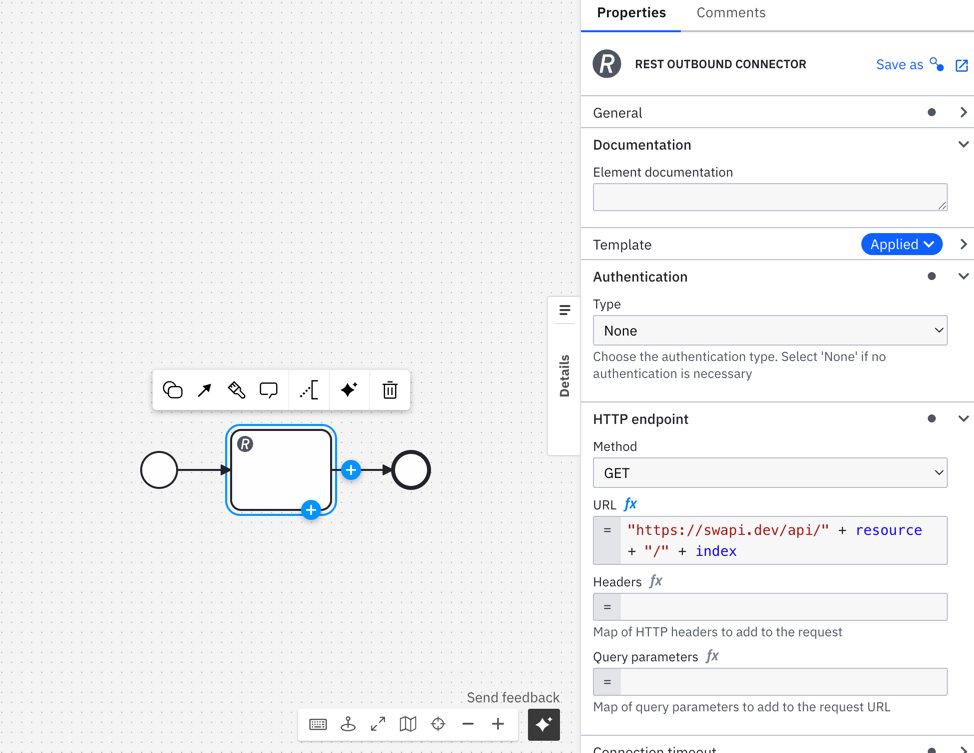
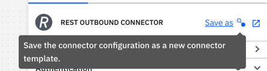
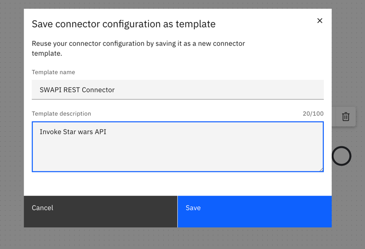
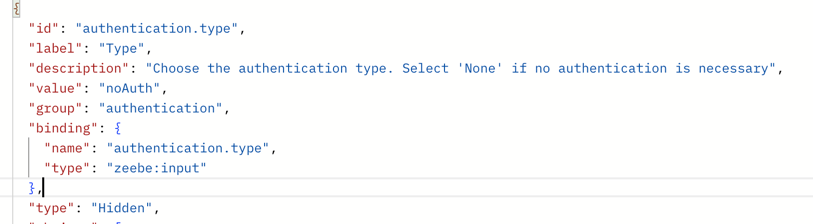
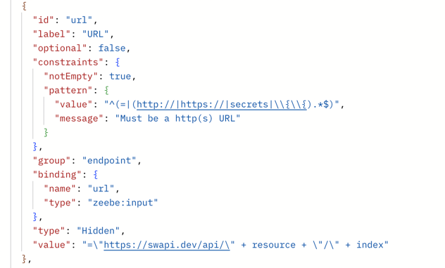
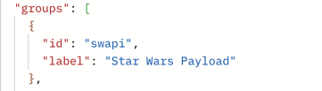
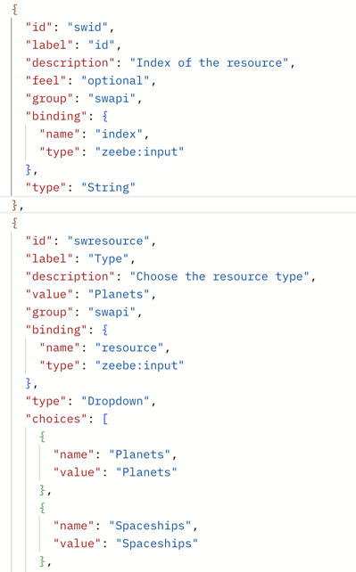
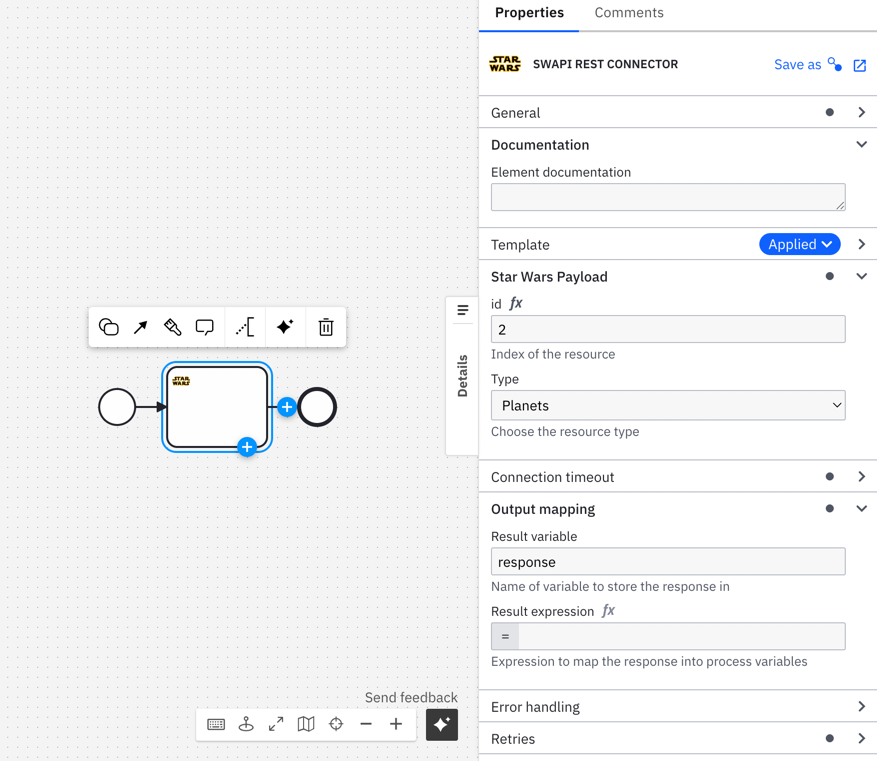

# Create a New Connector Based on the REST Connector

## Step 1: Create a BPMN in the Web Modeler

1. Open the Camunda Platform Web Modeler and log in to your account.
2. Create a new project or open an existing one.
3. Add a new BPMN diagram to your project:
    - Click `New Diagram`.
    - Name your diagram and click `Create`.

## Step 2: Add the REST Connector to the BPMN

1. In the BPMN editor, add a new task element to your diagram.
2. Change the task type to `Connector`:
    - Click on the task element.
    - Select the wrench icon to change the element type and choose `REST Outbound Connector` from the Connectors section.
3. Configure the REST Connector:
    - In the properties panel, fill out the required fields such as Authentication URL, HTTP method, and any headers or payload needed for the API request.

## Step 3: Save the REST Connector as a New Connector Template

1. With the REST Connector task selected, open the element template editor:
    - Click the `Save as Template` button.
2. Enter the template details:
    - **Name**: Provide a name that clearly indicates the functionality of the template.
    - **Description**: Describe the main features and benefits of the template.
    - **Icon**: Optionally, upload a custom icon with supported formats: SVG, PNG, and JPEG.
3. Click `Create Template` to save the new connector template.

## Step 4: Customize the New Connector Using the Element Template Editor

1. Open the template editor for further customization:
    - Select the newly created template from the template list.
    - Click `Edit Template` to open the template editor.
2. Customize the template:
    - Add or remove fields as required.
    - Adjust default values and input parameters.
    - Update the description and other metadata as necessary.
3. Save your changes to finalize the customization.

:::note Warning
If one of your variables is used somewhere else in your element template, be mindful that the variable using other variables is declared after.
Otherwise, they will be considered `null`
:::

## Example Overview

In this guide, you'll learn how to create a custom connector that fetches data from the Star Wars API (SWAPI). By following the steps outlined below, you'll be able to incorporate this connector into your BPMN workflows seamlessly.

### Step-by-Step Instructions

1. **Create a `Rest Outbound Connector` Task**
   - Begin by creating a `Rest outbound connector` task in your workflow.
   - Define the URL using a FEEL (Friendly Enough Expression Language) expression, utilizing the `resource` and `index` variables.
     

2. **Click on `Save as`**
   - Save your current progress by selecting `Save as`. This will enable you to create a template from your configured connector.
     

3. **Fill Out Template Information**
   - Provide essential details such as the `Template Name` and `Template Description`.
   - These fields are crucial for identifying and understanding the purpose of the template.
     

4. **Open the New Connector Template in the Editor**
   - Access the newly created template in the editor to make further customizations and configurations.

5. **Hide Unwanted Properties**
   - For properties that are not required in your connector, set their `type` to `Hidden`.
      - Example: Since authentication is not necessary, set it to `Hidden`.
        
   - Similarly, hide other fields such as `url`, `method`, `headers`, and `queryParameters`. If the `hidden` type does not apply, ensure that you remove the `feel` property.
     

6. **Create a Custom Group for the Star Wars API**
   - Introduce a customized group named `swapi` for organizing your Star Wars-related properties.
     

7. **Define the Properties in the SWAPI Group**
   - Map the properties within the new group to the variables defined earlier (`resource` and `index`).
      - Set `resource` as a `Dropdown`.
      - Set `index` as a `String`.
        

8. **Add an Icon**
   - Enhance your connector's visual appeal by adding an appropriate icon.
     

9. **Publish the Connector**
   - Once all configurations are complete, click on `Publish` to make your connector available for use.
     

10. **Access Your New SWAPI Connector**
- The newly published SWAPI connector is now ready for use in your BPMN workflows.
  

## Conclusion

By following these detailed steps, you have successfully created a reusable connector template based on the REST connector. This template streamlines interactions with the specified REST API and ensures consistency and standardization across different BPMN workflows. Enjoy integrating the power of the Star Wars API into your business processes!