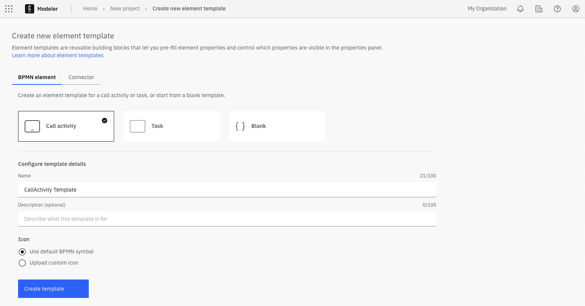
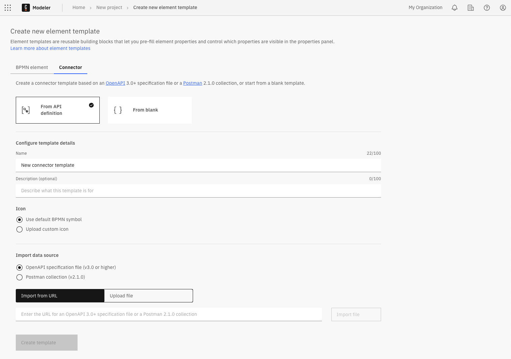

You can configure and automatically generate a custom element template in Web Modeler.  

You can start from a **Call Activity** template, a **Task** template, or a **blank** template.

## Generate an element template

To generate an element template:

1. Select the Modeler project where you want to create the template.  
2. Click **Create new**, select **Element template**, and then choose the **BPMN element** tab to open the **Create new element template** screen.  
   

3. Select the template starting point:
   - **From Call activity**: Start from a Call activity template.
   - **From Task**: Start from a Task template.  
     You can choose from predefined Task templates, such as User task, Service task, Script task, and more.
   - **From blank**: Start from a blank template.

## Generate a connector template

You can configure and automatically generate a custom [Connector template](/components/connectors/custom-built-connectors/connector-templates.md) in Web Modeler.  

You can start from a blank template or import an existing API definition such as an [OpenAPI specification](https://swagger.io/resources/open-api/), [Swagger specification](https://swagger.io/resources/open-api/), or a [Postman collection](https://www.postman.com/collection/). For example, download a Postman collection as a YAML file, import it into the generator, and choose which methods to include in the generated template.

To generate a connector template:

1. Select the Modeler project where you want to create the template.  
2. Click **Create new**, select **Element template**, and then choose the **Connector** tab to open the **Create new connector template** screen.  
   

3. Select the template starting point:
   - **From API definition**: Import an existing API definition file as a starting point. The **Import data source** section will appear below the template details.
   - **From blank**: Start from a blank template.

### Configure the template details

4. In the **Configure template details** section, provide the following information:

   - **Name:** Enter a clear and descriptive name for the template. For example, include the brand name if the template connects to a service, or indicate its main feature.
   - **Description:** Describe the template’s main features and benefits.
   - **Icon:** Use a default BPMN symbol or upload a custom icon. Supported formats: SVG, PNG, JPEG. Maximum file size: 8 KB. Minimum dimensions: 512 × 512 pixels.
     - **Import from URL:** Enter the URL of the image and click **Import icon**.  
     - **Upload file:** Drag and drop a file into the upload area, or click the link to select a file.

   :::note
   If you do not configure template details at this stage, a default name and BPMN symbol are assigned. You can edit them later.
   :::

#### Only for connector templates: Import an API definition

5. If you selected **From API definition**, the **Import data source** section appears.  

   1. Select the format to upload (OpenAPI or Postman).  
   2. Upload the API definition:
      - **Import from URL:** Enter the API definition URL and click **Import icon**.  
      - **Upload file:** Drag and drop a file into the upload area, or click the link to select a file.

   3. After importing, select which actions to include from the generated list of supported methods.  
      

   :::info
   For more information on working with and configuring connector templates, see [Connector templates](/components/connectors/custom-built-connectors/connector-templates.md).
   :::

### Create the template

6. Click **Create template** to generate and open the new element template in the [element template editor](/components/connectors/manage-connector-templates.md).
