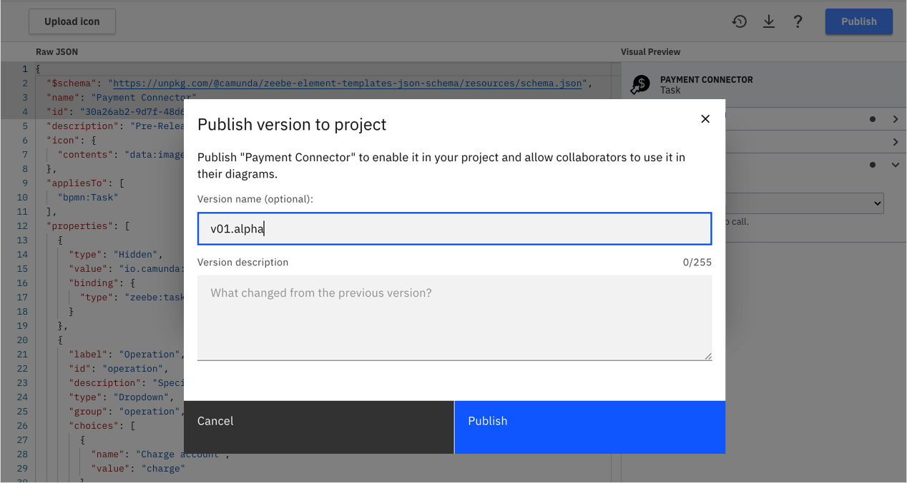
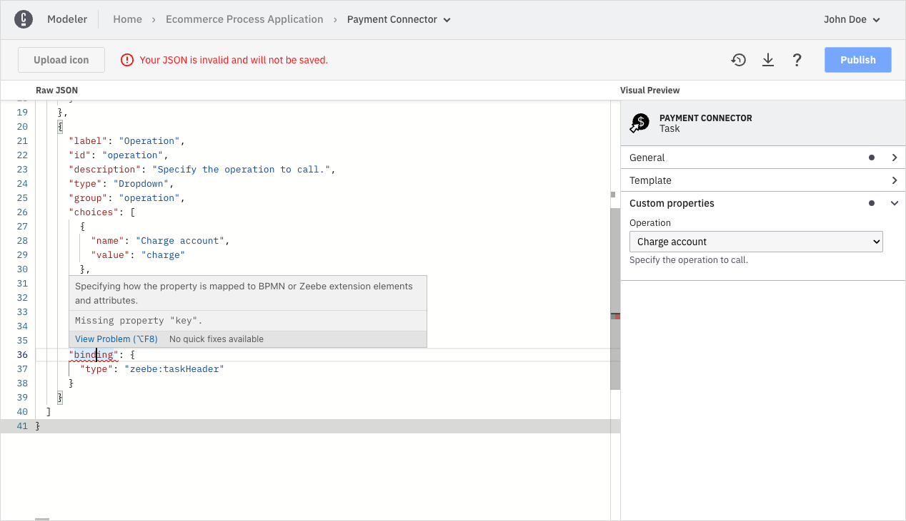
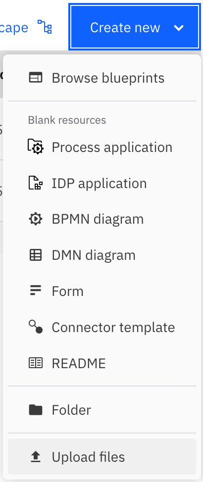
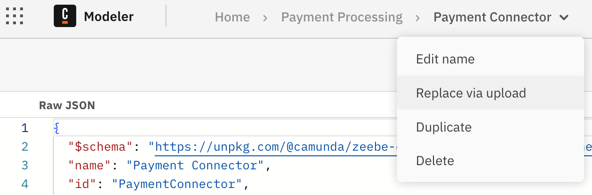

export const UploadIcon = () => <svg xmlns="http://www.w3.org/2000/svg" viewBox="0 0 24 24" width="16" height="16"><path d="M0 0h24v24H0z" fill="none"></path><path d="M9 16h6v-6h4l-7-7-7 7h4zm-4 2h14v2H5z" fill="currentColor"></path></svg>;

Camunda 8 only

You can create and manage [Connector templates](/components/connectors/custom-built-connectors/connector-templates.md) just as any other asset in a Web Modeler project.

## Create Connector templates

Take the following steps to create a new Connector template:

1. Navigate to the project of your choice and click **New**.

2. Click **Connector Template**.

   

3. You will be taken to the **Connector template editor** screen. In this screen, you can define the Connector template by writing the template JSON. The template editor supports you in writing the template by providing autocompletion, error highlighting, and a live preview.

   

   The components of the editor interface are as follows:

   - In the **breadcrumbs bar** at the top of the screen, you can rename your template by clicking the chevron next to the template name. Note that you cannot change the name of your template in the template JSON, but only with this action.
   - On the left, you observe the **template JSON editor**. Here, you define the actual template descriptor. The descriptor follows the [most recent element template schema](https://github.com/camunda/element-templates-json-schema). The editor is divided into two sections: a read-only section, containing the schema reference, the template name, the template id, and an editable section, where you can [define your template descriptor](/components/modeler/desktop-modeler/element-templates/defining-templates.md).
   - On the right, you observe the live **Visual Preview**. The live preview shows how the properties panel will look when you apply the template to an element. It automatically updates on every valid change, and reflects the latest valid state of the template. The preview allows you to interactively check your template before publishing, enhancing its usability.
   - In the upper left, you can **Upload an icon** for your template. You can upload any image file you want, however we recommend to use squared SVG graphics. The icons get rendered 18x18 pixels in the element on the modeling canvas, and 32x32 pixels in the properties panel.

   On every valid change, the template is saved automatically. If there are errors in the JSON file, the template will not be saved. Ensure all [errors are resolved](#fixing-template-problems) for the template to save successfully.

4. Once you've written your template, publish it by clicking **Publish**. You will be prompted to optionally enter a version name. This name appears in your milestone list.

   

   When using the Camunda 8 SaaS offering, as [organization owner](/components/console/manage-organization/manage-users.md#users) you can publish a template version to the organization making it available to all projects in the organization.
   To do so, either click **Publish > Publish to organization** on the Connector template editor screen or promote a template via the [Version History](#versioning-connector-templates).

   

5. After publishing, a template version can be applied to elements of all models in the same project or organization depending on its publication status.
   You can check the publication status of template versions in the [Version History](#versioning-connector-templates).

### JSON editor features

The JSON editor is based on the [Monaco Editor](https://microsoft.github.io/monaco-editor/). The Monaco Editor is the editor that powers VS Code. As a result, the template editor supports many familiar features, such as auto-formatting, indentation support, code completion, and error highlighting.

Read the [VS Code editor docs](https://code.visualstudio.com/docs/editor/editingevolved) for a full overview of features.

### Versioning Connector templates

You can version your Connector templates using [milestones](/components/modeler/web-modeler/milestones.md), similar to diagrams.

If you publish a new version of a Connector template and an older version is already being used in diagrams, the user can either [update the diagram elements](/components/modeler/desktop-modeler/element-templates/using-templates.md#updating-templates) to use the most recent version of the Connector template, or they can continue using the older version of the Connector template in their diagrams.

## Fixing problems in your templates {#fixing-template-problems}

While working on a template, the template will be in invalid intermediate states. For instance, when you add a new property, it must contain various mandatory attributes.

Unless all mandatory attributes are defined, the template will not be saved, and the preview is not updated. This ensures that you can never publish an invalid or broken template.

The editor toolbar indicates if the template is currently in a valid state or not. The JSON editor provides you with error highlighting, allowing you to add mandatory values and resolve problems without missing anything.

If there are problems at the root level of the JSON (such as a missing or misspelled mandatory attribute,) the error is highlighted in the first line of the editor. Click the error marker at the curly bracket to expand the error message.

## Importing existing Connector templates

If you have created templates for Desktop Modeler and want to reuse them in Web Modeler, you need to make some adjustments to the template files:

1. **Split the files**. Web Modeler maintains a 1:1 relation between Connector templates and files. Since Desktop Modeler allows you to keep multiple template definitions in single file, you must split the file in advance to one file per template before uploading.
2. **Remove the brackets**. Remove the list brackets from the Connector template file before uploading. Even if a template file for Desktop Modeler contains only a single template, it is always wrapped in a list.
3. **Be aware that the ID and name of the template from the original file will be ignored.** A new ID is auto-assigned to ensure consistency and uniqueness in Web Modeler.

Once your file follows the requirements, you can upload it. There are two ways to do so:

1. Upload it as a _new Connector template_ via the <UploadIcon /> **Upload files** action in the projects view. This will auto-generate a new ID for the template.

   

2. Update an existing template via the **Replace via upload** action in the breadcrumbs of the editor view. This preserves the name and ID of the existing template.

   

:::info Desktop Modeler support
The Connector template editor is currently only available in Web Modeler. Refer to the [Desktop Modeler documentation](/components/modeler/desktop-modeler/element-templates/about-templates.md) for instructions on configuring Connector templates in Desktop Modeler.
:::
