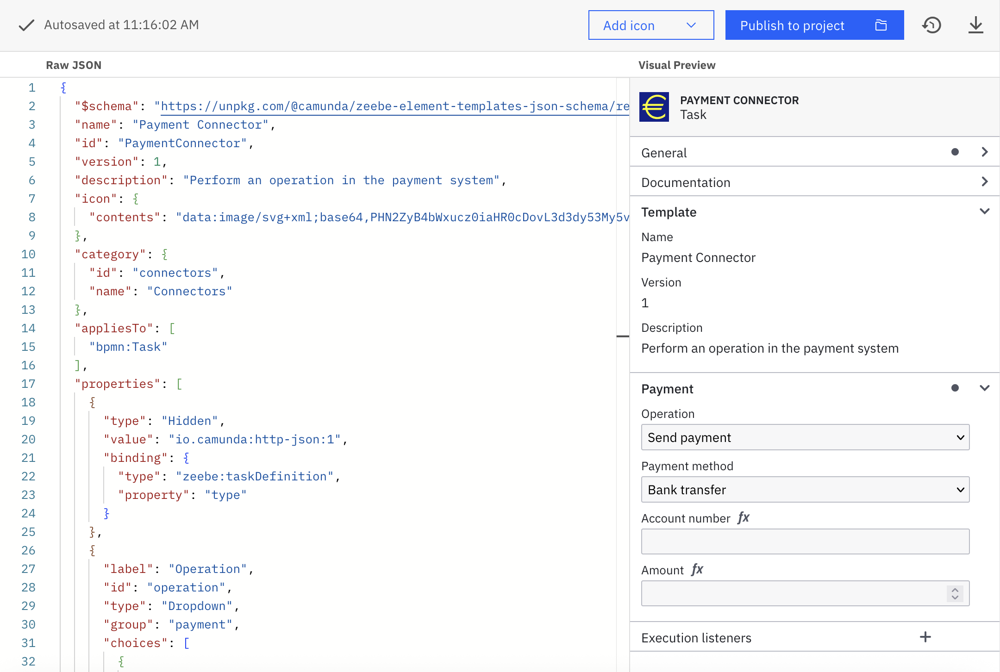
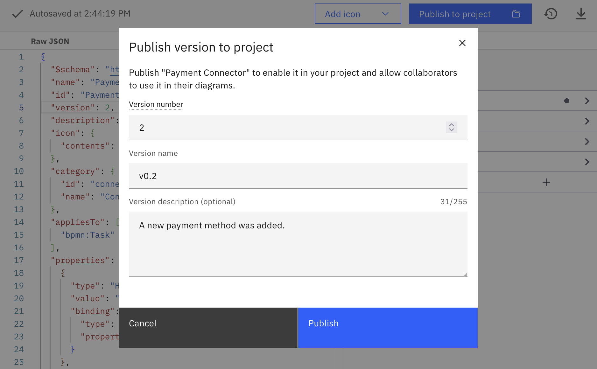
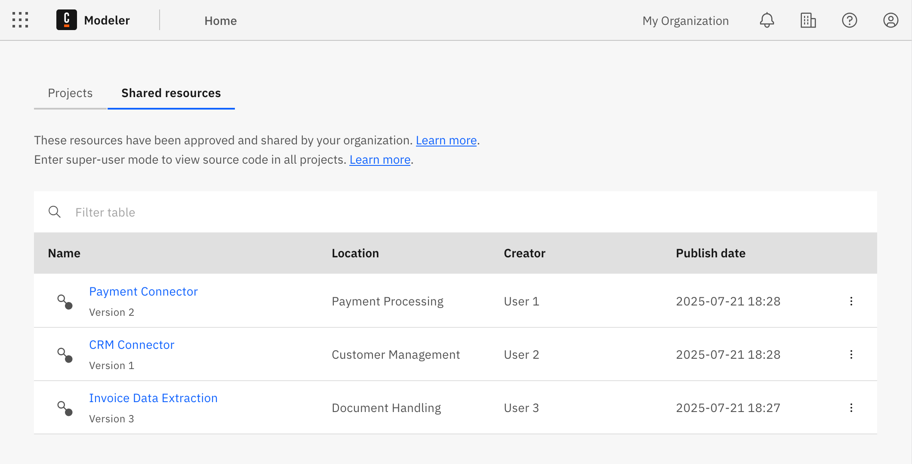
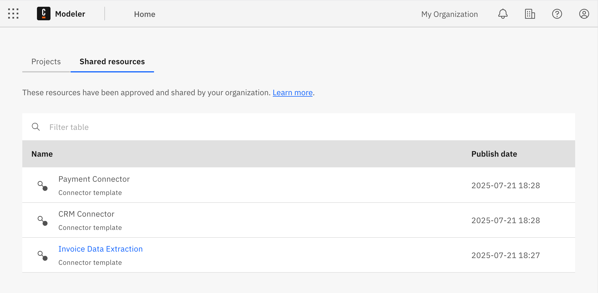
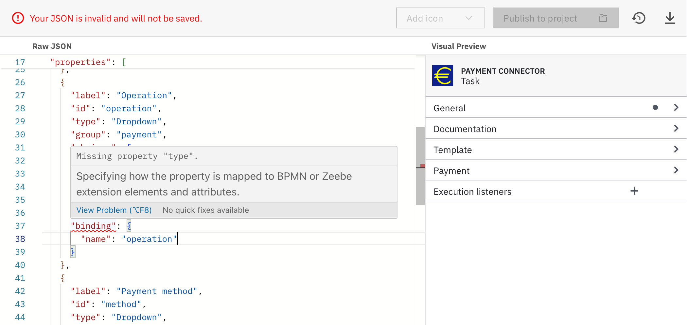

export const UploadIcon = () => <svg xmlns="http://www.w3.org/2000/svg" viewBox="0 0 24 24" width="16" height="16"><path d="M0 0h24v24H0z" fill="none"></path><path d="M9 16h6v-6h4l-7-7-7 7h4zm-4 2h14v2H5z" fill="currentColor"></path></svg>;
import PublishToOrganizationFromEditorImg from './img/connector-templates/publish-to-organization-from-editor.png';
import PublishToOrganizationFromVersionsListImg from './img/connector-templates/publish-to-organization-from-versions-list.png';
import EditConnectorTemplate1Img from './img/connector-templates/edit-connector-template-1.png';
import EditConnectorTemplate2Img from './img/connector-templates/edit-connector-template-2.png';
import EditConnectorTemplate3Img from './img/connector-templates/edit-connector-template-3.png';
import UploadFilesImg from './img/connector-templates/upload-files.png';
import ReplaceViaUploadImg from './img/connector-templates/replace-via-upload.png';

Camunda 8 only

You can create and manage [connector templates](/components/connectors/custom-built-connectors/connector-templates.md) just as any other asset in a Web Modeler project.

## Create a connector template

To create a new connector template, follow the steps described in [Generate a connector template](./custom-built-connectors/connector-template-generator.md#generate-a-connector-template).

You will be taken to the **Connector template editor** screen.
In this screen, you can define the connector template by writing the template JSON.
The template editor supports you in writing the template by providing autocompletion, error highlighting, and a live preview.

The components of the editor interface are as follows:

- On the left, you find the **template JSON editor**. Here, you define the actual [template descriptor](/components/modeler/desktop-modeler/element-templates/defining-templates.md).
  The descriptor follows the [most recent element template schema](https://github.com/camunda/element-templates-json-schema).

  :::info
  Starting with 8.8, the following properties are not managed by Web Modeler anymore, and you can freely edit them:
  - `name`: Human-friendly name shown when selecting a template and in the properties panel after the template has been applied. The value can be different from the file name.
  - `id`: Identifier of the template. Changing this value creates a new template. We recommend setting a meaningful value (e.g. "PaymentConnector", "CreateUserTemplate").
  - `version`: Integer-based version number. Combined with the `id`, it defines a unique template version. When [publishing](#publish-a-connector-template) a new version, you need to update the version number manually.

  The value of the `$schema` property is still fixed; manual changes will not be saved.
  :::

- On the right, you observe the live **Visual Preview**. The live preview shows how the properties panel will look when you apply the template to an element. It automatically updates on every valid change, and reflects the latest valid state of the template. The preview allows you to interactively check your template before publishing it.
  :::info
  Any changes you make in the preview will _not_ get applied to the template JSON.
  :::

- In the upper right, you can **Add an icon** for your template. You can upload an image file with a maximum size of 8 KB. We recommend using squared SVG graphics. Icons appear as 18x18 pixels in the element on the modeling canvas, and as 32x32 pixels in the properties panel.

On every valid change, the template is saved automatically. If there are errors in the JSON file, the template will not be saved. Ensure all [errors are resolved](#fixing-template-problems) for the template to save successfully.

## Publish a connector template

After finalizing your connector, click **Publish to project** to activate it within the project context. In the modal that opens:

- Update the version number if necessary. You don't need to change it for the initial version or if you have updated it already in the template editor.
  The value entered here is saved to the `version` property in the JSON.
- Assign a distinct version name for effective version management.
- Add a description to explain what changed since the previous version.

Web Modeler checks the template for conflicts with already-published template versions.
You cannot publish a new version if:

- The template's ID is already used in a published version of a different template file. 
- The version number is equal to or lower than the last published version of the same template file with the same template ID. 

Web Modeler also shows a warning if the template ID has changed since the last published version.
You can still publish the new version in this case.

As a [user with elevated access](/components/modeler/web-modeler/collaboration.md#elevated-access), you can publish a connector template version within the organization context, enabling all organization members to use it in their diagrams.
To do so, click **Publish > Publish to organization** on the editor screen or promote a template version via the [versions list](#versioning-connector-templates).

### Manage published connector templates

After publishing, a connector template version can be applied across all models within the same project or organization, depending on its publication status. You can review the publication status of template versions in the [versions list](#versioning-connector-templates).

On the Web Modeler home page, you can find an overview of all shared resources within your organization.

[Users with elevated access](/components/modeler/web-modeler/collaboration.md#elevated-access) can:

- View additional details about the published version.
- Open the resource's versions list (if they are in [super-user mode](/components/modeler/web-modeler/collaboration.md#super-user-mode) or are a [project admin or editor](/components/modeler/web-modeler/collaboration.md#access-rights-and-permissions) of the resource's project).
- Unpublish a connector template directly from this view.

Organization members without special organization permissions can:

- View all the resources published within the organization.
- Open the resource's versions list (if they are a [project admin or editor](/components/modeler/web-modeler/collaboration.md#access-rights-and-permissions) of the resource's project).

### Versioning connector templates

You can version your connector templates [similar to diagrams](/components/modeler/web-modeler/versions.md).

If you publish a new version of a connector template and an older version is already being used in diagrams, the user can either:

- [Update the diagram elements](/components/modeler/desktop-modeler/element-templates/using-templates.md#updating-templates) to use the most recent version of the connector template. You cannot undo this action.
- Continue using the older version of the connector template in their diagrams.

## JSON editor features

The JSON editor is based on the [Monaco Editor](https://microsoft.github.io/monaco-editor/). The Monaco Editor is the editor that powers VS Code. As a result, the template editor supports many familiar features, such as auto-formatting, indentation support, code completion, and error highlighting.

With code completion, you can add a complete property object when you press `Ctrl+Space` at a location for a new property.

When you press `Ctrl+Space` to create a new attribute, you get proposals for all available attributes.

When the domain for values is defined, you can select one by pressing `Ctrl+Space` in a value.

Read the [Visual Studio Code editor docs](https://code.visualstudio.com/docs/editor/editingevolved) for a full overview of features.

## Fixing problems in your templates {#fixing-template-problems}

While working on a template, the template will be in invalid intermediate states. For instance, when you add a new property, it must contain various mandatory attributes.

Unless all mandatory attributes are defined, the template will not be saved, and the preview is not updated. This ensures that you can never publish an invalid or broken template.

The editor toolbar indicates if the template is currently in a valid state or not. The JSON editor provides you with error highlighting, allowing you to add mandatory values and resolve problems without missing anything.

If there are problems at the root level of the JSON (such as a missing or misspelled mandatory attribute), the error is highlighted in the first line of the editor. Click the error marker at the curly bracket to expand the error message.

## Importing an existing connector template

If you have created templates for Desktop Modeler and want to reuse them in Web Modeler, you need to make some adjustments to the template files:

1. **Split the files**. Web Modeler maintains a 1:1 relation between connector templates and files. Since Desktop Modeler allows you to keep multiple template definitions in a single file, you must split the file in advance to one file per template before uploading.
2. **Remove the brackets**. Remove the list brackets from the connector template file before uploading. Even if a template file for Desktop Modeler contains only a single template, it is always wrapped in a list.

Once your file follows the requirements, you can upload it. There are two ways to do so:

1. Upload it as a new connector template via the <UploadIcon /> **Upload files** action in the project view.
   

2. Update an existing template via the **Replace via upload** action in the breadcrumbs of the editor view.
   

:::info Desktop Modeler support
The connector template editor is currently only available in Web Modeler. Refer to the [Desktop Modeler documentation](/components/modeler/desktop-modeler/element-templates/about-templates.md) for instructions on configuring connector templates in Desktop Modeler.
:::
